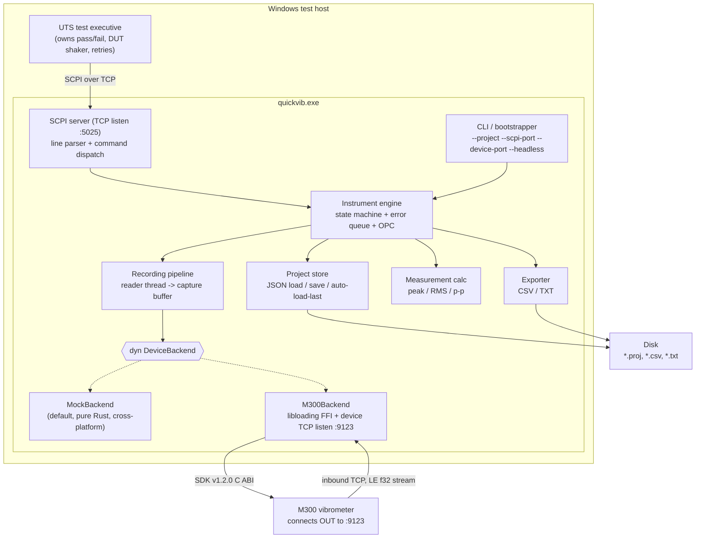
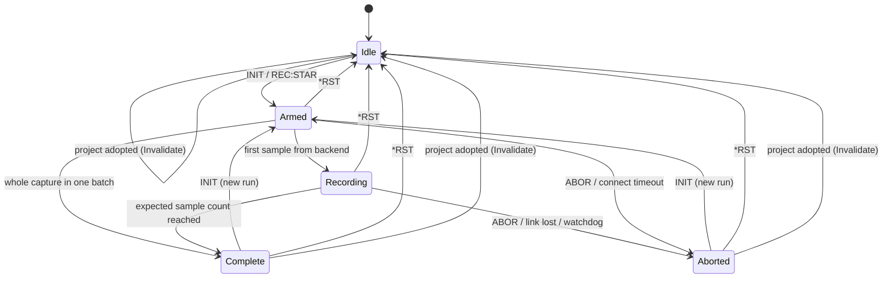

# QuickVib — Analysis and Implementation Plan

> Status: **plan only — no product code written yet. Coding has NOT been approved.** This document is
> the review artifact that precedes implementation. Nothing here is compiled; every code block is
> illustrative pseudocode or a proposed file format, not a source file. No `Cargo.toml`, no `.rs`
> file, and no workspace scaffolding exists or will be created until the requester explicitly
> approves this plan.

> **Language decision — locked: Rust.** An earlier revision of this plan targeted C# / .NET 8. That
> is **superseded and withdrawn**. The product is built in **Rust** (edition 2021, see D1), shipped as
> a single self-contained Windows `.exe`, with the entire test suite runnable on Linux via
> `cargo test`. Every section below — layout, milestones, decision register, traceability, test plan,
> CI — has been rewritten accordingly. There is no `.sln`, no `.csproj`, no target framework moniker,
> no P/Invoke and no xUnit anywhere in this plan.

---

## 1. Executive summary

QuickVib is a small Windows console application that makes an **M300 laser Doppler vibrometer**
look and behave like a **Keysight-style SCPI instrument** to an existing UTS (unit test system).

The UTS launches `quickvib.exe` from a Windows command prompt, then opens a TCP socket to it and
sends SCPI text commands (`*IDN?`, `INIT`, `FETC?`, …) exactly as it would to a bench instrument.
QuickVib translates those commands into M300 SDK v1.2.0 calls — the SDK's existing **C ABI**, bound
from Rust with **`bindgen`-verified declarations loaded at runtime through `libloading`** — records a
fixed-duration vibration capture, and returns the samples and derived scalar measurements
(peak, RMS, peak-to-peak).

Two independent TCP roles exist and must not be confused:

| Role | Direction | Default port | Peer |
| --- | --- | --- | --- |
| **SCPI server** | QuickVib listens, UTS connects in | `5025` | UTS test executive |
| **Device server** | QuickVib listens, **M300 connects in** | `9123` | M300 vibrometer |

The M300 is the *inbound* party on the device link — QuickVib is the server on both sides. Sample
data arrives as a raw **little-endian `f32`** stream.

Deliberately narrow scope: QuickVib **records, measures, and exports**. It does **not** decide
pass/fail, does **not** drive DUT vibration, and does **not** own retry policy — those stay in the
UTS. There will be **no fake/stub native DLL** committed to the repo; the default backend is a
pure-Rust **mock** so the whole product is developable and testable on Linux with `cargo test`.

Toolchain: **stable Rust, edition 2021**, MSRV pinned (D1). The shipped artifact targets
`x86_64-pc-windows-msvc`; the workspace also cross-compiles to `x86_64-pc-windows-gnu` from Linux
with mingw-w64 (§18.2). All crates except the one thin M300 interop crate are platform-neutral, are
`#![forbid(unsafe_code)]`, and are fully exercised by `cargo test` on Linux.

---

## 2. Current repo state and working agreement

### 2.1 State at the time of writing

```
/workspace
├── .git/
├── README.md        # contents: "# QuickVib"
└── docs/
    └── PLAN.md      # this file
```

* Branch `cursor/build-quickvib-3de8`, branched from `main`.
* Commits: `51bcdd3 Initial commit`, `02802b7 docs: add QuickVib implementation plan`,
  `cf2a939 docs: expand QuickVib plan with decision register, traceability, and native contract`.
* **No product code of any kind exists**: no `Cargo.toml`, no `Cargo.lock`, no `.rs` file, no
  `rust-toolchain.toml`, no `src/` or `crates/` directory, no sample data files, no native binaries,
  no CI workflow, no `.gitignore`, no `rustfmt.toml`, no `clippy.toml`.
* Verified immediately before this revision: `git ls-files` returns exactly `README.md` and
  `docs/PLAN.md`. Working tree clean; nothing to remove.

### 2.2 Implication

This is a greenfield build. Every convention — crate split, edition, MSRV, lint level, error type
strategy, CI — is ours to choose, so this plan specifies them explicitly rather than inferring them
from existing code. The first implementation phase must therefore also add the housekeeping files
that do not yet exist.

### 2.3 Working agreement for the planning stage

Until the plan is approved, the repository holds **only** `README.md` and `docs/PLAN.md`. **No
`Cargo.toml`, no `Cargo.lock`, no `.rs` file, no `rust-toolchain.toml`, no test file, and no sample
`.proj`** is committed during planning — including the sample project file shown in §14, which is
displayed for review and created only in Phase 1.

**Approval gate:** Phase 0 (§19) does not begin until the requester says so in writing. This document
is the thing being reviewed; the code is not started.

**Assumption to confirm:** the M300 SDK v1.2.0 headers/DLL are *not* in the repo and will not be
committed. The plan treats the native surface as a documented contract that is exercised only on a
Windows machine with the real SDK installed.

---

## 3. Requirements traceability

Every line of the product brief mapped to where it is addressed and when it is built.

| # | Requirement from brief | Addressed in | Built in |
| --- | --- | --- | --- |
| R1 | Windows host executable, launched from `cmd` | §7.1, §13, §18.2 | Phase 5 |
| R2 | UTS drives it via SCPI-over-TCP like a Keysight instrument | §7.2, §8 | Phase 4–5 |
| R3 | Wraps M300 SDK v1.2.0 (C ABI) via `bindgen`/`libloading` | §10, §11, §15 | Phase 6 |
| R4 | Host is TCP server; M300 connects **inbound** on `9123` | §7.3, §5.1 | Phase 6 |
| R5 | Stream is little-endian `f32` | §7.3, §7.6 | Phase 2 |
| R6 | Units: velocity μm/s, displacement μm, acceleration m/s² | §7.7, §12 | Phase 1 |
| R7 | UTS owns DUT vibration / pass-fail / retry — not QuickVib | §22 | n/a (excluded) |
| R8 | Load project (JSON) | §7.5, §12 | Phase 1 |
| R9 | Auto-load last project | §7.5, §8.2 | Phase 1 + 5 |
| R10 | Record N seconds | §7.6, §8.4 | Phase 3 |
| R11 | Notify finish (`#REC:DONE` + `REC:WAIT?`) | §8.4, §8.8 | Phase 3–4 |
| R12 | Export CSV / TXT | §7.8, §8.2, §8.3 | Phase 1 |
| R13 | Compute peak / RMS / pp | §7.7, §8.6 | Phase 1 |
| R14 | CLI `--project --scpi-port --device-port --headless` | §13 | Phase 5 |
| R15 | Full SCPI surface (IEEE 488.2 + instrument) | §8 | Phase 4 |
| R16 | Default backend is mock | §7.4, §15, D4 | Phase 2 |
| R17 | Thin `DeviceBackend` trait for mock vs M300 FFI | §10 | Phase 2 + 6 |
| R18 | **Rust** (edition 2021, stable); tests runnable on Linux | §6, §17, §18, D1 | Phase 0 |
| R19 | Sample `Test.proj` described, not yet created | §14, §2.3 | Phase 1 |
| R20 | Chinese + English README outline | §23 | Phase 7 |
| R21 | No pass/fail, no DUT vibration, no fake DLL | §22, §15 | n/a (excluded) |
| R22 | Windows `.exe` produced reproducibly (cross-build and/or native CI) | §18.2 | Phase 0 + 7 |
| R23 | Zero-or-minimal runtime dependencies, justified | §6.3, D18 | Phase 0 |

---

## 4. Key decisions register

Decisions taken so implementation can begin without waiting on answers. Each has a status:
**Decided** (committed, change only with cause) or **Default** (a reasonable choice the requester may
overturn cheaply, with the corresponding question listed in §21.2). Nothing needed for Phases 0–5 is
undecided; the genuinely unanswerable items are isolated in §21.1 and only gate Phase 6.

| ID | Decision | Status | Rationale / reversal cost |
| --- | --- | --- | --- |
| D1 | **Rust, edition 2021**, stable toolchain, MSRV pinned in `rust-toolchain.toml` and each `Cargo.toml` (`rust-version`) | Decided | Edition 2021 is what every CI image and vendored toolchain already supports; edition 2024 buys nothing this product needs and narrows the usable toolchain floor. Reversal is a one-line `edition` bump per crate plus a `cargo fix --edition` pass. See Q11 |
| D2 | **Cargo workspace, seven members** (§6.1): `quickvib` (bin) + `quickvib-core`, `-project`, `-measure`, `-device`, `-scpi`, `-engine`, plus the Windows-only `quickvib-m300` excluded from `default-members` | Decided | Smallest split that isolates the only Windows-bound code and keeps compile-time feedback fast; `default-members` is the Cargo analogue of a solution filter, so a plain `cargo test` on Linux never builds the FFI crate |
| D3 | QuickVib is a **TCP server on both** links; it never dials out | Decided | Directly from the brief |
| D4 | **Mock is the default backend**, selected unless the project or CLI explicitly says `m300` | Decided | From the brief; also what makes Linux CI possible |
| D5 | Sample framing (LE `f32` decode) lives in a platform-neutral type driven by `impl Read`, not a socket | Decided | Makes the bug-prone part of the M300 path testable on Linux with a `&[u8]` cursor |
| D6 | SCPI parsing implemented in-house (lexer + command tree), not via a third-party SCPI crate | Decided | The surface is ~25 commands; no mature Rust SCPI-*server* crate worth the dependency or the API risk |
| D7 | Error queue uses standard SCPI-99 codes, never invented ones | Decided | UTS error handling already understands them |
| D8 | Instrument state is **shared** across concurrent SCPI sessions; error queue is global; `*OPC?` is per-session | Default | Mirrors real instruments; see Q7 |
| D9 | Data from an **aborted** capture is **not** fetchable — `FETC?`/`CALC:*` return `-230` | Default | Conservative; partial data invites silent bad measurements. See Q2 |
| D10 | `FETC?` returns comma-separated ASCII on one line; a binary block form is additive if needed | Default | Simplest for a text UTS; see Q3 and the risk in §20 |
| D11 | Single channel throughout; no channel index in the protocol or project schema | Default | See Q4 |
| D12 | Unit is fixed per project; no runtime `CONF:UNIT` | Default | See Q5 |
| D13 | Sample rate is declared by the project file; a disagreeing device value is logged, not enforced | Default | See Q9 |
| D14 | Duration is enforced by **sample count**, not wall-clock, with a wall-clock watchdog as backstop | Decided | Deterministic tests; tolerant of device jitter |
| D15 | Measurement accumulation in `f64` even though samples are `f32` | Decided | Avoids precision loss on multi-hundred-thousand-sample captures |
| D16 | Numeric formatting/parsing uses Rust's `core::fmt` / `str::parse`, which are **locale-independent by definition**; no locale API is ever consulted | Decided | Rust has no ambient culture, so the comma-decimal class of bug is structurally absent — but the tests in §17.1 still assert the wire format explicitly |
| D17 | `#`-prefixed lines are the out-of-band notification namespace (`#REC:DONE`) | Decided | From the brief; `#` cannot begin a normal response in this surface |
| D18 | **Runtime dependencies: `serde` + `serde_json` only** (plus `libloading`, Windows-target-only, for the M300 crate, and `eframe`, `quickvib-ui`-only behind the non-default `gui` feature). No async runtime, no CLI crate, no logging crate, no date crate, no error-derive crate. Dev-dependencies: `tempfile` only | Default | §6.3 justifies each inclusion and each exclusion. A UTS-launched exe benefits from a dependency graph a reviewer can read in full. See Q10 and Q13 |
| D19 | **Blocking `std::net` + OS threads; no `tokio`, no `async`** | Decided | §6.4. The concurrency is ~6 long-lived threads, not 10 000 connections; blocking sockets with read timeouts express every requirement here, and cancellation is `AtomicBool` + `TcpStream::shutdown` rather than a runtime-specific cancellation model |
| D20 | Time is injected through a `Clock` trait (Rust has no `TimeProvider`); `Instant::now`/`SystemTime::now` are banned outside `quickvib-core::clock`, enforced by `clippy.toml` `disallowed-methods` | Decided | A "5-second" capture must run in milliseconds under test; the lint makes the rule mechanical instead of cultural |
| D21 | No fake `m300_sdk.dll`; the ABI is captured in `docs/M300-NATIVE.md`, declarations are cross-checked against `bindgen` output on a machine that has the SDK, and correctness is verified by a manual Windows smoke checklist | Decided | From the brief |
| D22 | `#![forbid(unsafe_code)]` in every crate **except** `quickvib-m300`, which is `#![deny(unsafe_op_in_unsafe_fn)]` and carries a `SAFETY:` comment per `unsafe` block | Decided | Rust's FFI has no marshalling safety net — a wrong signature is UB, not an exception. Confining `unsafe` to one small crate is the whole mitigation (§20) |
| D23 | Lints: `#![deny(warnings)]` in CI via `RUSTFLAGS=-Dwarnings`, `cargo clippy --all-targets -- -D warnings`, `cargo fmt --check`, all from Phase 0 | Decided | Cheap at the start, expensive to retrofit — the direct analogue of the old `TreatWarningsAsErrors` |
| D24 | Errors: hand-written `enum` error types per crate implementing `std::error::Error` + `Display`; no `thiserror`/`anyhow`. The binary uses a single top-level `AppError` mapped to exit codes | Default | Fewer than a dozen error enums total; the derive macro's cost is a proc-macro dependency in the build graph for boilerplate we write once. See Q13 |
| D25 | Shipped artifact is `x86_64-pc-windows-msvc` built on a Windows runner with `-C target-feature=+crt-static`; `x86_64-pc-windows-gnu` cross-built from Linux is a developer/CI convenience target, gated but not shipped | Default | §18.2. The MSVC target matches what the SDK vendor built against (Q-C: MSVC, linker 14.41), and `+crt-static` keeps `quickvib.exe` itself free of the VC++ redistributable. The vendor's `m300_sdk.dll` still imports `VCRUNTIME140`, so an M300 bench needs the redistributable anyway — the shipped exe just does not add that requirement of its own. See Q12 |
| D26 | `Cargo.lock` **is committed** (this workspace produces a binary, not a library) and CI builds with `--locked` | Decided | Reproducible UTS deployments; a surprise `serde_json` patch bump should never appear between a smoke test and a shipped exe |
| D27 | Panic strategy stays `unwind`; every long-lived thread body is wrapped so a panic kills one SCPI session, not the process | Decided | `panic = "abort"` would let one malformed command take down an instrument the UTS depends on. See §7.10 |
| D28 | **The window's default language is Simplified Chinese**, English behind a title-bar switch, from one exhaustively tested label table; the preference lives in `ui-language.txt` in the state directory and a fresh machine always starts Chinese. Errors carry a structured `Issue` and localise at display time, never a pre-rendered sentence | Decided | The operators are Chinese-speaking technicians; an English-first panel with a translation bolted on gets read wrong under time pressure. §19 Phase 8 |
| D29 | **The window shows the ports the process bound, separately from the ports the project file asks for.** The app passes the live `SocketAddr`s in at launch; the editable fields are labelled as taking effect at the next start, and a mismatch is called out. The window never rebinds a live listener | Decided | `--scpi-port` overrides the file, so a form showing `5025` while the process listens on `15025` is a wrong answer to "what do I connect to". Rebinding would drop a UTS session mid-run. §19 Phase 8 |
| D30 | **A subset of Noto Sans SC (SIL OFL 1.1) is committed under `crates/quickvib-ui/assets` and embedded with `include_bytes!` behind the `gui` feature**, with a test asserting the subset covers every label in both languages | Decided | egui ships no CJK glyphs and a locked-down test cell is the wrong place to discover a missing system font. A data file is not a dependency, so D18 stands; the coverage test turns a tofu box on the bench into a red CI run |

---

## 5. Architecture

### 5.1 Component diagram



### 5.2 Recording sequence

```mermaid
sequenceDiagram
    participant UTS
    participant SCPI as SCPI server
    participant ENG as Engine
    participant BE as DeviceBackend
    participant M300

    UTS->>SCPI: *IDN?
    SCPI-->>UTS: QuickVib,M300-SCPI,<serial>,1.0.0
    UTS->>SCPI: MMEM:LOAD:STAT "Test.proj"
    UTS->>SCPI: CONF:REC:DUR 5.0
    UTS->>SCPI: SYST:DEV:CONN?
    SCPI-->>UTS: 1
    UTS->>SCPI: INIT
    SCPI->>ENG: start recording
    ENG->>BE: stream(request, on_batch) on reader thread
    M300-->>BE: LE f32 samples (streaming)
    SCPI-->>UTS: (no response; INIT is a command)
    UTS->>SCPI: REC:WAIT?
    Note over ENG: expected sample count reached
    ENG-->>UTS: #REC:DONE (async notification)
    SCPI-->>UTS: 1 (REC:WAIT? unblocks)
    UTS->>SCPI: CALC:MEAS:ALL?
    SCPI-->>UTS: 12.3400,4.5600,24.6800
    UTS->>SCPI: MMEM:STOR:TRAC "run001.csv"
    SCPI-->>UTS: (file written)
```

### 5.3 Instrument state machine



`REC:STAT?` maps directly onto these states (`IDLE|ARMED|RECORDING|COMPLETE|ABORTED`). Entering
`Armed` for a new run discards the previous capture buffer and measurements, so `FETC?` between
`INIT` and completion returns `-230` rather than stale data from the prior run.

The `Invalidate` edge is the out-of-band capture discard: adopting a project (`MMEM:LOAD:STAT`,
`MMEM:LOAD:AUTO`, the GUI's *Apply*) drops the stored capture, and the terminal run status goes with
it, so `REC:STAT?` can never answer `COMPLETE` while `FETC?` answers `-230`. It exists only out of
the settled states; from `Armed`/`Recording` it is rejected, which is the `-221` a load attempted
mid-run reports. The in-flight check and the state write happen under one lock hold, so a load that
races `INIT` is refused rather than replacing the settings the run in flight is working from.

The state enum lives in `quickvib-engine` and transitions go through one `fn transition(&mut self,
ev: Event) -> Result<State, EngineError>`, so illegal edges are a compile-time-shaped `match` rather
than scattered `if` checks.

### 5.4 Threading and concurrency model

No async runtime (D19). Six kinds of thread, all `std::thread`:

| Thread | Owns | Rules |
| --- | --- | --- |
| SCPI accept loop | `TcpListener` on `--scpi-port` | One spawned thread per accepted client, capped at `max_sessions` (default 8); beyond the cap the connection is accepted, refused with a log line, and closed |
| SCPI session thread (one per client) | `BufReader<TcpStream>` read half | All writes to that socket go through a per-session `Mutex<TcpStream>` write half, so a notification can never interleave mid-response. A 5 s write timeout disconnects a stalled peer so it cannot block `#REC:DONE` broadcast. `*OPC` bookkeeping is engine-global, not per-session |
| Instrument engine | State machine, loaded project, capture buffer, measurements, error queue | One `Mutex<EngineState>`; handlers are short and never do I/O while holding the guard. Blocking queries wait on a `Condvar` paired with that same mutex |
| Device accept loop | `TcpListener` on `--device-port` | Accepts the M300's inbound connection; hands the stream to the framer |
| Backend reader thread | Socket → framing → `SampleBatch` callback | Single producer for the capture buffer; the only writer to sample storage during `Recording` |
| Watchdog thread | Wall-clock backstop for a run | One per run; sleeps on the run's `Condvar` with `wait_timeout` so completion wakes it early instead of leaving a thread parked |

Cancellation is a `CancelToken { flag: Arc<AtomicBool>, cv: Arc<Condvar> }` plus, for socket reads, a
`TcpStream::shutdown` on the reader's cloned handle — `ABOR`, the watchdog, and process shutdown all
go through that one mechanism (the direct replacement for `CancellationToken`).

Blocking queries (`REC:WAIT?`, `*OPC?`) never hold the engine lock while waiting: they use
`Condvar::wait_timeout_while` on the engine mutex, which releases it for the duration of the wait.
Because sessions are capped and few, one parked OS thread per blocked query is cheaper than an async
runtime (D19).

Shared ownership is `Arc<Engine>`; interior mutability is `Mutex`/`Condvar` from `std::sync` only —
no `parking_lot`, no `crossbeam`. The sample handoff from reader thread to engine is a direct
callback into the engine under its lock, batched (~4096 samples) so lock traffic stays negligible at
100 kS/s.

---

## 6. Workspace structure

### 6.1 Cargo layout

```
quickvib/
├── Cargo.toml                        # [workspace] members + default-members + [workspace.dependencies] + shared lints
├── Cargo.lock                        # committed (D26)
├── rust-toolchain.toml               # channel = "stable", pinned MSRV, components = rustfmt, clippy
├── rustfmt.toml                      # max_width = 100, edition 2021
├── clippy.toml                       # disallowed-methods: Instant::now, SystemTime::now (D20)
├── deny.toml                         # optional: cargo-deny license/advisory gate (Phase 7)
├── .gitignore                        # /target, *.csv/*.txt under out/
├── .cargo/config.toml                # cross-compile linker for x86_64-pc-windows-gnu
├── .github/workflows/ci.yml
├── README.md                         # bilingual EN + ZH
├── docs/
│   ├── PLAN.md                       # this file
│   ├── SCPI.md                       # full command reference (expanded from §8)
│   └── M300-NATIVE.md                # documented native ABI contract, no binaries (§11)
├── samples/
│   └── Test.proj                     # sample JSON project (see §14)
└── crates/
    ├── quickvib/                     # BINARY crate -> quickvib.exe; the composition root
    │   └── src/
    │       ├── main.rs               # arg parse -> build engine -> start listeners -> block
    │       ├── cli.rs                # hand-rolled parser (§13), ~150 lines
    │       ├── scpi_server.rs        # TcpListener :5025, one thread per session
    │       ├── device_server.rs      # TcpListener :9123 wiring into quickvib-device
    │       ├── backend_factory.rs    # mock by default; m300 only on Windows + feature
    │       └── log.rs                # structured line logger (§16)
    ├── quickvib-core/                # shared domain vocabulary; no I/O
    │   └── src/
    │       ├── lib.rs                # #![forbid(unsafe_code)]
    │       ├── unit.rs               # SampleUnit
    │       ├── error.rs              # ScpiError (code + message), SCPI-99 catalogue (§9)
    │       ├── clock.rs              # Clock trait, SystemClock, TestClock (D20)
    │       └── cancel.rs             # CancelToken (§5.4)
    ├── quickvib-project/             # JSON project schema, load/save/validate, last-project record
    │   └── src/{lib.rs, schema.rs, store.rs, last_project.rs, validate.rs}
    ├── quickvib-measure/             # peak/RMS/p-p + CSV/TXT export (both operate on the capture buffer)
    │   └── src/{lib.rs, stats.rs, export/{mod.rs, csv.rs, txt.rs}}
    ├── quickvib-device/              # backend trait, mock, LE f32 framer, inbound listener
    │   └── src/
    │       ├── lib.rs                # DeviceBackend trait, SampleBatch, DeviceCapabilities (§10)
    │       ├── framer.rs             # LE f32 framing over `impl Read` (D5)
    │       ├── listener.rs           # inbound TCP accept, loopback-testable
    │       ├── sink.rs               # SampleSink + bounded SampleChannel (listener -> backend)
    │       ├── stream.rs             # StreamBackend: records the inbound link (§7.4)
    │       └── mock.rs               # deterministic seeded signal generator + fault injection
    ├── quickvib-scpi/                # lexer, command tree, parsed AST, response formatting
    │   └── src/{lib.rs, lexer.rs, tree.rs, command.rs, format.rs, session.rs}
    ├── quickvib-engine/              # state machine, error queue, OPC, recording pipeline, dispatch
    │   └── src/{lib.rs, state.rs, engine.rs, errors.rs, opc.rs, recording.rs, dispatch.rs}
    ├── quickvib-ui/                  # desktop front end (§19, Phase 8); egui behind `gui`
    │   ├── assets/                   # NotoSansSC subset + OFL.txt + build-font.py
    │   └── src/
    │       ├── i18n.rs               # Lang::{Zh, En}, the label table, ZH default + preference
    │       ├── form.rs               # ProjectForm: the window's fields as plain data
    │       ├── controller.rs         # load/save/apply/record over the shared Arc<Engine>
    │       ├── ports.rs              # what this process bound vs what the project asks for
    │       ├── status.rs             # one poll of the instrument, taken between repaints
    │       ├── options.rs            # what the app hands the window at launch
    │       ├── font.rs               # the embedded CJK subset and its coverage test
    │       ├── theme.rs              # palette, spacing, and the card/grid/readout helpers
    │       └── window.rs             # the egui view; feature-gated, holds no rules
    ├── quickvib-sim/                 # BINARY crate -> m300-sim; the inbound device stand-in (§15)
    │   └── src/{lib.rs, main.rs}
    └── quickvib-m300/                # WINDOWS-ONLY; the ONLY crate with `unsafe`
        ├── build.rs                  # bindgen, gated behind the `bindgen` feature (§11)
        └── src/
            ├── lib.rs                # exports, the supported-target flag, the SDK version
            ├── ffi_generated.rs      # the reviewed bindgen declaration snapshot
            ├── resolver.rs           # where the DLL is looked for, in what order
            ├── maps.rs               # vendor enum indices <-> hertz, units, ranges
            ├── error.rs              # native status codes -> DeviceError / SCPI
            ├── batch.rs              # what a data callback may believe about its buffer
            ├── shim.rs               # the extern "C" callbacks, the queue, the drain loop
            ├── ffi.rs                # WINDOWS: the libloading symbol table
            └── backend.rs            # WINDOWS: M300Backend itself
```

Integration tests live in `crates/quickvib/tests/` (they drive the real TCP server) and in
`crates/quickvib-engine/tests/`; unit tests live in `#[cfg(test)] mod tests` next to the code they
cover, per normal Rust convention. Shared fixtures (fake clock helpers, a tiny `ScpiClient`) live in
`crates/quickvib-testkit/` as a `publish = false` dev-only member — the eighth member, listed here
rather than above because it ships nothing.

### 6.2 Dependency graph and why the split is this shape

```
quickvib (bin)
 ├── quickvib-engine ── quickvib-scpi ─┐
 │        ├── quickvib-device ─────────┤
 │        ├── quickvib-project ────────┼── quickvib-core
 │        └── quickvib-measure ────────┘
 └── quickvib-m300 (cfg(windows) + feature "m300") ── quickvib-device, quickvib-core
```

* **Acyclic by construction.** `quickvib-scpi` is *pure parsing and formatting*: it turns a line into
  a `Command` value and a `Response` value into bytes. It knows nothing about the engine. The engine
  depends on it, not the reverse, which is what keeps the parser trivially unit-testable.
* **`quickvib-core` is the only shared leaf**, holding the vocabulary three crates need
  (`SampleUnit`, `ScpiError`, `Clock`, `CancelToken`). Keeping it tiny prevents it becoming a dumping
  ground.
* **`quickvib-measure` owns export as well as statistics** because both are pure functions over the
  same `&[f32]` capture buffer, and splitting them would create a crate with one file in it.
* **`quickvib-device` deliberately holds the framer and the inbound listener** even though they are
  "the M300 path", because they are pure `std` code and carry most of that path's real risk. What is
  left for `quickvib-m300` is FFI declarations plus thin glue.
* **`quickvib-m300` is excluded from `default-members`**, so `cargo build`, `cargo test`, and
  `cargo clippy` at the workspace root on Linux never touch it. This is the exact role the old
  solution filter played, and an accidental cross-dependency fails Linux CI immediately rather than
  on the bench.
* The bin crate is a composition root only: argument parsing, socket setup, logger, backend
  selection, exit codes. Nothing in it is business logic, so nothing important is untestable for
  being in a `main.rs`.

### 6.3 Dependency policy — zero-or-minimal, itemized (D18, R23)

**Runtime dependencies, all crates, total:**

| Crate | Where | Why it earns its place | What we'd write instead |
| --- | --- | --- | --- |
| `serde` (derive) + `serde_json` | `quickvib-project` only | A hand-rolled JSON parser is ~600 lines of the exact category of code that produces silent data bugs (escapes, exponents, surrogate pairs, duplicate keys). `serde_json` is the de-facto standard, has no transitive deps beyond `itoa`/`ryu`/`memchr`/`serde`, and gives us forward-compatible "ignore unknown fields" for free via `#[serde(default)]` + `deny_unknown_fields` off | ~600 lines of parser + a lifetime of edge cases |
| `libloading` | `quickvib-m300` only, `[target.'cfg(windows)'.dependencies]` | Runtime `LoadLibraryW` + `GetProcAddress` with lifetime-checked symbols, so a missing SDK becomes `-241,"Hardware missing"` instead of a process that will not start. Alternative is hand-written `windows-sys` FFI to the loader — more `unsafe`, not less | ~80 lines of `unsafe` loader code |
| `eframe` (egui) | `quickvib-ui` only, `optional = true` behind the non-default `gui` feature (§19, Phase 8) | A desktop window is not something to hand-roll: it is a windowing system, an event loop, a GPU surface and text layout. egui is immediate-mode, pure Rust with no C build script, and runs the same code on Windows and Linux, so the window is developed and screenshotted on the CI box and shipped on the bench. Off by default, so the UTS product, `cargo test --workspace` and the Windows cross-build carry the unchanged two-crate graph | An OS-specific UI toolkit binding, or no GUI |

**Not a dependency:** the Noto Sans SC subset under `crates/quickvib-ui/assets` (D30) is a
committed data file read by `include_bytes!`, not a crate. It adds nothing to the build graph and
nothing to a `--headless` binary, and its licence (SIL OFL 1.1) travels with it in the same
directory.

**Build dependency:** `bindgen`, in `quickvib-m300` only, behind the non-default `bindgen` feature
(§11). It needs `libclang` and the vendor header, so it never runs in CI; it is a verification tool
run by a developer on the Windows bench.

**Dev dependencies:** `tempfile` (safe, auto-cleaned temp dirs for export and project-store tests).
Everything else uses the built-in test harness — `#[test]`, `assert!`, `assert_eq!`, and a local
`assert_close(a, b, tol)` helper. No `pretty_assertions`, no `rstest`, no `proptest` (a hand-written
table-driven loop covers the chunk-boundary matrix in §17.1 without a dependency).

**Deliberately excluded, and what replaces each:**

| Not used | Replaced by | Reasoning |
| --- | --- | --- |
| `tokio` / `async-std` | `std::net` + `std::thread` (D19, §6.4) | Six long-lived threads, not connection scale |
| `clap` | ~150-line hand-rolled parser | Nine flags, no subcommands, no shell completion; and the UTS invokes it from a plain `cmd` line where quoting quirks matter more than parser features |
| `log` / `tracing` + subscriber | ~80-line logger writing the fixed format in §16 | The output format is a contract with the UTS's log scraper, not a convenience; a facade adds indirection and a filter DSL we do not want |
| `chrono` / `time` | ~30-line `civil_from_days` conversion in `log.rs`, unit-tested against known epochs | We need exactly one thing: `SystemTime` → `YYYY-MM-DDTHH:MM:SS.mmmZ`. No parsing, no zones, no locales, no leap seconds |
| `thiserror` / `anyhow` | Hand-written error enums (D24) | Under a dozen enums; avoids proc-macro build time in every crate |
| `dirs` / `directories` | `std::env::var("LOCALAPPDATA")` on Windows, `$XDG_STATE_HOME` else `~/.local/state` on Unix | One path, two branches (§7.5) |
| `byteorder` | `f32::from_le_bytes` (stable since 1.40) | std covers it exactly, and is correct on any host endianness |
| `rand` | Xoshiro256++ / Box–Muller in `mock.rs`, ~40 lines, seeded | The mock must be **bit-reproducible across versions and platforms**; pinning our own PRNG is a stronger guarantee than depending on a crate's stability promises |
| `parking_lot`, `crossbeam` | `std::sync::{Mutex, Condvar}`, `std::sync::mpsc` | std is sufficient at six threads |
| `csv` | ~60 lines of formatting | Our CSV is three numeric columns with no quoting or escaping cases |

Net runtime graph: **2 direct crates + 4 transitive**, all Windows-independent; `cargo tree` fits on
a screen and a reviewer can audit it. This is the concrete meaning of "minimal dependencies" for
R23, and it is enforced from Phase 0 by a CI step that fails if `cargo tree --edges normal --depth 1`
lists anything not in this table.

### 6.4 Async vs threads — the decision in full (D19)

| Consideration | `tokio` | `std` threads (chosen) |
| --- | --- | --- |
| Concurrency actually needed | 2 accept loops + ≤8 sessions + 1 reader + 1 watchdog | same |
| Cost per blocked `REC:WAIT?` | ~KB of task state | ~8 MB *virtual*, ~64 KB resident stack (configurable via `Builder::stack_size`) |
| Cancellation | drop the future — but a blocking `read` inside `spawn_blocking` is still not cancellable | `AtomicBool` + `TcpStream::shutdown`, uniform for socket and non-socket waits |
| Read timeouts | timer wheel + `tokio::time::timeout` | `TcpStream::set_read_timeout` — one syscall, no runtime |
| Dependency graph | ~25 crates (`mio`, `parking_lot`, `socket2`, …) | zero |
| Testability | needs `#[tokio::test]` and time pausing | plain `#[test]` + injected `Clock` (D20) |
| FFI interaction | native callbacks must be bridged onto the runtime | reader thread calls the callback directly |

The deciding factor is the last two rows: the risky code is the framer and the FFI reader, and both
are easier to reason about and test as straight-line blocking code. If a future requirement brings
hundreds of concurrent SCPI sessions, the abstraction that would have to change is
`scpi_server.rs` — the engine, parser, framer, and measurement code are all synchronous pure logic
either way. That bounds the reversal cost to one file.

---

## 7. Component design

### 7.1 CLI / bootstrapper (`quickvib` bin crate)

* Parses arguments (see §13). Hand-rolled parser over `std::env::args_os`, ~150 lines, zero
  dependencies (D18): the surface is a handful of flags and the UTS invokes it from a plain `cmd`
  line where argument quirks matter more than parser features. `args_os` (not `args`) so a non-UTF-8
  Windows path in `--project` is reported cleanly rather than panicking.
* Resolution order for the project to open: `--project <path>` → auto-load-last (if enabled and a
  last-project record exists) → start with no project loaded (SCPI still answers `*IDN?`, `SYST:ERR?`
  and friends; anything needing a project returns `-221`).
* Selects the backend: **mock is the default**. The real device is opt-in via `--backend m300` or the
  project's `device.backend` field; `--backend` wins when both are given. On a non-Windows host, or
  in a build without the `m300` feature, `--backend m300` is a startup error, not a silent fallback.
* Starts the SCPI listener, prints a one-line banner with both ports, then blocks until the process
  is terminated or an internal shutdown request fires. **Ctrl-C is left to the OS.** A graceful
  drain would need either a `SetConsoleCtrlHandler` shim (which is `unsafe`, and the bin crate is
  `forbid(unsafe_code)`) or the `ctrlc` crate (a dependency the D18 stance excludes), so it is
  raised as Q15 rather than smuggled in. The normal shutdown path for a UTS is `ABOR` followed by
  closing the socket, which needs no signal handling at all.
* Exit codes: `0` clean shutdown, `2` bad arguments, `3` port bind failure, `4` project load failure
  (only when `--project` was explicitly given), `5` backend open failure. Set via
  `std::process::exit` after an explicit flush of stdout/stderr.

### 7.2 SCPI server

* `TcpListener` on `--scpi-port` (default `5025`, the conventional SCPI-raw socket port).
* Accepts multiple concurrent clients up to `max_sessions` (default 8); **the instrument model is
  shared** (D8) behind one `Arc<Engine>`, mirroring a real instrument where two sessions can both
  talk to one box. Each session gets its own write mutex and its own `*OPC?` pending flag; the error
  queue is shared and global, as on Keysight hardware.
* **Wire format:** ASCII (UTF-8 compatible), commands terminated by `\n`, `\r\n` tolerated.
  Responses terminated by `\n`. Reading uses `BufReader::read_until(b'\n', &mut Vec<u8>)` on raw
  bytes rather than `read_line`, so invalid UTF-8 from a misbehaving client is a `-100` rather than
  an error that kills the session. Maximum accepted input line length 64 KiB; longer input pushes
  `-100,"Command error"` and the line is discarded up to the next terminator.
* Semicolon-chained compound messages (`*CLS;*IDN?`) are supported by splitting on `;` with standard
  SCPI header-path semantics for leading-colon rules; query responses within one compound message are
  joined with `;` on a single response line.
* Parsing follows IEEE 488.2 / SCPI-99 essentials: case-insensitive (ASCII-only casefold —
  `eq_ignore_ascii_case`, never Unicode-aware folding), short and long forms accepted
  (`MEAS` == `MEASure`), optional nodes, `?` suffix denotes a query.
* Unknown headers push `-113,"Undefined header"` onto the error queue and return nothing (queries
  included — standard behavior; the UTS discovers the fault via `SYST:ERR?`).
* **Async notification:** when a recording finishes, the engine pushes the literal line `#REC:DONE`
  to every connected session. There is no per-session enable switch. The `#` prefix marks it out-of-band so a
  UTS reading a query response can distinguish it (D17). `REC:WAIT?` is the blocking alternative for
  clients that prefer strict request/response. The per-session write mutex guarantees a notification
  never appears in the middle of a response line. A peer that stops reading is disconnected after
  5 s (`SESSION_WRITE_TIMEOUT`) so one stalled client cannot block the broadcast.
* Idle sessions are never *read*-timed-out by QuickVib; the UTS owns its own socket lifetime. A session
  thread parked in `read_until` exits when the peer closes, when shutdown calls `shutdown(Both)` on
  its cloned handle, or when a write (including a notification) hits the 5 s write timeout.

### 7.3 Device link

* `listener.rs` (in `quickvib-device`, pure `std`) listens on `--device-port` (default `9123`).
  **QuickVib is the server; the M300 dials in.**
* On accept: validate the peer against `device.allowedPeers` if configured (empty list = accept any),
  then hand the stream to the framer.
* `framer.rs` reads into a reused `Vec<u8>` (64 KiB), carries a partial-sample remainder of 1–3 bytes
  across reads, and converts complete 4-byte groups with `f32::from_le_bytes` — correct on any host
  endianness, and with `chunks_exact(4)` it is bounds-check-free in the hot loop without `unsafe`.
  The framer's input is `impl Read`, so tests drive it from a `&[u8]` cursor and from a
  deliberately pathological reader that yields one byte per call (D5).
* Only one device connection is honored at a time. A second inbound connection while one is live is
  logged and closed immediately.
* Reconnection is expected and tolerated: a dropped socket during `Idle` is logged; during `Armed`
  or `Recording` it fails the capture with `-240,"Hardware error"` and moves to `Aborted`. A
  `read` returning `Ok(0)` and an `ErrorKind::ConnectionReset` are treated identically.
* Health is surfaced through `SYST:DEV:CONN?`.

### 7.4 Backends

`DeviceBackend` (§10) is deliberately thin: connect, describe capabilities, start/stop a stream,
push sample batches to a consumer. Everything above it — buffering, duration enforcement, unit
bookkeeping, measurement math, export — lives in the platform-neutral crates and is therefore shared
and tested once.

* **`MockBackend` (default).** Generates a deterministic signal from configurable sine components
  (frequency, amplitude, phase) plus optional Gaussian noise from a seeded, **vendored** PRNG
  (Xoshiro256++ with Box–Muller, ~40 lines — so the byte-for-byte output is our guarantee, not a
  dependency's). Uses the injected `Clock` (D20) so a "5-second" capture runs in milliseconds under
  test. Because the peak/RMS/p-p of a synthesized sine are analytically known, the mock doubles as
  the oracle for measurement-math tests. Fault-injection modes (stall, link-drop, short-stream) exist
  for negative testing.
* **`StreamBackend` (`--backend tcp`).** Records whatever dials into `--device-port`, framed by the
  same `framer.rs` the M300 path uses. The device server owns the socket and the framer and hands
  each batch to a `SampleSink`; a bounded `SampleChannel` is the queue between that link thread and
  the reader thread, dropping the oldest samples when nobody is recording. Opening does not wait for
  a device — `SYST:DEV:CONN?` stays `0` and `INIT` is `-241` until one dials in. Pure `std`, so the
  whole route from socket to measurement runs on Linux CI; `m300-sim` (§15) is the stand-in that
  drives it.
* **`M300Backend`.** Wraps the SDK v1.2.0 C ABI plus the inbound socket. Lives in `quickvib-m300`,
  compiled only for Windows targets with the `m300` feature on, and constructed only when explicitly
  selected *and* running on Windows.

Selection is `Box<dyn DeviceBackend + Send>` (dynamic dispatch): the call rate is one batch per
~4096 samples, so the virtual call is free, and a trait object keeps `backend_factory.rs` from
becoming a generic-parameter cascade through the engine.

### 7.5 Project model

* `ProjectStore::load(path)` deserializes with `serde_json` into a `#[derive(Deserialize)]` schema
  struct, then validates (sample rate > 0, duration in range, known unit, known backend, known
  format). Unknown properties are ignored (no `deny_unknown_fields`) for forward compatibility;
  missing optional fields come from `#[serde(default = "…")]`. Validation failures become
  `-224,"Illegal parameter value"` with a human-readable detail in the log; serde's own error carries
  a line/column that goes into the log line.
* Enum-valued fields (`unit`, `backend`, `format`) are `#[derive(Deserialize)]` Rust enums with
  `#[serde(rename_all)]`, so an invalid value is rejected by the parser rather than by an
  after-the-fact string comparison.
* `MMEM:STOR:STAT` writes the current in-memory project — including any runtime `CONF:REC:DUR` or
  `FORM` override — back to disk with `serde_json::to_writer_pretty`.
* **Auto-load-last:** the path of the most recently loaded or saved project is persisted to
  `%LOCALAPPDATA%\QuickVib\last-project.json` on Windows (from `std::env::var("LOCALAPPDATA")`), and
  to `$XDG_STATE_HOME/quickvib/` or `~/.local/state/quickvib/` on Unix — two branches of `std::env`,
  no `dirs` crate. `MMEM:LOAD:AUTO` re-runs that resolution on demand; startup does it implicitly
  unless `--project` was supplied or `--no-auto-load` was passed. If the recorded path no longer
  exists it is skipped and logged, not treated as fatal at startup.

### 7.6 Recording pipeline

1. `INIT` (or `REC:STAR`) validates that a project is loaded and the device is connected, discards
   any previous capture, and transitions to `Armed`.
2. The pipeline computes `expected_samples = (duration_s * rate_hz).ceil() as usize` and allocates
   the capture buffer with `Vec::with_capacity` up front, giving a bounded, predictable memory
   footprint (see §7.9). The allocation is attempted before arming so an out-of-memory condition is a
   clean `-222` rather than an abort.
3. Sample batches from the backend are appended by the single reader thread via `extend_from_slice`.
   The first batch flips `Armed → Recording` and stamps `t0` from the injected `Clock`.
4. On reaching `expected_samples` the run completes: trailing samples in the same batch are
   discarded, measurements are computed eagerly (one O(n) pass), the OPC bit is set, `REC:WAIT?`
   waiters are released with `Condvar::notify_all`, and `#REC:DONE` is fanned out.
5. A watchdog of `duration * timeout_multiplier + 1 s` aborts a stalled capture with
   `-365,"Time out error"` rather than hanging the UTS forever. Implemented as
   `Condvar::wait_timeout` against the injected `Clock`, so it is instant under test.
6. `ABOR` sets the `CancelToken` and shuts the device socket down, then marks `Aborted`. Per D9, the
   partial samples are discarded rather than made fetchable.

### 7.7 Measurement calculation

Single pass over the capture buffer producing:

| Metric | Definition |
| --- | --- |
| Peak | `max(abs(x_i))` |
| RMS | `sqrt( (1/N) · Σ x_i² )` |
| Peak-to-peak | `max(x_i) − min(x_i)` |

Accumulate in `f64` even though samples are `f32` (D15). The kernel is
`fn compute(samples: &[f32], opts: MeasureOptions) -> MeasurementSet` — a pure function with no I/O,
which is why it is the cheapest thing in the product to test exhaustively. Min/max use explicit
comparison rather than `f32::max`, so `NaN` propagation is our documented choice rather than an
accident of which std method was reached for.

Optional DC removal (subtract the mean before peak and RMS) is the project-level flag
`measurement.removeDc`, defaulting to `false` so the raw instrument reading is reported unless
explicitly requested; p-p is unaffected by DC removal by definition. Units follow the project's
configured channel unit: velocity **μm/s**, displacement **μm**, acceleration **m/s²**. QuickVib
performs **no unit conversion** — it reports samples in the unit the device is configured for and
labels them accordingly.

Edge cases: `N = 0` cannot occur for a completed capture (a completed run has `expected_samples > 0`,
and the type is a `NonEmptyCapture` newtype so the empty case is unrepresentable rather than
untested); `NaN`/`Inf` samples are propagated rather than filtered, and their presence is logged as a
warning once per run.

### 7.8 Export

* `FORM CSV|TXT` selects the active format; `MMEM:STOR:TRAC "<path>"` writes the last capture.
* **CSV:** an optional comment preamble (`# project`, `# timestamp`, `# sampleRateHz`, `# unit`,
  `# samples`, `# durationSeconds`), then the header row `index,time_s,value`, then one row per
  sample. Values are written with `{}` on `f32`, which in Rust emits the **shortest representation
  that round-trips** — the same guarantee the old plan bought with `G9`, without a format string, and
  locale-independent by construction (D16). `\r\n` line endings for Windows tooling friendliness.
  `export.includeHeader=false` suppresses the preamble and header row.
* **TXT:** one value per line, no header — the minimal form for scripts that just want numbers.
* All writes go through a `BufWriter` with a 64 KiB buffer; at 500 000 rows the difference between
  buffered and unbuffered is the difference between ~0.2 s and ~20 s.
* Paths are resolved relative to `export.directory` when not absolute. Missing directories are
  created with `create_dir_all`. Existing files are overwritten (documented behavior, not an error).
* Writes go to a temporary file in the target directory, are `flush`ed **and** `sync_all`ed, and are
  then `fs::rename`d into place, so a UTS that polls for the file never observes a half-written CSV.
  (`rename` is atomic within a directory on both NTFS and ext4; the temp file must therefore be
  created in the *target* directory, not `/tmp`.)

### 7.9 Resource budget

For the sample project (100 kS/s, 5 s, single channel):

| Item | Size | Note |
| --- | --- | --- |
| Capture buffer | 500 000 × 4 B ≈ **2 MB** | One `Vec<f32>` with capacity reserved at `INIT`; reused across runs when the shape is unchanged |
| Socket read buffers | 64 KiB per link | Reused `Vec<u8>`, no pool needed at this thread count |
| `FETC?` ASCII response | ≈ **6 MB** on one line | Written incrementally into a `BufWriter<TcpStream>`, never materialized as one `String` — see the risk in §20 |
| CSV export | ≈ **15 MB** | Written streaming through a `BufWriter` |
| Per-thread stack | 8 MB virtual × ≤11 threads | Resident cost is a few hundred KB; `Builder::stack_size(256 * 1024)` on session threads if it ever matters |

A 3600 s capture at 100 kS/s would be 1.44 GB, which exceeds what a single buffer should hold; the
duration ceiling interacts with sample rate, so `INIT` rejects runs whose
`expected_samples * 4` exceeds a configurable cap (default 512 MB) with `-222,"Data out of range"`.

### 7.10 Failure containment (Rust-specific)

Rust has no exceptions, so the failure model is explicit:

* **`Result` everywhere in library crates.** No `unwrap`/`expect` outside tests and outside
  `main.rs`'s startup path; enforced by `clippy::unwrap_used` and `clippy::expect_used` denied at
  workspace level for the library crates.
* **No panics as control flow.** A malformed SCPI line is a `-100`, not a panic. Indexing is by
  `get`/`chunks_exact`, and arithmetic that could overflow uses checked forms (`checked_mul` on the
  capture-size guard, notably — a `duration * rate` overflow must produce `-222`, not a debug-mode
  panic and a release-mode wrap).
* **Panic containment (D27).** Each session thread body runs inside
  `std::panic::catch_unwind(AssertUnwindSafe(…))`. A panic logs at `error` with the offending command,
  pushes `-100` to the error queue, and closes only that session. A panic in the reader thread aborts
  the run with `-240`. The process survives; a UTS mid-sequence sees an error code instead of a dead
  socket.
* **Poisoned mutexes.** Because panics are caught, a `Mutex` can be poisoned. Every lock site uses
  `.lock().unwrap_or_else(PoisonError::into_inner)` with a comment: the engine state is a plain data
  struct with no invariant that a mid-mutation panic could break beyond what the state machine
  already re-validates.

---

## 8. SCPI command reference

Short forms are shown in uppercase, optional long-form completion in lowercase. All queries return a
single `\n`-terminated line unless stated otherwise. Commands marked *(proposed)* are additions not
named in the brief; see Q8 in §21.

### 8.1 IEEE 488.2 mandated

| Command | Type | Response | Behavior |
| --- | --- | --- | --- |
| `*IDN?` | Query | `QuickVib,M300-SCPI,<serial>,<fw>` | Four comma-separated fields: manufacturer, model, serial, firmware/app version. All four are **configurable** via the project's `identity` block so the UTS's expected-ID check can be satisfied. Serial defaults to the device serial when connected, else `0`. Version default comes from `env!("CARGO_PKG_VERSION")`. |
| `*RST` | Command | — | Abort any recording, discard capture data, reset duration and format to the loaded project's values, keep the loaded project, clear the error queue. Returns to `Idle`. |
| `*CLS` | Command | — | Clear the error queue and the pending `*OPC` request together with the OPC bit. Does not touch data or state. The status byte and standard event register are **not implemented** — there is no `*STB?`/`*ESR?`, so "clearing the registers" reduces to those two items (§21.2 item 16). |
| `*OPC` | Command | — | Arms the OPC bit for when all pending overlapped operations (i.e. an active recording) complete. The bit is engine-internal bookkeeping: without `*ESR?` a UTS observes completion through `*OPC?`, `REC:WAIT?` or `#REC:DONE`. |
| `*OPC?` | Query | `1` | Blocks until pending operations complete, then returns `1`. Bounded by the run watchdog plus one extra second on the condvar wait, so it cannot hang past `duration × multiplier + 2 s`. |
| `SYST:ERR?` | Query | `<code>,"<message>"` | Pops the oldest entry from the FIFO error queue (`VecDeque`, bounded). Returns `0,"No error"` when empty. Queue depth 32; overflow replaces the last entry with `-350,"Queue overflow"`. |

### 8.2 Project / mass-memory

| Command | Type | Response | Behavior |
| --- | --- | --- | --- |
| `MMEM:LOAD:STAT "<path>"` | Command | — | Load a JSON project file. Errors: `-256,"File name not found"`, `-224,"Illegal parameter value"` on schema violation. On success, updates the last-project record and resets runtime overrides to the file's values. Rejected with `-221` while a recording is active. |
| `MMEM:STOR:STAT "<path>"` | Command | — | Save the current project, including runtime overrides, to `<path>`. Updates the last-project record. `-257,"File name error"` if the path is unwritable. |
| `MMEM:LOAD:AUTO` | Command | — | Load the most recently used project. `-256` if no record exists or the recorded file is gone. |
| `MMEM:LOAD:AUTO?` | Query | `"<path>"` \| `""` | *(proposed)* Report the path auto-load would use, for UTS diagnostics. |
| `MMEM:STOR:TRAC "<path>"` | Command | — | Export the last completed capture using the active `FORM` format. `-230,"Data corrupt or stale"` if no completed capture exists; `-257` on an unwritable path. |

### 8.3 Configuration

| Command | Type | Response | Behavior |
| --- | --- | --- | --- |
| `CONF:REC:DUR <seconds>` | Command | — | Set record duration in seconds (float). Range `(0, 3600]`, further bounded by the buffer cap in §7.9; out of range → `-222,"Data out of range"`. Overrides the project value for subsequent runs; persisted only by `MMEM:STOR:STAT`. `-221` while recording. |
| `CONF:REC:DUR?` | Query | `5.000` | Current duration, three decimals (`{:.3}`). |
| `FORM CSV\|TXT` | Command | — | Select export format. Unknown value → `-224`. |
| `FORM?` | Query | `CSV` | Active format. |

### 8.4 Recording control

| Command | Type | Response | Behavior |
| --- | --- | --- | --- |
| `INIT` | Command | — | Start a recording. Errors: `-221,"Settings conflict"` if a recording is already active or no project is loaded; `-241,"Hardware missing"` if the device is not connected. Non-blocking (overlapped operation); discards the previous capture. |
| `REC:STAR` | Command | — | Exact alias of `INIT`, provided because the UTS's vocabulary uses it. |
| `ABOR` | Command | — | Abort the active recording. No error if already idle (standard SCPI leniency). |
| `REC:STAT?` | Query | `IDLE\|ARMED\|RECORDING\|COMPLETE\|ABORTED` | Current state; non-blocking, safe to poll. |
| `REC:WAIT?` | Query | `1` \| `0` | Blocks until the active run reaches `Complete` (`1`) or `Aborted`/timeout (`0`). Returns immediately if the run has already finished. Bounded server-side by the watchdog, so it can never hang forever. Returns `0` immediately when called from `Idle` with no run ever started. |

### 8.5 Data retrieval

| Command | Type | Response | Behavior |
| --- | --- | --- | --- |
| `FETC?` | Query | `v1,v2,…,vN` | Comma-separated ASCII samples from the last completed capture, shortest round-trip `f32` formatting, streamed to the socket through a `BufWriter`. `-230,"Data corrupt or stale"` if there is no completed capture. |
| `TRAC:DATA?` | Query | same as `FETC?` | Alias for UTS scripts using the trace vocabulary. |
| `TRAC:POIN?` | Query | `500000` | *(proposed)* Sample count of the last completed capture, so the UTS can size its read buffer before `FETC?`. `-230` if no capture. |

### 8.6 Calculated measurements

| Command | Type | Response | Behavior |
| --- | --- | --- | --- |
| `CALC:MEAS:PEAK?` | Query | `12.3400` | `max(abs(x))` in project units. |
| `CALC:MEAS:RMS?` | Query | `4.5600` | Root mean square. |
| `CALC:MEAS:PP?` | Query | `24.6800` | `max − min`. |
| `CALC:MEAS:ALL?` | Query | `12.3400,4.5600,24.6800` | Peak, RMS, p-p in that fixed order — one round trip instead of three. |

All four return `-230,"Data corrupt or stale"` when no completed capture exists. Numeric format is
fixed-point with 4 decimals by default (`{:.*}` with the width from `measurement.responseDecimals`;
see the schema change noted in §12).

### 8.7 System / device

| Command | Type | Response | Behavior |
| --- | --- | --- | --- |
| `SYST:DEV:CONN?` | Query | `1` \| `0` | `1` when a device backend session is live: mock is `1` once opened; M300 requires an accepted inbound socket. |
| `SYST:VERS?` | Query | `1999.0` | *(proposed)* SCPI standard version, conventional on Keysight gear. |

### 8.8 Async notification

| Line | Direction | Meaning |
| --- | --- | --- |
| `#REC:DONE` | QuickVib → UTS | Pushed unsolicited to connected sessions when a recording completes successfully. |
| `#REC:ABORT` | QuickVib → UTS | *(proposed)* Pushed when a recording aborts or times out, so a UTS waiting only on notifications is not left hanging. |

---

## 9. Error code catalogue

Standard SCPI-99 codes are reused rather than invented (D7), so the UTS's existing error handling
works unchanged. Represented in `quickvib-core::error` as a `#[non_exhaustive] enum ScpiError` with
`const fn code(&self) -> i16` and `const fn message(&self) -> &'static str`, so the table below and
the code cannot drift.

| Code | Message | Raised when |
| --- | --- | --- |
| `0` | `No error` | Queue empty |
| `-100` | `Command error` | Malformed message, over-long line, non-UTF-8 input, contained panic |
| `-113` | `Undefined header` | Unknown command |
| `-221` | `Settings conflict` | No project loaded / already recording / config change during a run |
| `-222` | `Data out of range` | Duration outside `(0, 3600]`, over the buffer cap, or a `checked_mul` overflow on the size guard |
| `-224` | `Illegal parameter value` | Bad `FORM` value, invalid project schema, serde deserialization failure |
| `-230` | `Data corrupt or stale` | Query for data with no completed capture |
| `-240` | `Hardware error` | Device link dropped during `Armed`/`Recording`; non-zero SDK return code |
| `-241` | `Hardware missing` | No device connected at `INIT`; SDK library not found by `libloading`; required symbol absent |
| `-256` | `File name not found` | Project file missing; no auto-load record |
| `-257` | `File name error` | Path invalid or not writable |
| `-350` | `Queue overflow` | More than 32 unread errors |
| `-365` | `Time out error` | Watchdog fired during a capture |

---

## 10. `DeviceBackend` trait sketch

> Pseudocode / trait shape only. **Not a source file.** Names and signatures are proposals for
> review.

```
// crates/quickvib-device/src/lib.rs   (ILLUSTRATIVE — not written yet)

/// Unit of the sample stream, as configured on the device.
enum SampleUnit { VelocityUmPerSec, DisplacementUm, AccelerationMPerSec2 }

/// Immutable description of what the connected device can do.
struct DeviceCapabilities {
    model: String,
    serial_number: String,
    firmware_version: String,
    sample_rate_hz: f64,
    unit: SampleUnit,
    max_record_seconds: f64,
}

/// One contiguous chunk of samples, already converted from LE f32 to host f32.
/// Borrowed, not owned: the reader thread reuses its buffer, so no allocation per batch.
struct SampleBatch<'a> { samples: &'a [f32], start_index: u64, arrived_at: Timestamp }

enum StreamOutcome { Completed, Cancelled, LinkLost, TimedOut }

struct StreamRequest { duration: Duration, expected_samples: u64, unit: SampleUnit }

trait DeviceBackend: Send {
    /// True once the transport is live. For M300: an inbound socket has been accepted.
    /// For mock: true after `open`. Backs SYST:DEV:CONN?.
    fn is_connected(&self) -> bool;

    /// Bring up the transport. For M300 this starts the :9123 listener and, if the SDK
    /// requires it, calls the native open/handshake entry points. Idempotent.
    fn open(&mut self, opts: &DeviceOpenOptions) -> Result<(), DeviceError>;

    /// Capabilities of the currently connected device.
    /// Err(DeviceError::NotConnected) if !is_connected().
    fn capabilities(&self) -> Result<DeviceCapabilities, DeviceError>;

    /// Block on this (reader) thread, delivering batches to `on_batch`, until the requested
    /// sample count has been delivered, the token is cancelled, or the link fails.
    fn stream(
        &mut self,
        request: &StreamRequest,
        on_batch: &mut dyn FnMut(SampleBatch<'_>) -> Result<(), DeviceError>,
        cancel: &CancelToken,
    ) -> Result<StreamOutcome, DeviceError>;

    /// Stop an in-flight stream promptly from another thread; safe to call when idle.
    fn stop(&self) -> Result<(), DeviceError>;

    /// Handle that `ABOR` / the watchdog can fire without holding `&mut self`.
    /// See the live `DeviceBackend::stop_handle` rustdoc for the idempotency contract.
    fn stop_handle(&self) -> Option<Arc<dyn Fn() + Send + Sync>>;

    /// Reportable teardown for paths that want an error; `Drop` still closes the rest.
    fn close(&mut self) -> Result<(), DeviceError>;
}

/// Connection transitions are published through this, replacing the C# `event`.
trait ConnectionObserver: Send + Sync {
    fn on_connection_changed(&self, connected: bool, peer: Option<SocketAddr>);
}
```

Design notes, and how the shape changed from the .NET sketch:

* **Push, not pull.** A callback avoids an intermediate queue for the M300's socket reader and keeps
  the mock trivial. In Rust it is `&mut dyn FnMut`, so no boxing and no allocation per batch.
* **Borrowed batches.** `SampleBatch<'a>` borrows the reader's buffer rather than owning a
  `ReadOnlyMemory<float>`; the engine copies into the capture `Vec` inside the callback. That removes
  the per-batch allocation the .NET shape implied and makes buffer reuse a type-level guarantee.
* **`stream` is blocking, not `async`** (D19): it runs on the reader thread and returns the outcome.
  Cancellation is the explicit `&CancelToken` parameter rather than an ambient token.
* **`stop(&self)`** takes `&self` (not `&mut self`) precisely because it must be callable from the
  `ABOR` handler on another thread while `stream` holds `&mut self`; internally it is an atomic flag
  plus a socket shutdown handle.
* **No `event`** — Rust has none. Connection transitions go through a `ConnectionObserver` trait
  object the engine registers once, which is also easier to assert on in tests.
* **No `IAsyncDisposable`** — `Drop` handles socket and native-handle teardown deterministically, and
  because `Drop` cannot return errors, an explicit `close()` is available for the paths that want to
  report failure.
* **`Send` but not `Sync`** on the trait: exactly one thread streams; sharing is the engine's job.
* **Seven methods total** (`is_connected`, `open`, `capabilities`, `stream`, `stop`,
  `stop_handle`, `close`). If the trait grows past this, the extra concern probably belongs in
  `quickvib-engine` instead. `stop_handle` is how `ABOR` and the watchdog unblock a `stream` that
  holds `&mut self`; the default returns `None` for backends that already poll `CancelToken`.

---

## 11. M300 native contract (outline for `docs/M300-NATIVE.md`)

This document is the review artifact standing in for the part that cannot be tested in CI. It is
written against the real SDK v1.2.0 headers, which are now in hand; the outline below is what it
follows.

**Binding strategy — `bindgen` for truth, `libloading` for loading, no fake DLL:**

* **`bindgen` (build-dependency, non-default `bindgen` feature).** On a machine that has the SDK
  headers, `build.rs` runs `bindgen` over `m300.h` (plus `m300_macros.h`) and emits type and
  signature definitions into
  `OUT_DIR`. Its output is **committed as a reviewed snapshot** in `src/ffi_generated.rs` so the
  normal build needs neither `libclang` nor the vendor header, and a CI-able check
  (`cargo build --features bindgen` on the bench) diffs regenerated output against the snapshot to
  catch SDK drift. Committing generated *Rust declarations* is not committing a fake DLL — no binary
  and no stub implementation enters the repo (D21).
* **`libloading` (runtime).** The DLL is opened with `Library::new` and each entry point is fetched
  with `get::<unsafe extern "C" fn(...)>`. This is the direct replacement for
  `NativeLibrary.SetDllImportResolver`: nothing is resolved at process start, so a missing SDK
  produces `-241,"Hardware missing"` and an actionable log line instead of a process that refuses to
  launch. It also means the shipped exe has **no import-library link dependency** on the SDK, so the
  same binary runs on a bench without it (in mock mode).

Outline of the document:

1. **Deployment** — where `m300_sdk.dll` must live: next to `quickvib.exe`, a
   directory given by `device.sdkPath` / `QUICKVIB_M300_SDK`, or the default DLL search path.
   Probe order is documented and logged at `debug`.
2. **Calling convention and marshalling** — `extern "C"` (cdecl), confirmed on both the x64 and the
   x86 build (Q-C). String encoding (ASCII/UTF-8 `char *`, no wide strings), null-termination, and
   **ownership of returned buffers** recorded explicitly, since getting this wrong corrupts memory
   silently — in Rust it is undefined behavior with no exception to catch it (§20).
3. **Entry-point table** — for each function used: exact name, signature, return/error semantics,
   thread affinity, and whether it blocks. The set QuickVib needs is small: initialize library,
   create and start the server, take the device handle from the connect callback, query identity and
   capabilities, configure rate/filter/type/range, start/stop acquisition, shut down. Filled in from
   the real headers (Q-A, answered in §21.1).
4. **Error mapping table** — native error code → SCPI error code from §9. Two codes per call: the
   `M300Result` return and the device's own `uint16_t result_code`.
5. **Socket ownership** — resolved (Q-B): **the SDK opens and owns the transport.** It binds the
   listening port, the vibrometer dials in exactly as the brief describes, and samples arrive on a
   callback rather than on a socket QuickVib holds. As the abstraction was meant to guarantee, this
   changed `quickvib-m300` alone — `DeviceBackend`, every platform-neutral crate, and every test
   were untouched.
6. **Threading rules** — which entry points may be called from any thread, and which require the
   same thread for open/close pairs. The vendor documents the SDK as thread-safe (per-device locks,
   replies matched by command id), so `stop` can call into it directly; the pessimism that remains
   is around the callbacks, which arrive on SDK-owned threads.
7. **Callback ABI, if any** — if the SDK delivers samples via a C callback, the Rust side must use an
   `extern "C"` shim that immediately `catch_unwind`s (unwinding across an FFI boundary is UB) and
   forwards through a `*mut c_void` user-data pointer.
8. **Manual Windows smoke checklist** — the only verification CI cannot do: device dials in,
   `SYST:DEV:CONN?` returns `1`, capabilities read back and match the project, a 5 s capture yields
   `duration × rate` samples, measurements are plausible, exported CSV opens in Excel, link-drop
   mid-capture produces `-240` and `ABORTED`, and a run with the DLL deliberately absent produces
   `-241` and a clean log line rather than a crash.

---

## 12. JSON project file schema

Version 1. Unknown properties are ignored on read (forward compatibility); a *major* `schemaVersion`
mismatch is rejected with `-224`. Property names are camelCase, mapped with
`#[serde(rename_all = "camelCase")]`.

> **One field changed with the language decision:** `measurement.responseFormat` was a .NET numeric
> format string (`"F4"`). Rust has no equivalent, so it becomes
> `measurement.responseDecimals` (integer, default `4`), used as the precision in `{:.*}`. This is
> the only schema difference from the previous revision.

| Path | Type | Required | Default | Notes |
| --- | --- | --- | --- | --- |
| `schemaVersion` | int | yes | — | `1` |
| `name` | string | yes | — | Human-readable project name |
| `description` | string | no | `""` | Free text |
| `device.backend` | string | no | `"mock"` | `"mock"` \| `"tcp"` \| `"m300"` — deserialized into an enum |
| `device.port` | int | no | `9123` | Inbound port the M300 dials; `--device-port` overrides |
| `device.sampleRateHz` | number | yes | — | e.g. `100000` |
| `device.unit` | string | yes | — | `"velocity_um_s"` \| `"displacement_um"` \| `"acceleration_m_s2"` |
| `device.allowedPeers` | string[] | no | `[]` | Empty = accept any inbound peer |
| `device.connectTimeoutSeconds` | number | no | `30` | How long to wait for the M300 to dial in |
| `device.sdkPath` | string | no | `null` | Directory to probe for the native SDK (M300 only) |
| `device.lpfHz` | number \| null | no | `null` | Low-pass cutoff. `null` tracks Nyquist (`sampleRateHz / 2`); a number pins it. The GUI keeps it at Nyquist as the rate changes until the operator overrides it. Read via `Device::effective_lpf_hz()` |
| `device.highPassHz` | number | no | `0` | High-pass cutoff; `0` disables. Must be below the effective low-pass cutoff |
| `device.velocityRange` | number | no | `1000` | Velocity measuring range, µm/s |
| `device.displacementRange` | number | no | `1000` | Displacement measuring range, µm |
| `device.accelerationRange` | number | no | `100` | Acceleration measuring range, m/s². `Device::active_range()` picks the one matching `device.unit` |
| `recording.durationSeconds` | number | yes | — | `(0, 3600]` |
| `recording.timeoutMultiplier` | number | no | `2.0` | Watchdog = duration × this + 1 s |
| `recording.maxCaptureBytes` | int | no | `536870912` | Guard from §7.9 |
| `measurement.removeDc` | bool | no | `false` | Subtract mean before peak/RMS |
| `measurement.responseDecimals` | int | no | `4` | Decimal places for `CALC:*` responses (`0..=9`) |
| `export.format` | string | no | `"CSV"` | `"CSV"` \| `"TXT"` |
| `export.directory` | string | no | `"."` | Base for relative export paths |
| `export.includeHeader` | bool | no | `true` | CSV metadata preamble + header row |
| `identity.manufacturer` | string | no | `"QuickVib"` | `*IDN?` field 1 |
| `identity.model` | string | no | `"M300-SCPI"` | `*IDN?` field 2 |
| `identity.serialNumber` | string | no | device serial or `"0"` | `*IDN?` field 3 |
| `identity.firmwareVersion` | string | no | `CARGO_PKG_VERSION` | `*IDN?` field 4 |
| `server.maxSessions` | int | no | `8` | *(proposed)* Concurrent SCPI session cap (§5.4) |
| `server.scpiPort` | int | no | `5025` | Port the SCPI server listens on. Resolved at startup by `app::resolve_scpi_port` the way `device.port` is: `--scpi-port` wins, then this field, then the default. The GUI edits it |
| `server.bindHost` | string | no | `"0.0.0.0"` | Address both TCP listeners bind. IPv4/IPv6 literals or an RFC 1123 hostname; no DNS at load time. `--bind` overrides |
| `mock.signal.components[]` | object[] | no | one 100 Hz component | `{ frequencyHz, amplitude, phaseDeg }` |
| `mock.signal.noiseStdDev` | number | no | `0` | Gaussian noise σ |
| `mock.signal.seed` | int | no | `12345` | Determinism for tests (vendored PRNG, §7.4) |

Validation rules enforced on load: `sampleRateHz > 0`; `durationSeconds ∈ (0, 3600]`;
`timeoutMultiplier ≥ 1.0`; `responseDecimals ∈ [0, 9]`; `unit`, `backend`, and `format` from their
enumerations; `ceil(duration × rate) × 4 ≤ maxCaptureBytes`, computed with `checked_mul`;
`lpfHz > 0` when present; `highPassHz ≥ 0` and, when non-zero, strictly below the effective
low-pass cutoff; the three range fields finite and `> 0`; `scpiPort ≠ 0`; `scpiPort ≠ device.port`,
since both listeners are bound at startup and a file naming one port twice can never be started;
`bindHost` is an IPv4/IPv6 literal or RFC 1123 hostname (`parse_bind_host`, no DNS at load time).

The `device.lpfHz`, `device.highPassHz`, and the three range fields are the **M300 setup block**:
every one is optional with a default, so a file written before they existed still loads unchanged,
and each one is directly editable in the GUI (§19, Phase 8).

---

## 13. CLI argument reference

| Argument | Value | Default | Behavior |
| --- | --- | --- | --- |
| `--project <path>` | file path | *(auto-load-last)* | Load this project at startup. Failure to load is fatal (exit `4`). |
| `--scpi-port <n>` | 1–65535 | `5025` | Port the SCPI server listens on for the UTS. |
| `--device-port <n>` | 1–65535 | `9123` | Port the device server listens on for the M300's inbound connection. Overrides `device.port`. |
| `--bind <host>` | IPv4/IPv6/hostname | `0.0.0.0` | Address both listeners bind. Overrides `server.bindHost`. Invalid host exits `2`; bind failure exits `3`. |
| `--headless` | flag | off | No interactive console UI; structured log lines only (§16). Intended for UTS-launched runs. |
| `--backend <mock\|tcp\|m300>` | enum | *(project, else `mock`)* | *(proposed)* Override the project's backend selection. `tcp` records the inbound LE `f32` stream on `--device-port` (§7.4). `m300` on a non-Windows host, or in a build without the `m300` feature, is a startup error (exit `2`). |
| `--no-auto-load` | flag | off | *(proposed)* Suppress auto-load-last, for a clean UTS run. |
| `--log-level <level>` | enum | `info` | *(proposed)* `trace\|debug\|info\|warn\|error`. |
| `--version` | flag | — | Print `quickvib <CARGO_PKG_VERSION>` and exit `0`. |
| `--help` | flag | — | Print usage and exit `0`. |

Unknown flags, missing values, and out-of-range ports exit `2` with usage on stderr. `--flag=value`
and `--flag value` are both accepted; `--` terminates flag parsing.

Example UTS invocation:

```
quickvib.exe --project C:\Tests\Test.proj --scpi-port 5025 --device-port 9123 --headless
```

---

## 14. Sample `Test.proj`

> To be created at `samples/Test.proj` **during Phase 1** — shown here for review only, per §2.3.

```json
{
  "schemaVersion": 1,
  "name": "Test",
  "description": "Sample QuickVib project: 5 s velocity capture, CSV export.",
  "device": {
    "backend": "mock",
    "port": 9123,
    "sampleRateHz": 100000,
    "unit": "velocity_um_s",
    "allowedPeers": [],
    "connectTimeoutSeconds": 30,
    "lpfHz": 50000,
    "highPassHz": 0,
    "velocityRange": 1000,
    "displacementRange": 1000,
    "accelerationRange": 100
  },
  "recording": {
    "durationSeconds": 5.0,
    "timeoutMultiplier": 2.0
  },
  "measurement": {
    "removeDc": false,
    "responseDecimals": 4
  },
  "export": {
    "format": "CSV",
    "directory": "./out",
    "includeHeader": true
  },
  "identity": {
    "manufacturer": "QuickVib",
    "model": "M300-SCPI",
    "serialNumber": "SN-0001",
    "firmwareVersion": "1.0.0"
  },
  "server": {
    "maxSessions": 8,
    "scpiPort": 5025
  },
  "mock": {
    "signal": {
      "components": [
        { "frequencyHz": 120.0, "amplitude": 250.0, "phaseDeg": 0.0 },
        { "frequencyHz": 360.0, "amplitude": 40.0, "phaseDeg": 90.0 }
      ],
      "noiseStdDev": 2.5,
      "seed": 12345
    }
  }
}
```

---

## 15. Mock vs M300 backend strategy (FFI without a fake DLL)

The constraint is: **no fake/stub native DLL in the repo**, yet everything must build and test on
Linux. The Rust approach:

1. **Isolate the native surface.** Every `unsafe extern "C"` declaration lives in exactly one crate,
   `quickvib-m300`, in one file (`ffi.rs`, backed by the reviewed `bindgen` snapshot). Every other
   crate is `#![forbid(unsafe_code)]` (D22), which is a *compiler-enforced* guarantee that FFI cannot
   leak outward — strictly stronger than the .NET convention it replaces.
2. **Never build it by accident.** `quickvib-m300` is omitted from the workspace's
   `default-members`, and its dependency in the bin crate is
   `[target.'cfg(windows)'.dependencies]` **and** behind the non-default `m300` feature. On Linux,
   `cargo build`/`cargo test`/`cargo clippy` at the workspace root never compile it; an accidental
   cross-dependency from a platform-neutral crate fails CI immediately rather than at runtime on the
   bench.
3. **Never load it by accident.** `libloading` resolves the DLL lazily, on first use.
   `backend_factory.rs` constructs `M300Backend` only when the backend is explicitly `m300`, the
   `m300` feature is on, **and** `cfg!(windows)`; otherwise it constructs the mock. A Linux run
   therefore never reaches a native call, and a Windows run without the SDK gets `-241`, not a crash.
4. **Test the risky logic without the DLL.** The bug-prone parts of the M300 path are *framing*
   (arbitrary chunk boundaries → `f32` samples) and *inbound accept/disconnect handling*. Both are
   pure `std`, so `framer.rs` (takes `impl Read`) and `listener.rs` (loopback) live in
   `quickvib-device` and are exhaustively unit-tested on Linux, including 1-byte-at-a-time delivery.
   `quickvib-m300` is left holding only FFI declarations and thin glue — a few hundred lines.
5. **Document, don't fake, the ABI.** `docs/M300-NATIVE.md` (§11) records entry points, calling
   convention, marshalling, ownership, error semantics, and threading rules. The `bindgen` snapshot
   is the machine-checkable half of that document.
6. **Clean failure, not a crash.** Missing DLL → `Library::new` error → `-241,"Hardware missing"` +
   an actionable log line naming every path probed. Missing symbol → the same, naming the symbol.
7. **One manual Windows smoke checklist** covers what CI cannot (§11.8).
8. **Rehearse the transport, not the SDK.** `--backend tcp` plus the `m300-sim` executable
   (`crates/quickvib-sim`) exercise the inbound link end to end: the simulator is a TCP *client* that
   dials the device port and pushes LE `f32`, which is the whole wire protocol. It stubs nothing —
   there is still no DLL, fake or otherwise — and the QuickVib code it drives is the code a real
   vibrometer drives. `crates/quickvib-sim/tests/pair.rs` spawns the built binary against an
   in-process instrument, so the documented pair is what CI runs.

Net effect: mock is the default, and everything except a thin, `unsafe`-confined interop crate is
exercised on Linux in CI.

---

## 16. Logging and diagnostics

`--headless` means no prompts, no cursor control, no color — just one structured line per event on
stdout (stderr for `warn`/`error`), safe for a UTS to capture and grep:

```
2026-01-01T12:00:00.123Z INFO  scpi    listening port=5025
2026-01-01T12:00:00.130Z INFO  device  listening port=9123 backend=mock
2026-01-01T12:00:01.004Z INFO  device  connected peer=127.0.0.1:51344
2026-01-01T12:00:02.500Z INFO  rec     started duration=5.000 expectedSamples=500000
2026-01-01T12:00:07.512Z INFO  rec     complete samples=500000 elapsed=5.012 peak=250.4 rms=177.9 pp=500.1
2026-01-01T12:00:07.530Z WARN  rec     rateDrift expected=100000 actual=99762
```

Fields are `timestamp level component message key=value…`, UTC. Implementation is ~80 lines behind a
`Logger` trait (so tests capture lines into a `Vec<String>` instead of stdout): a `Mutex<Box<dyn
Write + Send>>` for atomic whole-line writes across threads, plus the hand-rolled
`SystemTime` → civil-date conversion described in §6.3. Every SCPI error pushed to the queue is also
logged at `warn` with the offending command text, so a UTS failure can be diagnosed from the console
capture alone without re-running with `SYST:ERR?` polling.

---

## 17. Test strategy

All tests run with `cargo test --workspace --locked` on **Linux**, using the built-in test harness —
`#[test]`, `assert!`/`assert_eq!`, `#[should_panic]` where a panic is the contract, and a local
`assert_close(a, b, tol)` for floats. No test requires Windows, hardware, or the SDK; the FFI crate
is outside `default-members` so it is not even compiled. Determinism comes from the seeded, vendored
mock signal generator and the injected `Clock` (D20) — no test sleeps in real time, and there are no
wall-clock-dependent assertions. Doc-tests on the public API of each library crate run as part of
`cargo test` and serve as the usage examples.

### 17.1 Unit tests (in-crate `#[cfg(test)] mod tests`)

| Crate / area | Representative cases |
| --- | --- |
| `quickvib-scpi` lexer/parser | Short vs long form (`CONF:REC:DUR` == `CONFigure:RECord:DURation`); ASCII case insensitivity; `?` detection; quoted string arguments with embedded spaces and escaped quotes; semicolon-chained messages; leading-colon path reset; over-long line, non-UTF-8 bytes, and malformed input → `-100`. |
| `quickvib-scpi` dispatch | Every command in §8 parses to the right `Command` variant with the right arguments; unknown header → `-113`. A match over the `Command` enum in the engine means adding a variant without a handler is a compile error, not a runtime gap. |
| `quickvib-engine` error queue | FIFO ordering; `0,"No error"` when empty; `*CLS` clears; 32-deep overflow → `-350`. |
| `quickvib-engine` state machine | Legal transitions; `INIT` while recording → `-221`; `ABOR` from `Idle` is a no-op; `*RST` from every state lands in `Idle`; a new `INIT` clears the previous capture; an exhaustive `(state, event)` table test over both enums. |
| `quickvib-measure` stats | Analytic oracle: pure sine amplitude `A` ⇒ peak `A`, RMS `A/√2`, p-p `2A` within tolerance; DC offset with and without `removeDc`; constant signal ⇒ RMS = value, p-p = 0; single-sample buffer; `f64` accumulation on a long buffer (assert against a Kahan-summed reference); `NaN`/`Inf` propagation. |
| `quickvib-project` store | Round-trip load→save→load equality; each missing required field → `-224`; each validation rule (rate, duration, unit, decimals, format, capture cap); unknown extra property ignored; missing file → `-256`; auto-load record write/read; stale recorded path skipped; `checked_mul` overflow on an absurd rate × duration → `-222` not a panic. |
| `quickvib-device` framing | LE `f32` decode; split across chunk boundaries at every offset 1–3 (table-driven over all offsets); a `Read` impl that yields exactly one byte per call; trailing partial sample retained across reads; known byte pattern → known float values; `Ok(0)` mid-sample handled as link loss; large-buffer throughput sanity. |
| `quickvib-measure` exporters | CSV preamble + header + row count; round-trip fidelity (write → parse → compare bit-exact, since Rust's `{}` is shortest-round-trip); TXT one value per line; `includeHeader=false`; directory auto-creation; overwrite; temp-then-rename leaves no partial file when the writer fails midway (injected failing `Write`). |
| `quickvib-device` mock | Determinism for a fixed seed, asserted against a **checked-in golden vector** so a refactor of the PRNG is caught; sample count == `ceil(duration × rate)`; cancellation stops promptly; multi-component superposition matches the analytic sum; fault-injection modes behave. |
| `quickvib` CLI | Defaults; each flag; `--flag=value` and `--flag value`; invalid port → exit `2`; unknown flag → exit `2`; `--help`/`--version`; `--backend m300` on Linux → exit `2`. Parser is a pure `fn parse(args: &[OsString]) -> Result<Options, CliError>`, so no process spawning is needed. |
| `quickvib` logger | Timestamp formatting against known epoch values, including a leap day and a year boundary; level routing to stdout vs stderr; concurrent writers never interleave within a line. |

### 17.2 Integration tests (`crates/quickvib/tests/`)

Spin up the real SCPI server on an ephemeral port (bind `127.0.0.1:0`, read back the assigned port
via `TcpListener::local_addr`) with the mock backend and a fake clock, driven by a small `ScpiClient`
helper from `quickvib-testkit`:

* **Full happy path:** `*IDN?` → `MMEM:LOAD:STAT` → `CONF:REC:DUR 0.1` → `SYST:DEV:CONN?` → `INIT` →
  `REC:WAIT?` → `CALC:MEAS:ALL?` → `MMEM:STOR:TRAC` → assert the file exists with the right row count.
* **`#REC:DONE` notification** arrives on a session that issued `INIT` and is just reading.
* **`REC:STAT?` polling loop** observes `ARMED`/`RECORDING` and then `COMPLETE`.
* **`ABOR` mid-capture** → `ABORTED`, `REC:WAIT?` returns `0`, and `FETC?` returns `-230` (D9).
* **Watchdog timeout** with a stalling mock → `-365` and `ABORTED`.
* **Two concurrent sessions** share instrument state; each resolves its own `*OPC?`; a notification
  never interleaves inside another session's response line.
* **Session cap** — the ninth concurrent connection is refused and logged, and the existing eight are
  unaffected.
* **Error paths:** `INIT` with no project → `-221`; `FETC?` with no data → `-230`;
  `MMEM:LOAD:STAT "nope.proj"` → `-256`; `FORM XML` → `-224`; `CONF:REC:DUR 0` → `-222`.
* **Device link:** a fake "M300" client connects to the device listener on loopback and pushes LE
  `f32` bytes; `SYST:DEV:CONN?` flips `0`→`1`→`0` across connect/disconnect; disconnect mid-capture
  → `-240`; a second inbound connection is refused while one is live.
* **Protocol robustness:** `\n` and `\r\n` both accepted; compound `*CLS;*IDN?`; a client that
  disconnects mid-query does not disturb the engine or other sessions; a session thread that is made
  to panic (test-only fault-injection command) closes that session and leaves the process healthy
  (D27).
* **`FETC?` at scale:** a capture of ≥ 100 000 samples transfers completely and parses back to the
  same values.

Every test binds `127.0.0.1:0` and uses `tempfile::TempDir` for filesystem work, so the suite is
parallel-safe under `cargo test`'s default thread-per-test model — no serialization attribute and no
fixed ports anywhere.

### 17.3 Not covered by automated tests

Real SDK FFI marshalling and real hardware timing. Covered instead by the manual Windows smoke
checklist in `docs/M300-NATIVE.md` (§11.8), plus a Windows CI job that *compiles* the FFI crate
(§18.1) so signature and type errors are caught even though they cannot be executed.

---

## 18. CI and producing the Windows executable

### 18.1 CI matrix (GitHub Actions)

| Job | Runner | Steps | Gate |
| --- | --- | --- | --- |
| `lint` | `ubuntu-latest` | `cargo fmt --all --check`; `cargo clippy --workspace --all-targets --locked -- -D warnings` | Required |
| `test` | `ubuntu-latest` | `cargo test --workspace --all-targets --locked` (default-members, so no FFI crate) + `cargo test --doc` | Required |
| `deps` | `ubuntu-latest` | Assert the direct-dependency list matches §6.3; optional `cargo deny check` from Phase 7 | Required |
| `cross-win-gnu` | `ubuntu-latest` | `apt install gcc-mingw-w64-x86-64`; `rustup target add x86_64-pc-windows-gnu`; `cargo build --release --target x86_64-pc-windows-gnu --locked` | Required — proves the exe still links from Linux |
| `win-msvc` | `windows-latest` | `cargo build --release --target x86_64-pc-windows-msvc --locked --features m300`; `cargo clippy -p quickvib-m300 --features m300 -- -D warnings`; upload `quickvib.exe` as an artifact | Required once a Windows runner exists; **compile-only for the FFI crate — no device tests** |

If no Windows runner is available, `win-msvc` is verified locally before each release and the gap is
documented (see §20). `cross-win-gnu` keeps most of that value in Linux-only CI, because a
Rust-only dependency graph (§6.3) means nearly every compile error is target-independent.

### 18.2 How the Windows `.exe` is produced (R22)

Rust produces a **single statically linked executable** by default — there is no runtime to install,
no `publish` profile, no `--self-contained`, and no framework-dependent/self-contained distinction to
reason about. Two supported routes:

**A. Native Windows build (the shipped artifact, D25).**

```
rustup target add x86_64-pc-windows-msvc
set RUSTFLAGS=-C target-feature=+crt-static
cargo build --release --target x86_64-pc-windows-msvc --locked --features m300
:: -> target\x86_64-pc-windows-msvc\release\quickvib.exe
```

`+crt-static` links the MSVC C runtime statically, so the UTS host needs **no Visual C++
redistributable** — a real deployment concern on locked-down test-cell machines. The MSVC target is
the one shipped because it is the ABI the SDK vendor almost certainly built against, and because it
is what a Windows-side debugger and crash dump tooling expect.

**B. Cross-compile from Linux with mingw-w64 (developer loop and Linux CI).**

```
sudo apt-get install -y gcc-mingw-w64-x86-64
rustup target add x86_64-pc-windows-gnu
cargo build --release --target x86_64-pc-windows-gnu --locked
# -> target/x86_64-pc-windows-gnu/release/quickvib.exe
```

with `.cargo/config.toml`:

```toml
[target.x86_64-pc-windows-gnu]
linker = "x86_64-w64-mingw32-gcc"
```

This works precisely because the dependency graph is pure Rust (§6.3) — nothing has a C build script.
The resulting exe is testable under Wine for the mock path.

**Why cross-compiling is still viable for the M300 build:** because the SDK is loaded at runtime with
`libloading` (§11), there is **no import library and no link-time dependency** on the vendor DLL, so
the GNU-target build has nothing to link against and nothing to miss. At the C ABI level, a
GNU-built exe can call an MSVC-built DLL for plain `extern "C"` functions over POD types — the
caveats are C++ name mangling, exceptions across the boundary, and passing CRT-owned handles
(`FILE*`, `malloc`'d pointers freed by the other side), all of which §11.2 requires the ABI document
to rule in or out. Until that is confirmed, MSVC remains the shipped target (D25) and GNU is a
convenience.

**C. `cargo-xwin`** (cross-compile to `*-pc-windows-msvc` from Linux using the Microsoft CRT headers
it downloads) is noted as a fallback if no Windows runner materializes but the MSVC target is
required. It is not the default because it adds a licensing/EULA acceptance step to CI.

Version stamping is `env!("CARGO_PKG_VERSION")` plus a build-time git SHA read from the
`GITHUB_SHA`/`git rev-parse` environment in `build.rs` for the bin crate only — no dependency, and
it feeds `*IDN?` field 4 and `--version`.

---

## 19. Implementation milestones

Ordered; each phase is independently reviewable and ends with a green `cargo test --workspace` on
Linux plus a green `cargo clippy -- -D warnings`. **None of this starts until the plan is approved.**

1. **Phase 0 — Cargo workspace scaffolding.** Create the root `Cargo.toml` with `[workspace]`,
   `members`, `default-members` (everything except `quickvib-m300`), `[workspace.package]`
   (edition 2021, `rust-version`, license, repository) and `[workspace.dependencies]` pinning `serde`,
   `serde_json`, `libloading`, `tempfile` in one place. Add `rust-toolchain.toml` (stable + rustfmt +
   clippy), `rustfmt.toml`, `clippy.toml` (the `disallowed-methods` entries for D20), `.gitignore`,
   `.cargo/config.toml` (mingw linker), and the eight crate skeletons — each with a `lib.rs`/`main.rs`
   carrying its lint header (`#![forbid(unsafe_code)]`, `#![deny(missing_docs)]`) and one placeholder
   item so the workspace compiles. Commit `Cargo.lock` (D26). Add the CI workflow from §18.1
   including the mingw cross-build job. **Deliverable: an empty-but-building workspace, `cargo test`
   green with zero tests, `cargo build --target x86_64-pc-windows-gnu` producing a `quickvib.exe`
   that prints its version.** That last item front-loads the whole Windows-artifact question into
   Phase 0 instead of discovering it in Phase 7.
2. **Phase 1 — Domain core.** `quickvib-core` (units, `ScpiError` catalogue, `Clock`, `CancelToken`),
   `quickvib-project` (serde schema, store, validation, last-project tracker), `quickvib-measure`
   (stats + CSV/TXT exporters), `samples/Test.proj`. All unit-tested; no networking. Highest
   test-value-per-line phase — almost entirely pure functions.
3. **Phase 2 — Backends and streaming.** `quickvib-device`: the `DeviceBackend` trait, `MockBackend`
   with the vendored seeded PRNG and fault injection, `framer.rs` with exhaustive chunk-boundary
   tests, `listener.rs` over loopback, `Clock` injection throughout.
4. **Phase 3 — Instrument engine.** `quickvib-engine`: state machine, error queue, OPC bookkeeping,
   recording pipeline with `Condvar` watchdog and capture-size guard, `REC:WAIT?` waiter primitives,
   `#REC:DONE` fan-out, panic containment (D27).
5. **Phase 4 — SCPI layer.** `quickvib-scpi`: lexer, command tree, the `Command` enum covering every
   command in §8, response formatting, session state, compound-message support; engine dispatch as an
   exhaustive `match`.
6. **Phase 5 — App, CLI, TCP.** `quickvib` bin: argument parsing, SCPI TCP server with the session
   cap, device server wiring, `backend_factory`, auto-load-last, `--headless` structured logging,
   exit codes. Integration tests over loopback (§17.2). **At the end of this phase the product is
   fully usable against the mock backend** — a UTS can be pointed at it, on Windows or Linux.
7. **Phase 6 — M300 backend.** `quickvib-m300`: `build.rs` + `bindgen` snapshot, `libloading`
   resolver, `M300Backend`, `docs/M300-NATIVE.md`, manual Windows smoke run. Windows-only;
   compile-checked in the cross-Windows CI job, not executed in CI. **No longer gated**: Q-A, Q-B
   and Q-C are answered in §21.1 from the vendor's own distribution.

   **In progress.** The ABI contract (`docs/M300-NATIVE.md`), the resolver and the reviewed
   `bindgen` snapshot have landed, and so has the application-side wiring this phase needs. That
   wiring is worth stating explicitly because Q-B changed it: `m300_server_create_ex` binds and
   listens on the device port itself, so with `--backend m300` QuickVib must not start a
   `DeviceServer` — it would take the port away from the backend it just opened, and the SDK would
   report `-7 ERR_NETWORK`. `backend_factory` therefore reports whether the backend it opened owns
   the listener, `App` holds an `Option<DeviceServer>` and skips the accept loop when it does, and
   `--bind` / `--device-port` are folded into `DeviceOpenOptions` so they can be handed to
   `m300_server_create_ex` as arguments. The SCPI server is unchanged on every backend, and so is
   the socket-fed `tcp` path. What remains is `M300Backend` itself — `ffi.rs`, the callback shim,
   the bounded queue that turns the SDK's push into the trait's pull — and the bench run in
   `docs/M300-NATIVE.md` §9.
8. **Phase 7 — Docs and polish.** Bilingual README (§23), `docs/SCPI.md`, a copy-pasteable UTS
   example transcript, release profile tuning (`lto = "thin"`, `codegen-units = 1`, `strip = true`,
   `panic = "unwind"` kept per D27), `cargo deny` gate, tagged release producing the MSVC exe.
9. **Phase 8 — GUI.** A desktop window over the existing crates: project load/save, edit of the
   device setup block (rate, `lpfHz` — held at Nyquist as the rate changes until the operator pins
   it — `highPassHz`, the three measuring ranges), recording/export/identity fields, and
   `server.scpiPort`; a run button driving the same engine the SCPI layer drives; live status. The
   schema side of this landed with the setup fields in §12. The window is skipped under
   `--headless`, so the UTS path is untouched. Validation stays in `quickvib-project` — the GUI
   surfaces `ProjectError`, it does not re-implement the rules.

   **Landed** as `quickvib-ui`, in two halves. `i18n`/`form`/`controller`/`ports`/`status` are
   the view model: no windowing dependency, so what *Apply* does to a live engine, how a
   rejected field reports itself, how the low-pass cutoff tracks Nyquist, which port is live
   and which is only in the project file, and the Chinese and English spelling of every label
   are all covered by the ordinary `cargo test --workspace` run on a machine with no display.
   `window`/`theme`/`font` are the egui view behind the off-by-default `gui` feature. Both
   accept loops move to background threads and the window takes the main thread; closing it
   cancels them. A host that cannot give us a window is a warning and a fall back to the
   console, never a failed start. Still to come: the advanced laser/TEC/PID/trigger tab, which
   waits on schema and backend support for those controls, and re-opening the backend in place
   so a sample-rate change does not need a restart.

   **The operator language is Simplified Chinese** (D28). The window opens in Chinese and every
   operator-visible string — menus, tabs, buttons, field labels, units, hints, validation
   messages, notices — comes from one label table in `i18n.rs`, which carries both spellings for
   every entry and is checked exhaustively by test. English is a switch in the title bar, stored
   in `ui-language.txt` under the same state directory as auto-load-last; the default on a fresh
   machine is always Chinese. Nothing raw from the schema reaches the screen: `velocity_um_s`
   renders as 速度 μm/s, `100000` Hz is annotated `= 100 kHz`, the backends read
   模拟 / TCP设备 / M300 and the states 空闲 / 武装 / 录制中 / 完成 / 已中止. Validation and
   action failures localise at the point of display rather than at the point of failure —
   `FieldError` carries an `Issue` and `ActionError` an enum, not a rendered English sentence —
   so flipping the switch re-renders what is already on screen.

   **Live ports are not project ports** (D29). `--scpi-port` / `--device-port` override the
   project file, so the ports the process bound are frequently not the ones in it. The app hands
   the bound `SocketAddr`s to the window at launch; they are read-only "实际监听端口" in the
   title bar, the I/O card and the status bar, while the editable fields are labelled
   "项目端口（需重启）" and the card says so when the two disagree. Rebinding a live listener
   from the window was rejected: a UTS mid-session would lose its socket.

   **The CJK font is embedded** (D30). egui's built-in fonts have no Chinese glyphs, and a
   Windows test cell is not a place to discover a missing system font, so `quickvib-ui/assets`
   carries a Noto Sans SC subset — SIL OFL 1.1, weight-instanced and cut to GB2312 level 1 plus
   the symbols the window draws, regenerated by `build-font.py`. It is a data file included with
   `include_bytes!` behind the `gui` feature, not a dependency, so D18 is untouched. A test walks
   every label in both languages against the font's `cmap`, so a string the subset cannot draw
   fails CI rather than showing boxes on the bench.

A reasonable first PR is Phases 0–2: self-contained, and it gives reviewers the crate boundaries, the
data model, and the math before any protocol code lands. Phases 3–5 are the natural second PR, at
which point the mock path is end-to-end complete. Phase 8 is independent of Phase 6 and can land
in either order.

---

## 20. Risks

| Risk | Impact | Mitigation |
| --- | --- | --- |
| ~~M300 SDK v1.2.0 ABI details are not in hand.~~ **Retired:** the SDK is in hand and `docs/M300-NATIVE.md` records the ABI. | — | The mitigation worked as designed: the answer to "who owns the socket" came back as *the SDK does*, the opposite of the assumption, and the cost was confined to `quickvib-m300`. What remains is the bench list in `docs/M300-NATIVE.md` §9. |
| **Rust FFI has no marshalling safety net.** A wrong signature or ownership assumption is undefined behavior — memory corruption or a silent wrong answer — where .NET would have thrown. | Corrupted measurements or a hard crash on the bench, potentially intermittent. | `#![forbid(unsafe_code)]` everywhere but `quickvib-m300` (D22); `bindgen`-generated declarations from the real header rather than hand-transcription (§11); a `SAFETY:` comment per block; the crate kept to a few hundred lines; the §11.8 smoke checklist run against real hardware before sign-off. |
| **Toolchain/ABI mismatch:** a GNU-target exe loading an MSVC-built vendor DLL, or a static-CRT exe exchanging CRT-owned resources with the DLL. | Crashes that only reproduce on the bench. | Ship the MSVC target (D25); require §11.2 to state whether any CRT-owned resource crosses the boundary; if one does, drop `+crt-static` and document the redistributable requirement. |
| ~~**The SDK may be 32-bit only.**~~ **Retired:** the vendor ships both x64 and x86, both MSVC-built, both cdecl. | — | `x86_64-pc-windows-msvc` stands (D25). The bench needs the VC++ 2015–2022 redistributable, which the vendor's DLL imports. |
| `bindgen` needs `libclang` and the vendor header, so it cannot run in CI. | Generated bindings could drift from the SDK unnoticed. | Commit the generated snapshot as reviewed source; the bench-side `--features bindgen` build regenerates and diffs; the SDK version is asserted at runtime where the ABI exposes it. |
| Unwinding across the FFI boundary (if the SDK uses callbacks) is UB. | Crash on any panic inside a callback. | Every `extern "C"` shim wraps its body in `catch_unwind` and converts a panic to an error code (§11.7). |
| `FETC?` on a 5 s × 100 kS/s capture is a ~6 MB single ASCII line; some SCPI clients cap read buffers. | UTS read failures or timeouts. | Offer `TRAC:POIN?` first; stream the response through a `BufWriter` rather than buffering it; keep an IEEE 488.2 definite-length block (`#<n><len><bytes>`) as an additive option (Q3). |
| Unsolicited `#REC:DONE` interleaving with a query response could confuse a strict client. | Parsing errors on the UTS side. | Distinct `#` prefix; per-session write mutex so it can never split a response; make notifications opt-out. |
| Real device timing jitter — samples arriving slower than nominal. | Captures ending short, or watchdog false positives. | Duration enforced by sample count with a generous watchdog multiplier; actual vs expected rate logged as a `rateDrift` warning. |
| Long captures at high sample rates could exhaust memory; Rust aborts on allocation failure rather than throwing. | Process death mid-test, no error code returned to the UTS. | Explicit capture-size cap rejected at `INIT` with `-222` (§7.9), computed with `checked_mul` so the guard itself cannot overflow. |
| Blocking thread-per-session model: a client that opens sessions and blocks each in `REC:WAIT?` consumes threads. | Thread exhaustion / refused connections. | `max_sessions` cap (default 8) with a logged refusal; §6.4 records the async escape hatch and bounds its cost to one file. |
| `Mutex` poisoning after a contained panic could wedge the engine. | Instrument stops responding after one bad command. | Panic containment per D27 plus `unwrap_or_else(into_inner)` at every lock site, with the invariant argument recorded in §7.10. |
| Hand-rolled UTC date formatting (to avoid a `chrono` dependency) is classic leap-year/epoch-bug territory. | Wrong timestamps in UTS log captures and CSV preambles. | ~30 lines of the standard civil-from-days algorithm, unit-tested against known epochs including a leap day and a year boundary (§17.1); if it ever misbehaves, adding `time` is a one-line reversal. |
| Windows-only code breaks Linux CI. | Red CI unrelated to the change. | `default-members` excludes `quickvib-m300` from Phase 0; a cross-dependency fails CI immediately. |
| No Windows CI runner may be available. | The FFI crate compiles only locally. | The mingw cross-build job keeps most of the coverage in Linux CI; the FFI crate is kept small and mechanical so local verification is credible; documented gap. |
| Divergence between this plan and the UTS's actual expectations (`*IDN?` text, command spellings). | Late rework at integration. | Every identity field is configurable; `INIT`/`REC:STAR` aliasing already hedges vocabulary; resolve Q1 before Phase 7 sign-off. |

---

## 21. Open questions

### 21.1 Blocking — all resolved

Nothing blocked starting Phases 0–5: every unresolved item has a recorded default in §4, and each is
cheap to change because it sits behind a trait or a config field. Three items used to block
**Phase 6** specifically. All three are now **answered** from the vendor's `M300SDK_v1.2.0`
distribution; the evidence and the consequences are written up in `docs/M300-NATIVE.md`, and
Phase 6 is unblocked.

* **Q-A. M300 SDK v1.2.0 ABI.** *Answered.* `m300_sdk.dll`, cdecl, ASCII strings, 105 exports of
  which the headers declare 103; `bindgen` output from the real headers is committed at
  `crates/quickvib-m300/src/ffi_generated.rs`. Two commands (`m300_set_sample_rate`,
  `m300_set_data_type`) are exported and documented but declared in no header, so they are declared
  by hand (`docs/M300-NATIVE.md` §3.1). Nothing is faked, per D21.
* **Q-B. Who owns the device socket.** *Answered — the SDK does.* `m300_server_create*` binds and
  listens, the vibrometer dials in as before, and samples arrive on a `CDataCallback` as
  little-endian `f32` already in physical units. So with `--backend m300` QuickVib must **not** bind
  `--device-port` itself and the framer is not on that path. As predicted, this changes
  `M300Backend` only: `DeviceBackend`, every platform-neutral crate and every test stand
  (`docs/M300-NATIVE.md` §6).
* **Q-C. SDK bitness and build toolchain.** *Answered.* Both x64 (PE32+) and x86 (PE32) are shipped,
  both built with **MSVC** (linker 14.41, VS 2022) against `VCRUNTIME140` + UCRT, and the x86 export
  names are undecorated, so it is cdecl on both. QuickVib stays on `x86_64-pc-windows-msvc` (D25),
  and the bench needs the VC++ 2015–2022 redistributable for the vendor's DLL.

### 21.2 Non-blocking (defaults recorded; confirm before v1 sign-off)

1. **`*IDN?` exact string.** Does the UTS match a specific manufacturer/model, or accept any
   four-field response? All four fields are configurable, but a known-good default beats a guess.
   *(Needed before Phase 7.)*
2. **Aborted-capture data.** After `ABOR`, should `FETC?`/`CALC:*` return the partial samples?
   Default: no, `-230` (D9).
3. **Large-data transfer format.** Is comma-separated ASCII acceptable for `FETC?` at these sample
   counts, or should a definite-length binary block be primary? Default: ASCII (D10).
4. **Multiple channels.** Always single-channel? Default: yes (D11).
5. **Runtime unit selection.** Should `CONF:UNIT` exist? Default: no, unit is project-fixed (D12).
6. **Auto-load-last storage location.** Is `%LOCALAPPDATA%\QuickVib\` acceptable, or does the UTS
   environment need a fixed path next to the exe (locked-down or roaming profiles)?
7. **Concurrency policy.** Reject a second SCPI client (as many instruments do), or share state?
   Default: share, capped at 8 (D8, §5.4).
8. **Proposed commands and flags.** Are `MMEM:LOAD:AUTO?`, `TRAC:POIN?`, `SYST:VERS?`, `#REC:ABORT`,
   `--backend`, `--no-auto-load`, and `--log-level` wanted, or should the surface stay exactly as
   specified in the brief? All are additive and individually removable.
9. **Sample-rate authority.** Project-declared or device-reported? Default: project declares, device
   disagreement is logged (D13).
10. **Dependency stance.** Is `serde` + `serde_json` acceptable, or is a literally zero-dependency
    build required? Default: the two crates, justified in §6.3 (D18). A zero-dependency variant costs
    roughly a 600-line hand-written JSON parser and its test suite.
11. **Edition and MSRV.** Edition 2021 with a conservative pinned MSRV is the default (D1). Is edition
    2024 (Rust 1.85+) wanted instead? Nothing in the design needs it; the cost of switching later is
    one `cargo fix --edition` pass. Also: is there a fixed toolchain version on the build machine we
    must not exceed?
12. **Shipped target triple.** `x86_64-pc-windows-msvc` with `+crt-static` (D25), or is the mingw
    (`-gnu`) artifact acceptable for deployment? Related: does the UTS host already have the VC++
    redistributable?
13. **Error/assert ergonomics.** Hand-written error enums and the built-in test harness (D24), or are
    `thiserror` (build-time only) and `pretty_assertions` (dev-only) acceptable? Neither reaches the
    shipped binary's runtime dependency set.
14. **Async posture.** Confirm that a blocking thread-per-session server is acceptable (D19,
    §6.4), i.e. that the UTS will not open more than a handful of concurrent SCPI sessions.
15. **Graceful Ctrl-C.** A clean drain-and-exit on Ctrl-C needs either a small `unsafe`
    `SetConsoleCtrlHandler` shim or a signal crate (`ctrlc`), both of which the current stance avoids
    (§7.1). Is abrupt termination on Ctrl-C acceptable for a UTS-launched process, given that
    `ABOR` + socket close is the normal shutdown path?
16. **IEEE 488.2 status registers.** `*STB?`, `*ESR?`, `*ESE`/`*SRE` are not implemented: the OPC bit
    is engine-internal and the error queue is read with `SYST:ERR?`, so `*CLS` has only those two
    things to clear (§8.1). Does the UTS contract require the register model, or are `*OPC?`,
    `REC:WAIT?` and `#REC:DONE` sufficient? Adding the registers is additive and touches only
    `quickvib-engine`'s status bookkeeping plus the parse tree.

---

## 22. Out of scope

Explicitly **not** built, by requirement:

* **Pass/fail evaluation.** No limits, no verdicts, no tolerance bands. QuickVib returns numbers; the
  UTS judges them. **This has not changed with the language decision** — it remains the UTS's job.
* **DUT vibration control.** No shaker/exciter drive, no stimulus generation on real hardware. The
  mock's synthesized signal is a *test fixture*, not DUT excitation. Also the UTS's job.
* **Retry logic.** A failed or aborted capture is reported; re-running is the UTS's decision.
* **A fake/stub native DLL.** No `m300_sdk.dll` shim, no stub `.lib`, and no binary artifacts
  committed. Linux testability comes from the mock backend and from keeping the native surface tiny,
  not from faking the library. (Committing `bindgen`-generated *declarations* is not a fake DLL:
  it is reviewed source describing an interface, with no implementation behind it.)

**The GUI is now in scope** (§19, Phase 8): a Chinese-language operator panel for editing the
project — device setup (sample rate, `lpfHz`, `highPassHz`, the three measuring ranges), recording,
export, identity and `server.scpiPort` — plus load/save and a run button. It is a *front end over
the same `quickvib-project` schema and the same engine*; it adds no behaviour the SCPI surface does
not already have, and `--headless` remains the UTS path.

What the window is deliberately **not**: a second place where validation rules live, a way to
rebind a listening socket out from under a connected UTS (D29), or a localisation framework — one
label table with two columns is the whole of it (D28), and a third language would be a third
column, not a resource-loading system.

Also out of scope for v1: real-time plotting, FFT/spectral analysis, multi-channel capture,
VISA/HiSLIP/VXI-11 transports (raw socket only), USBTMC, triggering beyond immediate `INIT`, any
data persistence beyond the explicit CSV/TXT export, `no_std` support, WASM targets, and publishing
any of these crates to crates.io.

---

## 23. Bilingual README outline

One `README.md` with a language switcher at the top (`English | 中文`), English first, then a full
Chinese section covering the same ground — not an abridged translation.

### English section

1. **QuickVib** — one-paragraph description: SCPI-over-TCP wrapper around the M300 laser Doppler
   vibrometer for UTS integration.
2. **Requirements** — a Rust stable toolchain (MSRV stated) to build; nothing to install to run, as
   the exe is statically linked; Windows plus M300 SDK v1.2.0 installed (not bundled) for real
   hardware; any OS for mock mode.
3. **Quick start** — `cargo build --release`, then
   `quickvib.exe --project samples\Test.proj --headless`; connect with telnet/PuTTY to `5025` and
   send `*IDN?`.
4. **Command-line reference** — table from §13.
5. **How it works** — the two TCP roles (UTS connects in on `5025`; M300 connects in on `9123`), the
   LE `f32` stream, the record→measure→export flow, with the architecture diagram.
6. **SCPI command reference** — tables from §8, or a summary linking to `docs/SCPI.md`.
7. **Example UTS session** — an annotated transcript from `*IDN?` through `MMEM:STOR:TRAC`.
8. **Project file format** — schema table (§12) plus the `Test.proj` example.
9. **Mock vs real device** — mock is the default; how to switch to the M300 (`--features m300`,
   `--backend m300`); where the SDK DLL must be.
10. **Export formats** — CSV and TXT layout with a short sample of each.
11. **Measurements** — peak/RMS/p-p definitions, units, DC-removal option.
12. **Building and testing** — `cargo build`, `cargo test` (runs fully on Linux), `cargo clippy`,
    the workspace crate map, and **both** Windows build routes from §18.2 (native MSVC and mingw
    cross-compile).
13. **Troubleshooting** — port already in use; device never dials in; `SYST:ERR?` code table; SDK DLL
    not found (`-241`) and the paths probed.
14. **Scope** — what QuickVib does not do (pass/fail, DUT vibration, retries), and why.
15. **License / contributing** — including the `unsafe` policy (D22) as a contribution rule.

### 中文部分 (Chinese section)

1. **QuickVib 简介** — 通过 SCPI over TCP 将 M300 激光多普勒测振仪封装为类 Keysight 仪器，供 UTS 调用。
2. **运行环境** — 使用 Rust stable 工具链编译（注明最低支持版本）；生成的是静态链接的单文件可执行程序，
   运行时无需安装任何运行库；真实硬件需 Windows 与 M300 SDK v1.2.0（不随仓库分发）；模拟模式支持任意平台。
3. **快速开始** — `cargo build --release` 后运行 `quickvib.exe --project samples\Test.proj --headless`，
   用 telnet 连接 `5025` 端口并发送 `*IDN?`。
4. **命令行参数说明** — 参数表（对应 §13）。
5. **工作原理** — 两个 TCP 角色：UTS 主动连接 `5025`；M300 主动连入 `9123`。小端 float32 数据流；
   录制→测量→导出流程；附架构图。
6. **SCPI 命令参考** — 命令表（对应 §8）。
7. **UTS 会话示例** — 从 `*IDN?` 到 `MMEM:STOR:TRAC` 的完整交互示例及注释。
8. **工程文件格式** — JSON 字段说明与 `Test.proj` 示例。
9. **模拟后端与真实设备** — 默认使用模拟后端；如何切换到 M300（`--features m300`、`--backend m300`）；
   SDK 动态库放置位置。
10. **导出格式** — CSV 与 TXT 的字段与样例。
11. **测量定义** — 峰值 / 有效值(RMS) / 峰峰值的计算方式、单位与去直流选项。
12. **编译与测试** — `cargo build`、`cargo test`（可在 Linux 上完整运行）、`cargo clippy`；
    workspace 各 crate 职责说明；两种生成 Windows 可执行文件的方式（Windows 原生 MSVC 构建，
    或在 Linux 上用 mingw-w64 交叉编译，见 §18.2）。
13. **常见问题排查** — 端口被占用、设备未连入、`SYST:ERR?` 错误码对照、找不到 SDK 动态库（`-241`）
    及其查找路径。
14. **功能边界** — 不做判定（pass/fail）、不驱动 DUT 振动、不做重试逻辑，这些由 UTS 负责。
15. **许可证与贡献指南** — 包含 `unsafe` 代码策略（D22）。

---

## 24. Definition of done (v1)

* `cargo fmt --check`, `cargo clippy --workspace --all-targets -- -D warnings`, and
  `cargo test --workspace --locked` all pass on Linux with zero warnings.
* `cargo build --release --target x86_64-pc-windows-gnu` succeeds from Linux CI, and a
  `x86_64-pc-windows-msvc` release build produces `quickvib.exe` that runs on a clean Windows host
  with no runtime installed.
* Every command in §8 is implemented and covered by at least one integration test against the mock.
* `quickvib.exe --project samples\Test.proj --headless` starts, answers `*IDN?`, and completes a full
  record→measure→export cycle with the mock backend.
* The manual Windows smoke checklist (§11.8) has been run once against real hardware.
* `unsafe` appears in exactly one crate, `quickvib-m300`, and every block carries a `SAFETY:` comment.
* `docs/SCPI.md`, `docs/M300-NATIVE.md`, and the bilingual `README.md` are complete.
* No native binaries and no fake DLL in the repo; `cargo tree --edges normal` matches §6.3.
* Every open question in §21 is resolved or explicitly deferred with the decision recorded in §4.

---

## 25. Status and next step

**Phases 0–5 of §19 are implemented: the mock path is end-to-end usable.** A UTS can point at
`quickvib.exe` (or the Linux build) and run the full sequence in §5.2 against the deterministic mock
backend — load a project, configure a duration, record, wait, read the samples and the derived
scalars, and export CSV or TXT. `cargo test --workspace` and `cargo clippy --workspace --all-targets
-- -D warnings` are green on Linux, and `cargo build --release --target x86_64-pc-windows-gnu`
produces the Windows executable.

**Phase 6, the M300 native backend, is in progress and no longer gated** — Q-A, Q-B and Q-C are
answered in §21.1 from the vendor's `M300SDK_v1.2.0` distribution. What has landed is the ABI
contract in `docs/M300-NATIVE.md`, the library resolver, the reviewed `bindgen` declaration
snapshot at `crates/quickvib-m300/src/ffi_generated.rs`, and the application-side wiring the phase
needs: the backend factory now reports whether the backend it opened owns the device port, the app
skips its own `DeviceServer` when it does, and the resolved listen address travels in
`DeviceOpenOptions` so it can be passed to `m300_server_create_ex`. There is still no `unsafe`
block, no SDK call and no fake DLL (D21), so selecting `--backend m300` remains a startup error
rather than a silent fallback to the mock.

What remains in the phase is `M300Backend` itself — the `libloading` symbol table, the callback
shim, and the bounded queue that turns the SDK's push into `DeviceBackend::stream`'s pull — and the
manual bench run in `docs/M300-NATIVE.md` §9. **Phase 7** (docs and release polish) does not depend
on any of it.
