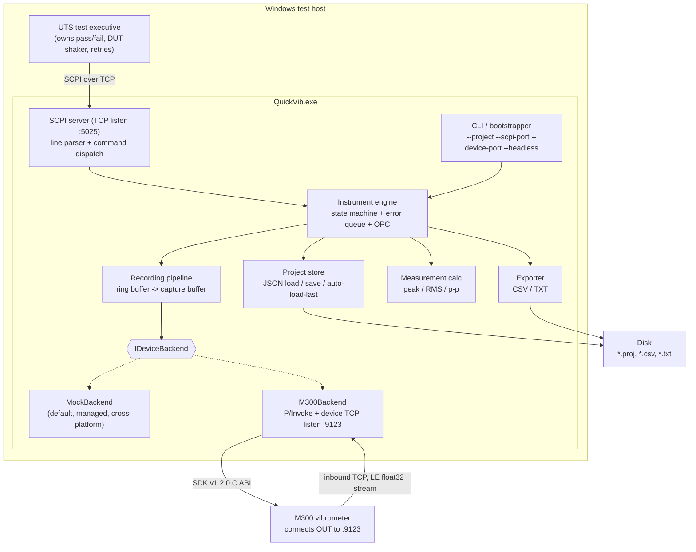
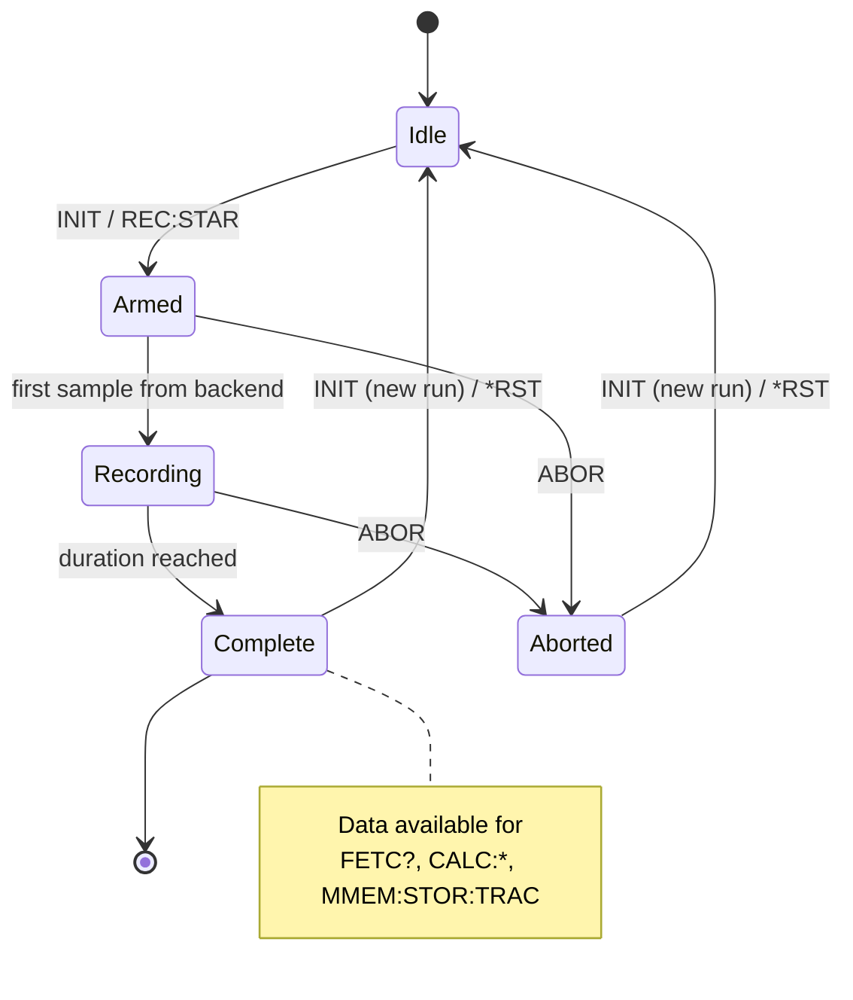

# QuickVib — Analysis and Implementation Plan

> Status: **plan only — no product code written yet.** This document is for review before any
> implementation begins. Nothing in this file is compiled; all code shown is illustrative pseudocode.

---

## 1. Executive summary

QuickVib is a small Windows console application that makes an **M300 laser Doppler vibrometer**
look and behave like a **Keysight-style SCPI instrument** to an existing UTS (unit test system).

The UTS launches `QuickVib.exe` from a Windows command prompt, then opens a TCP socket to it and
sends SCPI text commands (`*IDN?`, `INIT`, `FETC?`, …) exactly as it would to a bench instrument.
QuickVib translates those commands into M300 SDK v1.2.0 calls (C ABI, via P/Invoke), records a
fixed-duration vibration capture, and returns the samples and derived scalar measurements
(peak, RMS, peak-to-peak).

Two independent TCP roles exist and must not be confused:

| Role | Direction | Default port | Peer |
| --- | --- | --- | --- |
| **SCPI server** | QuickVib listens, UTS connects in | `5025` | UTS test executive |
| **Device server** | QuickVib listens, **M300 connects in** | `9123` | M300 vibrometer |

The M300 is the *inbound* party on the device link — QuickVib is the server on both sides. Sample
data arrives as a raw **little-endian `float32`** stream.

Deliberately narrow scope: QuickVib **records, measures, and exports**. It does **not** decide
pass/fail, does **not** drive DUT vibration, and does **not** own retry policy — those stay in the
UTS. There will be **no fake/stub native DLL** committed to the repo; the default backend is a
pure-managed **mock** so the whole product is developable and testable on Linux with `dotnet test`.

Target framework: **.NET 8** (SDK `8.0.424` is already available in this workspace, verified on
Linux x86-64). The app itself targets Windows for real hardware runs, but core libraries and all
tests are platform-neutral.

---

## 2. Current repo state analysis

```
/workspace
├── .git/
└── README.md        # contents: "# QuickVib"
```

* Single commit (`51bcdd3 Initial commit`), branch `cursor/build-quickvib-3de8` off `main`.
* No solution file, no projects, no CI, no `.gitignore`, no `.editorconfig`, no license.
* Working tree clean.

**Implication:** this is a greenfield build. Every convention — layout, naming, nullable settings,
analyzer level, CI — is ours to choose, so the plan below specifies them explicitly rather than
inferring from existing code. The first implementation phase must also add the housekeeping files
(`.gitignore`, `.editorconfig`, `Directory.Build.props`, CI workflow) that don't exist yet.

**Assumption to confirm with the requester:** the M300 SDK v1.2.0 headers/DLL are *not* in the repo
and will not be committed. The plan therefore treats the native surface as a documented contract
that is only exercised on a Windows machine with the real SDK installed.

---

## 3. Architecture

### 3.1 Component diagram



### 3.2 Recording sequence

```mermaid
sequenceDiagram
    participant UTS
    participant SCPI as SCPI server
    participant ENG as Engine
    participant BE as IDeviceBackend
    participant M300

    UTS->>SCPI: *IDN?
    SCPI-->>UTS: QuickVib,M300-SCPI,<serial>,1.0.0
    UTS->>SCPI: MMEM:LOAD:STAT "Test.proj"
    UTS->>SCPI: CONF:REC:DUR 5.0
    UTS->>SCPI: SYST:DEV:CONN?
    SCPI-->>UTS: 1
    UTS->>SCPI: INIT
    SCPI->>ENG: start recording
    ENG->>BE: StartAsync(duration)
    M300-->>BE: LE float32 samples (streaming)
    SCPI-->>UTS: (no response; INIT is a command)
    UTS->>SCPI: REC:WAIT?
    Note over ENG: recording completes
    ENG-->>UTS: #REC:DONE (async notification)
    SCPI-->>UTS: 1 (REC:WAIT? unblocks)
    UTS->>SCPI: CALC:MEAS:ALL?
    SCPI-->>UTS: 12.3400,4.5600,24.6800
    UTS->>SCPI: MMEM:STOR:TRAC "run001.csv"
    SCPI-->>UTS: (file written)
```

### 3.3 Instrument state machine



`REC:STAT?` maps directly onto these states (`IDLE|ARMED|RECORDING|COMPLETE|ABORTED`).

---

## 4. Project structure

```
QuickVib/
├── QuickVib.sln
├── .gitignore
├── .editorconfig
├── Directory.Build.props            # net8.0, nullable enable, warnings-as-errors, LangVersion latest
├── README.md                        # bilingual EN + ZH
├── docs/
│   ├── PLAN.md                      # this file
│   ├── SCPI.md                      # full command reference (expanded from §6)
│   └── M300-NATIVE.md               # documented native ABI contract, no binaries
├── samples/
│   └── Test.proj                    # sample JSON project (see §11)
├── src/
│   ├── QuickVib.Core/               # net8.0, platform-neutral, no I/O to console
│   │   ├── Instrument/
│   │   │   ├── InstrumentEngine.cs
│   │   │   ├── InstrumentState.cs
│   │   │   ├── ErrorQueue.cs            # SCPI-99 error codes for SYST:ERR?
│   │   │   └── OperationComplete.cs     # *OPC / *OPC? bookkeeping
│   │   ├── Scpi/
│   │   │   ├── ScpiLexer.cs             # header/short-form/long-form matching
│   │   │   ├── ScpiCommandTree.cs       # registration + dispatch
│   │   │   ├── ScpiSession.cs           # per-connection state
│   │   │   └── ScpiResponseFormatter.cs
│   │   ├── Projects/
│   │   │   ├── ProjectFile.cs           # POCO for the JSON schema (§9)
│   │   │   ├── ProjectStore.cs          # load/save/validate
│   │   │   └── LastProjectTracker.cs    # auto-load-last support
│   │   ├── Recording/
│   │   │   ├── RecordingSession.cs
│   │   │   ├── SampleRingBuffer.cs
│   │   │   └── CaptureResult.cs
│   │   ├── Measurements/
│   │   │   ├── MeasurementCalculator.cs # peak / RMS / p-p
│   │   │   └── MeasurementSet.cs
│   │   ├── Export/
│   │   │   ├── ITraceExporter.cs
│   │   │   ├── CsvExporter.cs
│   │   │   └── TxtExporter.cs
│   │   └── Devices/
│   │       ├── IDeviceBackend.cs        # §8
│   │       ├── DeviceCapabilities.cs
│   │       ├── SampleBatch.cs
│   │       └── Mock/MockDeviceBackend.cs
│   ├── QuickVib.Device.M300/        # net8.0-windows, real SDK P/Invoke + device TCP server
│   │   ├── M300DeviceBackend.cs
│   │   ├── M300Interop.cs               # [DllImport] declarations only
│   │   ├── M300StreamReader.cs          # LE float32 framing off the inbound socket
│   │   └── DeviceTcpListener.cs         # listens :9123, accepts M300 inbound
│   └── QuickVib.App/                # net8.0 console exe, entry point
│       ├── Program.cs
│       ├── CommandLineOptions.cs
│       ├── ScpiTcpServer.cs             # listens :5025, one session per client
│       └── BackendFactory.cs            # mock by default; M300 only on Windows
└── tests/
    ├── QuickVib.Core.Tests/         # xUnit, runs on Linux
    ├── QuickVib.Integration.Tests/  # loopback TCP against real ScpiTcpServer + mock backend
    └── QuickVib.TestKit/            # shared fixtures, fake clock, ScpiClient helper
```

Rationale for the split: `QuickVib.Core` holds everything that can be unit-tested without Windows
or hardware; `QuickVib.Device.M300` is the only assembly that touches the native SDK and is the only
one that is Windows-targeted, so a Linux `dotnet test` never needs it. `QuickVib.App` is a thin
composition root.

---

## 5. Component design

### 5.1 CLI / bootstrapper (`QuickVib.App`)

* Parses arguments (see §10). Prefer `System.CommandLine` if a dependency is acceptable; otherwise a
  ~120-line hand-rolled parser keeps the dependency graph at zero. **Recommendation: hand-rolled**,
  because the surface is five flags and the UTS invokes it from a plain `cmd` line where argument
  quirks matter more than features.
* Resolution order for the project to open: `--project <path>` → auto-load-last (if enabled and a
  last-project record exists) → start with no project loaded (SCPI still answers `*IDN?` etc.).
* Selects the backend: **mock is the default**. The real device is opt-in via `--backend m300`
  (proposed addition, see §13 open questions) or by the project file's `device.backend` field.
* Starts the SCPI listener, prints a one-line banner with both ports, then blocks until Ctrl-C or a
  shutdown request. With `--headless` there is no interactive console UI at all — only structured
  log lines on stdout/stderr, suitable for capture by the UTS.
* Exit codes: `0` clean shutdown, `2` bad arguments, `3` port bind failure, `4` project load failure
  (only when `--project` was explicitly given).

### 5.2 SCPI server

* `TcpListener` on `--scpi-port` (default `5025`, the IANA/VXI-11 "hislip/scpi-raw" convention).
* Accepts multiple concurrent clients; **the instrument model is shared**, mirroring a real
  instrument where two sessions can both talk to one box. Each session gets its own output queue and
  its own `*OPC?` pending flag; the error queue is shared and global, as on Keysight hardware.
* Line protocol: commands terminated by `\n` (tolerate `\r\n`). Responses terminated by `\n`.
  Semicolon-chained compound messages (`*CLS;*IDN?`) are supported by splitting on `;` with
  standard SCPI header-path semantics for leading-colon rules.
* Parsing rules follow IEEE 488.2 / SCPI-99 essentials: case-insensitive, short and long forms
  accepted (`MEAS` == `MEASure`), optional nodes, `?` suffix denotes a query.
* Unknown headers push `-113,"Undefined header"` onto the error queue and return nothing (queries
  additionally return nothing, which is standard behavior — the UTS discovers the fault via
  `SYST:ERR?`).
* **Async notification:** when a recording finishes, the engine pushes the literal line `#REC:DONE`
  to every connected session that has notifications enabled. The `#` prefix marks it as
  out-of-band so a UTS reading a query response can distinguish it. `REC:WAIT?` is the blocking
  alternative for clients that prefer request/response.

### 5.3 Device TCP server (`QuickVib.Device.M300`)

* `TcpListener` on `--device-port` (default `9123`). **QuickVib is the server; the M300 dials in.**
* On accept: validate the peer against `device.allowedPeers` if configured, then hand the socket to
  `M300StreamReader`.
* `M300StreamReader` reads into a pooled `byte[]`, tracks a partial-sample remainder across reads,
  and converts complete 4-byte groups with `BinaryPrimitives.ReadSingleLittleEndian`. On a
  big-endian host it would byte-swap, but the conversion API makes that automatic.
* Reconnection is expected and tolerated: a dropped socket during `Idle` is logged; during
  `Recording` it fails the capture with error `-240,"Hardware error"` and moves to `Aborted`.
* Health is surfaced through `SYST:DEV:CONN?`.

### 5.4 Backends

`IDeviceBackend` (§8) is deliberately thin: connect, describe capabilities, start/stop a stream,
push sample batches to a consumer. Everything above it — buffering, duration enforcement, unit
conversion bookkeeping, measurement math, export — lives in `Core` and is therefore shared and
tested once.

* **`MockDeviceBackend` (default).** Generates a deterministic signal from a seeded PRNG plus
  configurable sine components (frequency, amplitude, phase) and optional Gaussian noise, at the
  project's sample rate. Uses an injected clock so tests can run a "5-second" capture in
  milliseconds. Because the expected peak/RMS/p-p of a synthesized sine are analytically known, the
  mock doubles as the oracle for measurement-math tests.
* **`M300DeviceBackend`.** Wraps the SDK v1.2.0 C ABI plus the inbound socket. Only built for
  `net8.0-windows`.

### 5.5 Project model

* `ProjectStore.Load(path)` → deserialize with `System.Text.Json`, then validate (sample rate > 0,
  duration > 0, known unit, known backend). Validation failures become
  `-224,"Illegal parameter value"` with a human-readable detail in the log.
* `MMEM:STOR:STAT` writes the current in-memory project (including any `CONF:REC:DUR` override) back
  to disk with indented JSON.
* **Auto-load-last:** the path of the most recently loaded/saved project is persisted to
  `%LOCALAPPDATA%\QuickVib\last-project.json` (on Linux, `$XDG_STATE_HOME` or `~/.local/state`).
  `MMEM:LOAD:AUTO` re-runs that resolution on demand; startup does it implicitly unless `--project`
  was supplied. If the recorded path no longer exists, it is silently skipped and logged.

### 5.6 Recording pipeline

1. `INIT` (or `REC:STAR`) validates that a project is loaded and the device is connected, then
   transitions `Idle → Armed`.
2. The pipeline computes `expectedSamples = ceil(durationSeconds * sampleRate)` and allocates the
   capture buffer up front, so a run has a bounded, predictable memory footprint
   (e.g. 5 s × 100 kS/s × 4 B ≈ 2 MB).
3. Sample batches from the backend are appended under a lock-free single-producer/single-consumer
   discipline. First batch flips `Armed → Recording` and stamps `t0`.
4. When `expectedSamples` is reached the session completes, computes measurements eagerly (cheap:
   one pass, O(n)), sets the `OPC` bit, releases `REC:WAIT?` waiters, and emits `#REC:DONE`.
5. A watchdog timer of `duration + graceMultiplier` (default 2× + 1 s) aborts a stalled capture with
   `-365,"Time out error"` rather than hanging the UTS forever.
6. `ABOR` cancels via `CancellationToken`, keeps whatever samples arrived, and marks `Aborted`.
   Whether aborted data is fetchable is an open question (§13).

### 5.7 Measurement calculation

Single pass over the capture buffer producing:

| Metric | Definition |
| --- | --- |
| Peak | `max(abs(x_i))` |
| RMS | `sqrt( (1/N) * Σ x_i² )` |
| Peak-to-peak | `max(x_i) - min(x_i)` |

Accumulate in `double` even though samples are `float`, to avoid precision loss on long captures.
Optional DC removal (subtract the mean before peak/RMS) is a project-level flag,
`measurement.removeDc`, defaulting to `false` so the raw instrument reading is reported unless
explicitly requested. Units follow the project's configured channel unit: velocity **μm/s**,
displacement **μm**, acceleration **m/s²**.

### 5.8 Export

* `FORM CSV|TXT` selects the active format; `MMEM:STOR:TRAC "<path>"` writes the last capture.
* **CSV:** a short comment/metadata preamble (`# project`, `# timestamp`, `# sampleRate`, `# unit`,
  `# samples`), then a header row `index,time_s,value`, then one row per sample. Invariant culture,
  `G9` round-trip formatting for `float`, `\r\n` line endings for Windows tooling friendliness.
* **TXT:** one value per line, no header — the minimal form for scripts that just want numbers.
* Paths are resolved relative to the project's `export.directory` when not absolute. Directories are
  created if missing. Existing files are overwritten (documented behavior).

---

## 6. SCPI command reference

Short forms are shown in uppercase, optional long-form completion in lowercase. All queries return a
single `\n`-terminated line unless stated otherwise.

### 6.1 IEEE 488.2 mandated

| Command | Type | Response | Behavior |
| --- | --- | --- | --- |
| `*IDN?` | Query | `QuickVib,M300-SCPI,<serial>,<fw>` | Four comma-separated fields: manufacturer, model, serial, firmware/app version. All four are **configurable** (CLI/project/config file) so the UTS's expected-ID check can be satisfied. Serial defaults to the device serial when connected, else `0`. |
| `*RST` | Command | — | Abort any recording, discard capture data, reset duration/format to project defaults, keep the loaded project, clear error queue. Returns to `Idle`. |
| `*CLS` | Command | — | Clear the error queue and status/event registers. Does not touch data or state. |
| `*OPC` | Command | — | Sets the OPC bit in the standard event register once all pending overlapped operations (i.e. an active recording) complete. |
| `*OPC?` | Query | `1` | Blocks until pending operations complete, then returns `1`. Subject to the session read timeout on the UTS side. |
| `SYST:ERR?` | Query | `<code>,"<message>"` | Pops the oldest entry from the FIFO error queue. Returns `0,"No error"` when empty. Queue depth 32; overflow replaces the last entry with `-350,"Queue overflow"`. |

### 6.2 Project / mass-memory

| Command | Type | Response | Behavior |
| --- | --- | --- | --- |
| `MMEM:LOAD:STAT "<path>"` | Command | — | Load a JSON project file. Errors: `-256,"File name not found"`, `-224,"Illegal parameter value"` on schema violation. Updates the last-project record. |
| `MMEM:STOR:STAT "<path>"` | Command | — | Save the current project (including runtime overrides) to `<path>`. Updates the last-project record. |
| `MMEM:LOAD:AUTO` | Command | — | Load the most recently used project. `-256` if no record exists or the recorded file is gone. |
| `MMEM:LOAD:AUTO?` | Query | `"<path>"` \| `""` | *(proposed)* Report the path that auto-load would use. Useful for UTS diagnostics. |
| `MMEM:STOR:TRAC "<path>"` | Command | — | Export the last completed capture using the active `FORM` format. `-221,"Settings conflict"` if no capture data exists. |

### 6.3 Configuration

| Command | Type | Response | Behavior |
| --- | --- | --- | --- |
| `CONF:REC:DUR <seconds>` | Command | — | Set record duration in seconds (float). Range `(0, 3600]`; out of range → `-222,"Data out of range"`. Overrides the project value for this run; persisted only by `MMEM:STOR:STAT`. |
| `CONF:REC:DUR?` | Query | `5.000` | Current duration, three decimals. |
| `FORM CSV\|TXT` | Command | — | Select export format. Unknown value → `-224`. |
| `FORM?` | Query | `CSV` | Active format. |

### 6.4 Recording control

| Command | Type | Response | Behavior |
| --- | --- | --- | --- |
| `INIT` | Command | — | Start a recording. Alias of `REC:STAR`. Errors: `-221,"Settings conflict"` if a recording is already active; `-241,"Hardware missing"` if the device is not connected; `-221` if no project is loaded. Non-blocking (overlapped operation). |
| `REC:STAR` | Command | — | Identical to `INIT`; provided because the UTS's vocabulary uses it. |
| `ABOR` | Command | — | Abort the active recording. No error if already idle (standard SCPI leniency). |
| `REC:STAT?` | Query | `IDLE\|ARMED\|RECORDING\|COMPLETE\|ABORTED` | Current state; non-blocking, safe to poll. |
| `REC:WAIT?` | Query | `1` \| `0` | Blocks until the active recording reaches `Complete` (`1`) or `Aborted`/timeout (`0`). If already complete, returns immediately. Server-side cap = watchdog timeout, so it can never hang forever. |

### 6.5 Data retrieval

| Command | Type | Response | Behavior |
| --- | --- | --- | --- |
| `FETC?` | Query | `v1,v2,…,vN` | Comma-separated ASCII samples from the last completed capture. `-230,"Data corrupt or stale"` if there is no capture. For large captures this line is long — see §13 open question on definite-length block format. |
| `TRAC:DATA?` | Query | same as `FETC?` | Alias, for UTS scripts using the trace vocabulary. |
| `TRAC:POIN?` | Query | `500000` | *(proposed)* Sample count, so the UTS can size its read buffer before `FETC?`. |

### 6.6 Calculated measurements

| Command | Type | Response | Behavior |
| --- | --- | --- | --- |
| `CALC:MEAS:PEAK?` | Query | `12.3400` | `max(abs(x))` in project units. |
| `CALC:MEAS:RMS?` | Query | `4.5600` | Root mean square. |
| `CALC:MEAS:PP?` | Query | `24.6800` | `max - min`. |
| `CALC:MEAS:ALL?` | Query | `12.3400,4.5600,24.6800` | Peak, RMS, p-p in that fixed order — one round trip instead of three. |

All four return `-230,"Data corrupt or stale"` when no completed capture exists. Numeric format is
invariant-culture fixed-point with 4 decimals by default, configurable via
`measurement.responseFormat`.

### 6.7 System / device

| Command | Type | Response | Behavior |
| --- | --- | --- | --- |
| `SYST:DEV:CONN?` | Query | `1` \| `0` | `1` when a device backend session is live (mock is always `1` once started; M300 requires an accepted inbound socket). |
| `SYST:VERS?` | Query | `1999.0` | *(proposed)* SCPI standard version, conventional on Keysight gear. |

### 6.8 Async notification

| Line | Direction | Meaning |
| --- | --- | --- |
| `#REC:DONE` | QuickVib → UTS | Pushed unsolicited to connected sessions when a recording completes successfully. |
| `#REC:ABORT` | QuickVib → UTS | *(proposed)* Pushed when a recording aborts or times out, so a UTS waiting on notifications isn't left hanging. |

---

## 7. Error code catalogue

Standard SCPI-99 codes are reused rather than invented, so the UTS's existing error handling works:

| Code | Message | Raised when |
| --- | --- | --- |
| `0` | `No error` | Queue empty |
| `-100` | `Command error` | Malformed message |
| `-113` | `Undefined header` | Unknown command |
| `-221` | `Settings conflict` | No project loaded / already recording / no data to export |
| `-222` | `Data out of range` | Duration outside `(0, 3600]` |
| `-224` | `Illegal parameter value` | Bad `FORM` value, invalid project schema |
| `-230` | `Data corrupt or stale` | Query for data with no completed capture |
| `-240` | `Hardware error` | Device link dropped mid-capture |
| `-241` | `Hardware missing` | No device connected at `INIT` |
| `-256` | `File name not found` | Project file missing |
| `-257` | `File name error` | Path invalid or not writable |
| `-350` | `Queue overflow` | More than 32 unread errors |
| `-365` | `Time out error` | Watchdog fired during capture |

---

## 8. `IDeviceBackend` interface sketch

> Pseudocode / interface shape only. Not a source file. Names and signatures are proposals for
> review.

```
namespace QuickVib.Core.Devices

/// Unit of the sample stream, as configured on the device.
enum SampleUnit { VelocityMicrometersPerSecond, DisplacementMicrometers, AccelerationMetersPerSecondSquared }

/// Immutable description of what the connected device can do.
record DeviceCapabilities(
    string   Model,
    string   SerialNumber,
    string   FirmwareVersion,
    double   SampleRateHz,
    SampleUnit Unit,
    double   MaxRecordSeconds)

/// One contiguous chunk of samples, already converted from LE float32 to host float.
readonly struct SampleBatch(ReadOnlyMemory<float> Samples, long StartIndex, DateTimeOffset ArrivedAt)

interface IDeviceBackend : IAsyncDisposable
{
    /// True once the transport is live. For M300: an inbound socket has been accepted.
    /// For mock: true after OpenAsync. Backs SYST:DEV:CONN?.
    bool IsConnected { get; }

    /// Raised on connect/disconnect so the engine can update state and log.
    event EventHandler<DeviceConnectionChangedEventArgs> ConnectionChanged;

    /// Bring up the transport. For M300 this starts the :9123 listener and, if the SDK requires it,
    /// calls the native open/handshake entry points. Idempotent.
    Task OpenAsync(DeviceOpenOptions options, CancellationToken ct);

    /// Capabilities of the currently connected device. Throws DeviceNotConnectedException if !IsConnected.
    Task<DeviceCapabilities> GetCapabilitiesAsync(CancellationToken ct);

    /// Begin streaming. Batches are delivered to onBatch on a background reader; the returned
    /// task completes when the requested duration's worth of samples has been delivered,
    /// the token is cancelled, or the link fails.
    Task<StreamOutcome> StreamAsync(
        StreamRequest request,               // duration, expected sample count, unit
        Func<SampleBatch, CancellationToken, ValueTask> onBatch,
        CancellationToken ct);

    /// Stop an in-flight stream promptly; safe to call when nothing is running.
    Task StopAsync(CancellationToken ct);
}

enum StreamOutcome { Completed, Cancelled, LinkLost, TimedOut }
```

Design notes:

* **Push, not pull.** A callback avoids an intermediate queue for the M300's socket reader and keeps
  the mock trivial.
* **No file, project, or SCPI concepts leak in.** The backend knows only about samples.
* **Cancellation is first-class** so `ABOR` and the watchdog share one mechanism.
* **`IAsyncDisposable`** because both implementations own sockets and (for M300) native handles.

---

## 9. JSON project file schema

Version 1. Unknown properties are ignored on read (forward compatibility); `schemaVersion` mismatch
on a *major* bump is rejected with `-224`.

| Path | Type | Required | Default | Notes |
| --- | --- | --- | --- | --- |
| `schemaVersion` | int | yes | — | `1` |
| `name` | string | yes | — | Human-readable project name |
| `description` | string | no | `""` | Free text |
| `device.backend` | string | no | `"mock"` | `"mock"` \| `"m300"` |
| `device.port` | int | no | `9123` | Inbound port the M300 dials |
| `device.sampleRateHz` | number | yes | — | e.g. `100000` |
| `device.unit` | string | yes | — | `"velocity_um_s"` \| `"displacement_um"` \| `"acceleration_m_s2"` |
| `device.allowedPeers` | string[] | no | `[]` | Empty = accept any inbound peer |
| `device.connectTimeoutSeconds` | number | no | `30` | How long to wait for the M300 to dial in |
| `recording.durationSeconds` | number | yes | — | `(0, 3600]` |
| `recording.timeoutMultiplier` | number | no | `2.0` | Watchdog = duration × this + 1 s |
| `measurement.removeDc` | bool | no | `false` | Subtract mean before peak/RMS |
| `measurement.responseFormat` | string | no | `"F4"` | .NET numeric format for `CALC:*` |
| `export.format` | string | no | `"CSV"` | `"CSV"` \| `"TXT"` |
| `export.directory` | string | no | `"."` | Base for relative export paths |
| `export.includeHeader` | bool | no | `true` | CSV metadata preamble + header row |
| `identity.manufacturer` | string | no | `"QuickVib"` | `*IDN?` field 1 |
| `identity.model` | string | no | `"M300-SCPI"` | `*IDN?` field 2 |
| `identity.serialNumber` | string | no | device serial or `"0"` | `*IDN?` field 3 |
| `identity.firmwareVersion` | string | no | app version | `*IDN?` field 4 |
| `mock.signal.components[]` | object[] | no | one 100 Hz component | `{ frequencyHz, amplitude, phaseDeg }` |
| `mock.signal.noiseStdDev` | number | no | `0` | Gaussian noise σ |
| `mock.signal.seed` | int | no | `12345` | Determinism for tests |

---

## 10. CLI argument reference

| Argument | Value | Default | Behavior |
| --- | --- | --- | --- |
| `--project <path>` | file path | *(auto-load-last)* | Load this project at startup. Failure to load is fatal (exit `4`). |
| `--scpi-port <n>` | 1–65535 | `5025` | Port the SCPI server listens on for the UTS. |
| `--device-port <n>` | 1–65535 | `9123` | Port the device server listens on for the M300's inbound connection. |
| `--headless` | flag | off | No interactive console UI; structured log lines only. Intended for UTS-launched runs. |
| `--backend <mock\|m300>` | enum | `mock` | *(proposed)* Override the project's backend selection. Keeps mock the default even when a project says `m300`, if the operator asks for it. |
| `--no-auto-load` | flag | off | *(proposed)* Suppress auto-load-last (useful for a clean UTS run). |
| `--log-level <level>` | enum | `info` | *(proposed)* `trace\|debug\|info\|warn\|error`. |
| `--version` | flag | — | Print version and exit `0`. |
| `--help` | flag | — | Print usage and exit `0`. |

Example UTS invocation:

```
QuickVib.exe --project C:\Tests\Test.proj --scpi-port 5025 --device-port 9123 --headless
```

---

## 11. Sample `Test.proj`

> To be created at `samples/Test.proj` **during implementation** — shown here for review only.

```json
{
  "schemaVersion": 1,
  "name": "Test",
  "description": "Sample QuickVib project: 5 s velocity capture, CSV export.",
  "device": {
    "backend": "mock",
    "port": 9123,
    "sampleRateHz": 100000,
    "unit": "velocity_um_s",
    "allowedPeers": [],
    "connectTimeoutSeconds": 30
  },
  "recording": {
    "durationSeconds": 5.0,
    "timeoutMultiplier": 2.0
  },
  "measurement": {
    "removeDc": false,
    "responseFormat": "F4"
  },
  "export": {
    "format": "CSV",
    "directory": "./out",
    "includeHeader": true
  },
  "identity": {
    "manufacturer": "QuickVib",
    "model": "M300-SCPI",
    "serialNumber": "SN-0001",
    "firmwareVersion": "1.0.0"
  },
  "mock": {
    "signal": {
      "components": [
        { "frequencyHz": 120.0, "amplitude": 250.0, "phaseDeg": 0.0 },
        { "frequencyHz": 360.0, "amplitude": 40.0, "phaseDeg": 90.0 }
      ],
      "noiseStdDev": 2.5,
      "seed": 12345
    }
  }
}
```

---

## 12. Mock vs M300 backend strategy (P/Invoke without a fake DLL)

The constraint is: **no fake/stub native DLL in the repo**, yet everything must build and test on
Linux. The approach:

1. **Isolate the native surface.** Every `[DllImport("M300Sdk", …)]` lives in exactly one file,
   `M300Interop.cs`, inside `QuickVib.Device.M300`, which targets `net8.0-windows`. Nothing in
   `Core`, `App` (composition aside), or the test projects references the native names.
2. **Never load it by accident.** .NET resolves `DllImport` lazily, at first call. Simply
   referencing the assembly does not probe for `M300Sdk.dll`. The `BackendFactory` only constructs
   `M300DeviceBackend` when the backend is explicitly `m300` **and** `OperatingSystem.IsWindows()`
   is true; otherwise it constructs the mock. So a Linux `dotnet test` never reaches a P/Invoke.
3. **Solution-level guard.** The Linux CI job builds and tests `QuickVib.Core`,
   `QuickVib.App`, and the test projects via a solution filter (`QuickVib.Linux.slnf`) that excludes
   the Windows-only project. The full solution builds on a Windows job (or is simply documented as
   Windows-only if no Windows CI runner is available — see §13).
4. **Test the translation layer without the DLL.** The interesting, bug-prone logic in the M300 path
   is *framing*: turning a byte stream with arbitrary chunk boundaries into `float32` samples. That
   logic lives in `M300StreamReader`, which takes a `Stream` (or `PipeReader`), not a socket, and has
   **no native dependency**. It can therefore live in `Core` (or be linked into a
   platform-neutral `QuickVib.Device.Streaming` project) and be fully unit-tested on Linux with
   `MemoryStream` inputs, including pathological 1-byte-at-a-time chunking. Same for
   `DeviceTcpListener`, which is pure BCL sockets and testable over loopback.
5. **Document, don't fake, the ABI.** `docs/M300-NATIVE.md` records the exact SDK v1.2.0 entry points,
   signatures, calling convention, string marshalling, error-code semantics, and threading rules that
   `M300Interop.cs` assumes. That document is the review artifact standing in for the untestable part.
6. **`NativeLibrary.SetDllImportResolver`** is registered in `M300DeviceBackend`'s static
   initializer so the SDK can be found next to the exe or in a configured directory, and so a
   *missing* SDK produces a clean `-241,"Hardware missing"` with an actionable log line instead of a
   raw `DllNotFoundException`.
7. **A single Windows smoke checklist** (manual, in `docs/M300-NATIVE.md`) covers what CI cannot:
   real device dials in, capabilities read back, 5 s capture, sample count matches, CSV opens.

Net effect: mock is the default and the entire product except ~200 lines of interop is exercised on
Linux in CI.

---

## 13. Test strategy

All tests target `net8.0`, use **xUnit** + **FluentAssertions** (or plain `Assert` if a
zero-extra-dependency stance is preferred), and run with `dotnet test` on Linux. No test requires
Windows, hardware, or the SDK.

### 13.1 Unit tests (`QuickVib.Core.Tests`)

| Area | Representative cases |
| --- | --- |
| SCPI lexer/parser | Short vs long form (`CONF:REC:DUR` == `CONFigure:RECord:DURation`); case insensitivity; `?` detection; quoted string arguments with embedded spaces and escaped quotes; semicolon-chained messages; leading-colon path reset; malformed input → `-100`. |
| Command dispatch | Every command in §6 dispatches to the right handler with the right parsed arguments; unknown header → `-113`. |
| Error queue | FIFO ordering; `0,"No error"` when empty; `*CLS` clears; 32-deep overflow → `-350`. |
| State machine | Legal transitions; `INIT` while recording → `-221`; `ABOR` from `Idle` is a no-op; `*RST` from every state lands in `Idle`. |
| Measurements | Analytic oracle: pure sine amplitude `A` ⇒ peak `A`, RMS `A/√2`, p-p `2A` within tolerance; DC offset with and without `removeDc`; constant signal ⇒ RMS = value, p-p = 0; empty/one-sample edge cases; `double` accumulation on a long buffer. |
| Project store | Round-trip load→save→load equality; missing required field → `-224`; unknown extra property ignored; missing file → `-256`; auto-load-last record write/read; stale recorded path skipped. |
| Stream framing | LE float32 decode; split across chunk boundaries at every offset 1–3; 1-byte-at-a-time delivery; trailing partial sample retained; NaN/Inf pass-through; large buffer performance sanity. |
| Exporters | CSV preamble + header + row count; invariant culture with a `de-DE` `CultureInfo` forced (catches comma-decimal bugs); `G9` round-trip fidelity; TXT one-value-per-line; directory auto-creation; overwrite. |
| Mock backend | Determinism for a fixed seed; sample count == `duration × rate`; cancellation stops promptly; multi-component signal superposition. |
| CLI parsing | Defaults; each flag; invalid port → exit `2`; unknown flag → exit `2`; `--help`/`--version`. |

### 13.2 Integration tests (`QuickVib.Integration.Tests`)

Spin up the real `ScpiTcpServer` on an ephemeral port (port `0`, read back the bound port) with the
mock backend and a fake clock, and drive it with a small `ScpiClient` helper from `QuickVib.TestKit`:

* **Full happy path:** `*IDN?` → `MMEM:LOAD:STAT` → `CONF:REC:DUR 0.1` → `SYST:DEV:CONN?` → `INIT` →
  `REC:WAIT?` → `CALC:MEAS:ALL?` → `MMEM:STOR:TRAC` → assert the file exists with the right row count.
* **`#REC:DONE` notification** arrives on a session that issued `INIT` and is just reading.
* **`REC:STAT?` polling loop** observes `ARMED`/`RECORDING` then `COMPLETE`.
* **`ABOR` mid-capture** → `ABORTED`, and `REC:WAIT?` returns `0`.
* **Watchdog timeout** with a mock configured to stall → `-365` and `ABORTED`.
* **Two concurrent sessions** share instrument state; each gets its own `*OPC?` resolution.
* **Error paths:** `INIT` with no project → `-221`; `FETC?` with no data → `-230`;
  `MMEM:LOAD:STAT "nope.proj"` → `-256`.
* **Device link:** a fake "M300" client connects to a `DeviceTcpListener` on loopback and pushes LE
  float32 bytes; `SYST:DEV:CONN?` flips `0`→`1`→`0` across connect/disconnect; disconnect mid-capture
  → `-240`.
* **Line-ending tolerance:** `\n` and `\r\n` both accepted.

### 13.3 What is *not* covered by automated tests

Real SDK P/Invoke marshalling and real hardware timing. Covered instead by the manual Windows smoke
checklist in `docs/M300-NATIVE.md` (§12.7).

### 13.4 CI

A GitHub Actions workflow on `ubuntu-latest`: `dotnet restore` → `dotnet build -c Release` →
`dotnet test -c Release --collect coverage` against the Linux solution filter. Optionally a
`windows-latest` job that builds the full solution (compile-only for the M300 project; no device
tests).

---

## 14. Implementation phases

Each phase is independently reviewable and ends with a green `dotnet test` on Linux.

**Phase 0 — Scaffolding.** `.gitignore`, `.editorconfig`, `Directory.Build.props` (net8.0, nullable
enable, `TreatWarningsAsErrors`), solution + the five projects, Linux solution filter, CI workflow.
Deliverable: empty-but-building solution.

**Phase 1 — Domain core.** Project model + `ProjectStore` + validation, `MeasurementCalculator`,
CSV/TXT exporters, `SampleRingBuffer`. All unit-tested. No networking yet. Sample `Test.proj`.
*Highest test-value-per-line phase; entirely pure functions.*

**Phase 2 — Backends (mock) + streaming.** `IDeviceBackend`, `MockDeviceBackend` with the seeded
signal generator, LE float32 stream framing with exhaustive chunk-boundary tests, injected clock.

**Phase 3 — Instrument engine.** State machine, error queue, OPC bookkeeping, recording pipeline
with watchdog, `REC:WAIT?` waiter primitives, `#REC:DONE` notification fan-out.

**Phase 4 — SCPI layer.** Lexer, command tree, all commands from §6, response formatting, session
handling, compound-message support.

**Phase 5 — App / CLI / TCP.** Argument parsing, `ScpiTcpServer`, `BackendFactory`, auto-load-last,
`--headless` logging, exit codes. Integration tests over loopback (§13.2).

**Phase 6 — M300 backend.** `DeviceTcpListener` on `:9123`, `M300StreamReader` wiring,
`M300Interop.cs`, `NativeLibrary` resolver, `docs/M300-NATIVE.md`. Windows-only; not exercised in
Linux CI.

**Phase 7 — Docs and polish.** Bilingual README (§16), `docs/SCPI.md`, a copy-pasteable UTS example
transcript, version stamping, single-file publish profile for `QuickVib.exe`.

A reasonable first PR is Phases 0–2; they are self-contained and give reviewers the data model and
math before any protocol code lands.

---

## 15. Risks and open questions

### Risks

| Risk | Impact | Mitigation |
| --- | --- | --- |
| M300 SDK v1.2.0 ABI details (exact entry points, calling convention, string marshalling, whether the SDK itself owns the socket vs. QuickVib listening) are not in hand. | Phase 6 could need rework. | Keep the native surface behind `IDeviceBackend`; document assumptions in `docs/M300-NATIVE.md`; confirm before starting Phase 6. |
| `FETC?` on a 5 s × 100 kS/s capture is a ~6 MB single ASCII line. Some SCPI clients cap read buffers. | UTS read failures or timeouts. | Offer `TRAC:POIN?` first; consider IEEE 488.2 definite-length block (`#<n><len><bytes>`) as an alternative format — see open questions. |
| Unsolicited `#REC:DONE` interleaving with a query response could confuse a strict client. | Parsing errors on the UTS side. | Distinct `#` prefix; make notifications opt-out; never emit while a query response is mid-write (serialize per-session writes). |
| Real device timing jitter — samples arriving slower than nominal rate. | Captures ending short or watchdog false-positives. | Duration is enforced by sample count with a generous watchdog multiplier; log actual vs. expected rate. |
| Windows-only build steps could break Linux CI. | Red CI unrelated to the change. | Solution filter excluding the Windows project; verified from Phase 0. |
| No Windows CI runner may be available. | M300 project compiles only locally. | Document as a known gap; keep that project small and mechanical. |

### Open questions for the requester

1. **`*IDN?` exact string.** Does the UTS match on a specific manufacturer/model, or accept any
   four-field response? The plan makes all four fields configurable, but a known-good default is
   better than a guess.
2. **Aborted-capture data.** After `ABOR`, should `FETC?`/`CALC:*` return the partial samples, or
   report `-230`? Plan currently assumes **`-230`** (data only from completed captures).
3. **Large-data transfer format.** Is plain comma-separated ASCII acceptable for `FETC?` at the
   expected sample counts, or should a definite-length binary block be the primary form?
4. **Multiple channels.** Is the M300 always single-channel for this application, or must the
   project model and `TRAC:DATA?` carry a channel index? Plan assumes **single channel**.
5. **Unit selection at runtime.** Is the unit (velocity/displacement/acceleration) fixed per project,
   or should there be a `CONF:UNIT` command? Plan assumes **project-fixed**.
6. **Auto-load-last storage location.** Is `%LOCALAPPDATA%\QuickVib\` acceptable, or does the UTS
   environment require a fixed path next to the exe (e.g. locked-down or roaming profiles)?
7. **Concurrency policy.** Should a second SCPI client be rejected outright (many instruments allow
   one session), or share state as planned?
8. **Proposed commands.** Are `MMEM:LOAD:AUTO?`, `TRAC:POIN?`, `SYST:VERS?`, `#REC:ABORT`, and the
   `--backend` / `--no-auto-load` / `--log-level` flags wanted, or should the surface stay exactly as
   specified?
9. **Sample rate authority.** Is the sample rate read from the device capabilities, or commanded by
   the project file? Plan assumes the project declares it and the device value is logged if it
   disagrees.
10. **Dependencies.** Is `System.CommandLine` / `FluentAssertions` acceptable, or is a zero
    third-party-dependency stance preferred?

---

## 16. Out of scope

Explicitly **not** built, by requirement:

* **Pass/fail evaluation.** No limits, no verdicts, no tolerance bands. QuickVib returns numbers; the
  UTS judges them.
* **DUT vibration control.** No shaker/exciter drive, no stimulus generation on real hardware. The
  mock's synthesized signal is a *test fixture*, not DUT excitation.
* **Retry logic.** A failed or aborted capture is reported; re-running is the UTS's decision.
* **A fake/stub native DLL.** No `M300Sdk.dll` shim, no binary artifacts committed. Linux
  testability comes from the mock backend and from keeping the native surface tiny, not from faking
  the library.
* Also out of scope for v1: GUI, real-time plotting, FFT/spectral analysis, multi-channel capture,
  VISA/HiSLIP/VXI-11 transports (raw socket only), USBTMC, and data persistence beyond the explicit
  CSV/TXT export.

---

## 17. Bilingual README outline

One `README.md` with a language switcher at the top (`English | 中文`), English first, then a full
Chinese section covering the same ground — not an abridged translation.

### English section

1. **QuickVib** — one-paragraph description: SCPI-over-TCP wrapper around the M300 laser Doppler
   vibrometer for UTS integration.
2. **Requirements** — .NET 8 runtime; Windows for real hardware; M300 SDK v1.2.0 installed
   (not bundled); any OS for mock mode.
3. **Quick start** — build, then `QuickVib.exe --project samples\Test.proj --headless`; connect with
   `telnet`/PuTTY to `5025` and send `*IDN?`.
4. **Command-line reference** — table from §10.
5. **How it works** — the two TCP roles (UTS connects in on `5025`; M300 connects in on `9123`),
   the LE float32 stream, the record→measure→export flow. Include the architecture diagram.
6. **SCPI command reference** — the tables from §6, or a summary linking to `docs/SCPI.md`.
7. **Example UTS session** — an annotated transcript from `*IDN?` through `MMEM:STOR:TRAC`.
8. **Project file format** — schema table (§9) plus the `Test.proj` example.
9. **Mock vs. real device** — mock is the default; how to switch to the M300; where the SDK must be.
10. **Export formats** — CSV and TXT layout with a short sample of each.
11. **Measurements** — peak/RMS/p-p definitions, units, DC-removal option.
12. **Building and testing** — `dotnet build`, `dotnet test` (runs fully on Linux), CI notes.
13. **Troubleshooting** — port already in use; device never dials in; `SYST:ERR?` code table;
    `DllNotFoundException` for the SDK.
14. **Scope** — what QuickVib does not do (pass/fail, DUT vibration, retries), and why.
15. **License / contributing.**

### 中文部分 (Chinese section)

1. **QuickVib 简介** — 通过 SCPI over TCP 将 M300 激光多普勒测振仪封装为类 Keysight 仪器，供 UTS 调用。
2. **运行环境** — .NET 8；真实硬件需 Windows 与 M300 SDK v1.2.0（不随仓库分发）；模拟模式支持任意平台。
3. **快速开始** — 编译后运行 `QuickVib.exe --project samples\Test.proj --headless`，用 telnet 连接
   `5025` 端口并发送 `*IDN?`。
4. **命令行参数说明** — 参数表（对应 §10）。
5. **工作原理** — 两个 TCP 角色：UTS 主动连接 `5025`；M300 主动连入 `9123`。小端 float32 数据流；
   录制→测量→导出流程；附架构图。
6. **SCPI 命令参考** — 命令表（对应 §6）。
7. **UTS 会话示例** — 从 `*IDN?` 到 `MMEM:STOR:TRAC` 的完整交互示例及注释。
8. **工程文件格式** — JSON 字段说明与 `Test.proj` 示例。
9. **模拟后端与真实设备** — 默认使用模拟后端；如何切换到 M300；SDK 放置位置。
10. **导出格式** — CSV 与 TXT 的字段与样例。
11. **测量定义** — 峰值 / 有效值(RMS) / 峰峰值的计算方式、单位与去直流选项。
12. **编译与测试** — `dotnet build`、`dotnet test`（可在 Linux 上完整运行）。
13. **常见问题排查** — 端口被占用、设备未连入、`SYST:ERR?` 错误码对照、SDK 未找到。
14. **功能边界** — 不做判定（pass/fail）、不驱动 DUT 振动、不做重试逻辑，这些由 UTS 负责。
15. **许可证与贡献指南。**

---

## 18. Definition of done (v1)

* `dotnet build` and `dotnet test` pass on Linux with zero warnings.
* Every command in §6 is implemented and covered by at least one integration test against the mock.
* `QuickVib.exe --project samples\Test.proj --headless` starts, answers `*IDN?`, and completes a
  full record→measure→export cycle with the mock backend.
* `docs/SCPI.md`, `docs/M300-NATIVE.md`, and the bilingual `README.md` are complete.
* No native binaries and no fake DLL in the repo.
* Open questions in §15 are resolved or explicitly deferred with a recorded decision.
