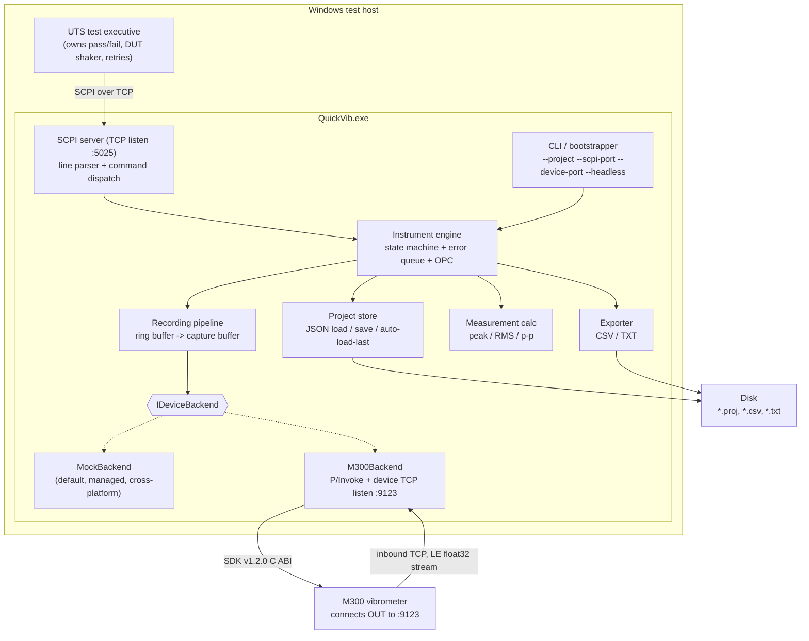
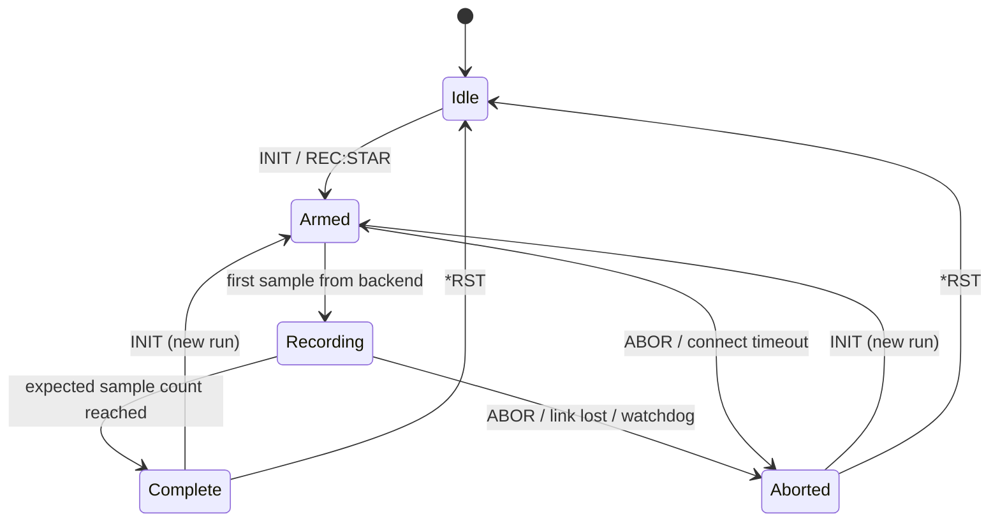

# QuickVib — Analysis and Implementation Plan

> Status: **plan only — no product code written yet.** This document is the review artifact that
> precedes implementation. Nothing here is compiled; every code block is illustrative pseudocode or a
> proposed file format, not a source file.

---

## 1. Executive summary

QuickVib is a small Windows console application that makes an **M300 laser Doppler vibrometer**
look and behave like a **Keysight-style SCPI instrument** to an existing UTS (unit test system).

The UTS launches `QuickVib.exe` from a Windows command prompt, then opens a TCP socket to it and
sends SCPI text commands (`*IDN?`, `INIT`, `FETC?`, …) exactly as it would to a bench instrument.
QuickVib translates those commands into M300 SDK v1.2.0 calls (C ABI, via P/Invoke), records a
fixed-duration vibration capture, and returns the samples and derived scalar measurements
(peak, RMS, peak-to-peak).

Two independent TCP roles exist and must not be confused:

| Role | Direction | Default port | Peer |
| --- | --- | --- | --- |
| **SCPI server** | QuickVib listens, UTS connects in | `5025` | UTS test executive |
| **Device server** | QuickVib listens, **M300 connects in** | `9123` | M300 vibrometer |

The M300 is the *inbound* party on the device link — QuickVib is the server on both sides. Sample
data arrives as a raw **little-endian `float32`** stream.

Deliberately narrow scope: QuickVib **records, measures, and exports**. It does **not** decide
pass/fail, does **not** drive DUT vibration, and does **not** own retry policy — those stay in the
UTS. There will be **no fake/stub native DLL** committed to the repo; the default backend is a
pure-managed **mock** so the whole product is developable and testable on Linux with `dotnet test`.

Target framework: **.NET 8**. The executable targets Windows for real hardware runs, but the core
libraries and *all* automated tests are platform-neutral and run on Linux.

---

## 2. Current repo state and working agreement

### 2.1 State at the time of writing

```
/workspace
├── .git/
├── README.md        # contents: "# QuickVib"
└── docs/
    └── PLAN.md      # this file
```

* Branch `cursor/build-quickvib-3de8`, branched from `main`.
* Commits: `51bcdd3 Initial commit`, `02802b7 docs: add QuickVib implementation plan`.
* **No product code of any kind exists**: no `.sln`, no `.csproj`, no `.cs`, no test projects, no
  sample data files, no native binaries, no CI workflow, no `.gitignore`/`.editorconfig`.
* Working tree clean; nothing to remove.

### 2.2 Implication

This is a greenfield build. Every convention — layout, naming, nullable settings, analyzer level,
CI — is ours to choose, so this plan specifies them explicitly rather than inferring them from
existing code. The first implementation phase must therefore also add the housekeeping files that do
not yet exist.

### 2.3 Working agreement for the planning stage

Until the plan is approved, the repository holds **only** `README.md` and `docs/PLAN.md`. No `.cs`,
`.csproj`, `.sln`, test file, or sample `.proj` is committed during planning — including the sample
project file shown in §14, which is displayed for review and created only in Phase 1.

**Assumption to confirm:** the M300 SDK v1.2.0 headers/DLL are *not* in the repo and will not be
committed. The plan treats the native surface as a documented contract that is exercised only on a
Windows machine with the real SDK installed.

---

## 3. Requirements traceability

Every line of the product brief mapped to where it is addressed and when it is built.

| # | Requirement from brief | Addressed in | Built in |
| --- | --- | --- | --- |
| R1 | Windows host executable, launched from `cmd` | §7.1, §13 | Phase 5 |
| R2 | UTS drives it via SCPI-over-TCP like a Keysight instrument | §7.2, §8 | Phase 4–5 |
| R3 | Wraps M300 SDK v1.2.0 (C ABI) | §10, §11, §15 | Phase 6 |
| R4 | Host is TCP server; M300 connects **inbound** on `9123` | §7.3, §5.1 | Phase 6 |
| R5 | Stream is little-endian `float32` | §7.3, §7.6 | Phase 2 |
| R6 | Units: velocity μm/s, displacement μm, acceleration m/s² | §7.7, §12 | Phase 1 |
| R7 | UTS owns DUT vibration / pass-fail / retry — not QuickVib | §22 | n/a (excluded) |
| R8 | Load project (JSON) | §7.5, §12 | Phase 1 |
| R9 | Auto-load last project | §7.5, §8.2 | Phase 1 + 5 |
| R10 | Record N seconds | §7.6, §8.4 | Phase 3 |
| R11 | Notify finish (`#REC:DONE` + `REC:WAIT?`) | §8.4, §8.8 | Phase 3–4 |
| R12 | Export CSV / TXT | §7.8, §8.2, §8.3 | Phase 1 |
| R13 | Compute peak / RMS / pp | §7.7, §8.6 | Phase 1 |
| R14 | CLI `--project --scpi-port --device-port --headless` | §13 | Phase 5 |
| R15 | Full SCPI surface (IEEE 488.2 + instrument) | §8 | Phase 4 |
| R16 | Default backend is mock | §7.4, §15, D4 | Phase 2 |
| R17 | Thin `IDeviceBackend` for mock vs M300 P/Invoke | §10 | Phase 2 + 6 |
| R18 | .NET 8; tests runnable on Linux | §6, §17, §18 | Phase 0 |
| R19 | Sample `Test.proj` described, not yet created | §14, §2.3 | Phase 1 |
| R20 | Chinese + English README outline | §23 | Phase 7 |
| R21 | No pass/fail, no DUT vibration, no fake DLL | §22, §15 | n/a (excluded) |

---

## 4. Key decisions register

Decisions taken so implementation can begin without waiting on answers. Each has a status:
**Decided** (committed, change only with cause) or **Default** (a reasonable choice the requester may
overturn cheaply, with the corresponding question listed in §21.2). Nothing needed for Phases 0–5 is
undecided; the two genuinely unanswerable items are isolated in §21.1 and only gate Phase 6.

| ID | Decision | Status | Rationale / reversal cost |
| --- | --- | --- | --- |
| D1 | Target `net8.0` for `Core`, `App`, tests; `net8.0-windows` only for the M300 interop assembly | Decided | Keeps Linux CI green; reversal is a TFM edit |
| D2 | Three source projects (`Core`, `Device.M300`, `App`) + three test projects | Decided | Smallest split that isolates the only Windows-bound code |
| D3 | QuickVib is a **TCP server on both** links; it never dials out | Decided | Directly from the brief |
| D4 | **Mock is the default backend**, selected unless the project or CLI explicitly says `m300` | Decided | From the brief; also what makes Linux CI possible |
| D5 | Sample framing (LE `float32` decode) lives in a platform-neutral type taking a `Stream`, not a socket | Decided | Makes the bug-prone part of the M300 path testable on Linux |
| D6 | SCPI parsing implemented in-house (lexer + command tree), not via a third-party SCPI library | Decided | The surface is ~25 commands; no mature .NET SCPI-server library worth the dependency |
| D7 | Error queue uses standard SCPI-99 codes, never invented ones | Decided | UTS error handling already understands them |
| D8 | Instrument state is **shared** across concurrent SCPI sessions; error queue is global; `*OPC?` is per-session | Default | Mirrors real instruments; see Q7 |
| D9 | Data from an **aborted** capture is **not** fetchable — `FETC?`/`CALC:*` return `-230` | Default | Conservative; partial data invites silent bad measurements. See Q2 |
| D10 | `FETC?` returns comma-separated ASCII on one line; a binary block form is additive if needed | Default | Simplest for a text UTS; see Q3 and the risk in §20 |
| D11 | Single channel throughout; no channel index in the protocol or project schema | Default | See Q4 |
| D12 | Unit is fixed per project; no runtime `CONF:UNIT` | Default | See Q5 |
| D13 | Sample rate is declared by the project file; a disagreeing device value is logged, not enforced | Default | See Q9 |
| D14 | Duration is enforced by **sample count**, not wall-clock, with a wall-clock watchdog as backstop | Decided | Deterministic tests; tolerant of device jitter |
| D15 | Measurement accumulation in `double` even though samples are `float` | Decided | Avoids precision loss on multi-hundred-thousand-sample captures |
| D16 | All numeric formatting/parsing uses `CultureInfo.InvariantCulture` | Decided | Comma-decimal locales would corrupt CSV and SCPI responses |
| D17 | `#`-prefixed lines are the out-of-band notification namespace (`#REC:DONE`) | Decided | From the brief; `#` cannot begin a normal response in this surface |
| D18 | Zero third-party runtime dependencies; hand-rolled CLI parser; xUnit (+ optional FluentAssertions) for tests only | Default | UTS-launched exe benefits from a minimal dependency graph. See Q10 |
| D19 | Clock is injected (`TimeProvider`) everywhere timing matters | Decided | A "5-second" capture must run in milliseconds under test |
| D20 | No fake `M300Sdk.dll`; the ABI is captured in `docs/M300-NATIVE.md` and verified by a manual Windows smoke checklist | Decided | From the brief |
| D21 | `TreatWarningsAsErrors`, `Nullable=enable` from Phase 0 | Decided | Cheap at the start, expensive to retrofit |

---

## 5. Architecture

### 5.1 Component diagram



### 5.2 Recording sequence

```mermaid
sequenceDiagram
    participant UTS
    participant SCPI as SCPI server
    participant ENG as Engine
    participant BE as IDeviceBackend
    participant M300

    UTS->>SCPI: *IDN?
    SCPI-->>UTS: QuickVib,M300-SCPI,<serial>,1.0.0
    UTS->>SCPI: MMEM:LOAD:STAT "Test.proj"
    UTS->>SCPI: CONF:REC:DUR 5.0
    UTS->>SCPI: SYST:DEV:CONN?
    SCPI-->>UTS: 1
    UTS->>SCPI: INIT
    SCPI->>ENG: start recording
    ENG->>BE: StreamAsync(duration)
    M300-->>BE: LE float32 samples (streaming)
    SCPI-->>UTS: (no response; INIT is a command)
    UTS->>SCPI: REC:WAIT?
    Note over ENG: expected sample count reached
    ENG-->>UTS: #REC:DONE (async notification)
    SCPI-->>UTS: 1 (REC:WAIT? unblocks)
    UTS->>SCPI: CALC:MEAS:ALL?
    SCPI-->>UTS: 12.3400,4.5600,24.6800
    UTS->>SCPI: MMEM:STOR:TRAC "run001.csv"
    SCPI-->>UTS: (file written)
```

### 5.3 Instrument state machine



`REC:STAT?` maps directly onto these states (`IDLE|ARMED|RECORDING|COMPLETE|ABORTED`). Entering
`Armed` for a new run discards the previous capture buffer and measurements, so `FETC?` between
`INIT` and completion returns `-230` rather than stale data from the prior run.

### 5.4 Threading and concurrency model

| Thread / context | Owns | Rules |
| --- | --- | --- |
| SCPI accept loop | `TcpListener` on `--scpi-port` | One `Task` per accepted client; no shared mutable state |
| SCPI session task (one per client) | Socket read buffer, session-local `*OPC?` flag, output queue | All writes to that socket go through a per-session `SemaphoreSlim` so a notification can never interleave mid-response |
| Instrument engine | State machine, loaded project, capture buffer, measurements, error queue | Every mutation happens under one engine lock; handlers are short and never block on I/O while holding it |
| Device accept loop | `TcpListener` on `--device-port` | Accepts the M300's inbound connection; hands the socket to the stream reader |
| Backend reader task | Socket → framing → `SampleBatch` callback | Single producer for the capture buffer; the only writer to sample storage during `Recording` |
| Watchdog timer | Wall-clock backstop for a run | Fires once per run; cancels via the run's `CancellationTokenSource` |

Blocking queries (`REC:WAIT?`, `*OPC?`) never hold the engine lock — they await a
`TaskCompletionSource` that the engine completes on transition out of `Recording`.

---

## 6. Solution structure

```
QuickVib/
├── QuickVib.sln
├── QuickVib.Linux.slnf              # excludes the Windows-only project, used by Linux CI
├── .gitignore
├── .editorconfig
├── Directory.Build.props            # net8.0, nullable enable, warnings-as-errors, LangVersion latest
├── README.md                        # bilingual EN + ZH
├── docs/
│   ├── PLAN.md                      # this file
│   ├── SCPI.md                      # full command reference (expanded from §8)
│   └── M300-NATIVE.md               # documented native ABI contract, no binaries (§11)
├── samples/
│   └── Test.proj                    # sample JSON project (see §14)
├── src/
│   ├── QuickVib.Core/               # net8.0, platform-neutral, no console I/O
│   │   ├── Instrument/
│   │   │   ├── InstrumentEngine.cs
│   │   │   ├── InstrumentState.cs
│   │   │   ├── ErrorQueue.cs            # SCPI-99 error codes for SYST:ERR?
│   │   │   └── OperationComplete.cs     # *OPC / *OPC? bookkeeping
│   │   ├── Scpi/
│   │   │   ├── ScpiLexer.cs             # header/short-form/long-form matching
│   │   │   ├── ScpiCommandTree.cs       # registration + dispatch
│   │   │   ├── ScpiSession.cs           # per-connection state
│   │   │   └── ScpiResponseFormatter.cs
│   │   ├── Projects/
│   │   │   ├── ProjectFile.cs           # POCO for the JSON schema (§12)
│   │   │   ├── ProjectStore.cs          # load/save/validate
│   │   │   └── LastProjectTracker.cs    # auto-load-last support
│   │   ├── Recording/
│   │   │   ├── RecordingSession.cs
│   │   │   ├── CaptureBuffer.cs
│   │   │   └── CaptureResult.cs
│   │   ├── Measurements/
│   │   │   ├── MeasurementCalculator.cs # peak / RMS / p-p
│   │   │   └── MeasurementSet.cs
│   │   ├── Export/
│   │   │   ├── ITraceExporter.cs
│   │   │   ├── CsvExporter.cs
│   │   │   └── TxtExporter.cs
│   │   └── Devices/
│   │       ├── IDeviceBackend.cs        # §10
│   │       ├── DeviceCapabilities.cs
│   │       ├── SampleBatch.cs
│   │       ├── Float32StreamFramer.cs   # LE float32 framing; Stream-based, no native dep (D5)
│   │       ├── DeviceTcpListener.cs     # pure-BCL inbound listener, loopback-testable
│   │       └── Mock/MockDeviceBackend.cs
│   ├── QuickVib.Device.M300/        # net8.0-windows, the ONLY assembly touching the native SDK
│   │   ├── M300DeviceBackend.cs
│   │   ├── M300Interop.cs               # [DllImport] declarations only
│   │   └── M300NativeResolver.cs        # NativeLibrary.SetDllImportResolver
│   └── QuickVib.App/                # net8.0 console exe, entry point
│       ├── Program.cs
│       ├── CommandLineOptions.cs
│       ├── ScpiTcpServer.cs             # listens :5025, one session per client
│       ├── ConsoleLog.cs                # structured line logging for --headless (§16)
│       └── BackendFactory.cs            # mock by default; M300 only on Windows
└── tests/
    ├── QuickVib.Core.Tests/         # xUnit, runs on Linux
    ├── QuickVib.Integration.Tests/  # loopback TCP against the real ScpiTcpServer + mock backend
    └── QuickVib.TestKit/            # shared fixtures, fake clock, ScpiClient helper
```

Rationale for the split: `QuickVib.Core` holds everything unit-testable without Windows or hardware
— note that the socket listener and the byte-stream framer live there deliberately, since they are
pure BCL and carry most of the M300 path's real risk. `QuickVib.Device.M300` is reduced to P/Invoke
declarations plus the glue that calls them, so a Linux `dotnet test` never needs it.
`QuickVib.App` is a thin composition root.

---

## 7. Component design

### 7.1 CLI / bootstrapper (`QuickVib.App`)

* Parses arguments (see §13). Hand-rolled parser, ~120 lines, zero dependencies (D18): the surface is
  a handful of flags and the UTS invokes it from a plain `cmd` line where argument quirks matter more
  than parser features.
* Resolution order for the project to open: `--project <path>` → auto-load-last (if enabled and a
  last-project record exists) → start with no project loaded (SCPI still answers `*IDN?`, `SYST:ERR?`
  and friends; anything needing a project returns `-221`).
* Selects the backend: **mock is the default**. The real device is opt-in via `--backend m300` or the
  project's `device.backend` field; `--backend` wins when both are given.
* Starts the SCPI listener, prints a one-line banner with both ports, then blocks until Ctrl-C or a
  shutdown request. With `--headless` there is no interactive console UI — only structured log lines
  (§16), suitable for capture by the UTS.
* Exit codes: `0` clean shutdown, `2` bad arguments, `3` port bind failure, `4` project load failure
  (only when `--project` was explicitly given), `5` backend open failure.

### 7.2 SCPI server

* `TcpListener` on `--scpi-port` (default `5025`, the conventional SCPI-raw socket port).
* Accepts multiple concurrent clients; **the instrument model is shared** (D8), mirroring a real
  instrument where two sessions can both talk to one box. Each session gets its own output queue and
  its own `*OPC?` pending flag; the error queue is shared and global, as on Keysight hardware.
* **Wire format:** ASCII (UTF-8 compatible), commands terminated by `\n`, `\r\n` tolerated.
  Responses terminated by `\n`. Maximum accepted input line length 64 KiB; longer input pushes
  `-100,"Command error"` and the line is discarded up to the next terminator.
* Semicolon-chained compound messages (`*CLS;*IDN?`) are supported by splitting on `;` with standard
  SCPI header-path semantics for leading-colon rules; query responses within one compound message are
  joined with `;` on a single response line.
* Parsing follows IEEE 488.2 / SCPI-99 essentials: case-insensitive, short and long forms accepted
  (`MEAS` == `MEASure`), optional nodes, `?` suffix denotes a query.
* Unknown headers push `-113,"Undefined header"` onto the error queue and return nothing (queries
  included — standard behavior; the UTS discovers the fault via `SYST:ERR?`).
* **Async notification:** when a recording finishes, the engine pushes the literal line `#REC:DONE`
  to every connected session that has notifications enabled. The `#` prefix marks it out-of-band so a
  UTS reading a query response can distinguish it (D17). `REC:WAIT?` is the blocking alternative for
  clients that prefer strict request/response. Per-session write serialization guarantees a
  notification never appears in the middle of a response line.
* Idle sessions are never timed out by QuickVib; the UTS owns its own socket lifetime.

### 7.3 Device link

* `DeviceTcpListener` (in `Core`, pure BCL) listens on `--device-port` (default `9123`).
  **QuickVib is the server; the M300 dials in.**
* On accept: validate the peer against `device.allowedPeers` if configured (empty list = accept any),
  then hand the socket to `Float32StreamFramer`.
* `Float32StreamFramer` reads into a pooled `byte[]`, carries a partial-sample remainder of 1–3 bytes
  across reads, and converts complete 4-byte groups with `BinaryPrimitives.ReadSingleLittleEndian`
  (correct on any host endianness).
* Only one device connection is honored at a time. A second inbound connection while one is live is
  logged and closed immediately.
* Reconnection is expected and tolerated: a dropped socket during `Idle` is logged; during `Armed`
  or `Recording` it fails the capture with `-240,"Hardware error"` and moves to `Aborted`.
* Health is surfaced through `SYST:DEV:CONN?`.

### 7.4 Backends

`IDeviceBackend` (§10) is deliberately thin: connect, describe capabilities, start/stop a stream,
push sample batches to a consumer. Everything above it — buffering, duration enforcement, unit
bookkeeping, measurement math, export — lives in `Core` and is therefore shared and tested once.

* **`MockDeviceBackend` (default).** Generates a deterministic signal from configurable sine
  components (frequency, amplitude, phase) plus optional Gaussian noise from a seeded PRNG, at the
  project's sample rate. Uses the injected `TimeProvider` (D19) so a "5-second" capture runs in
  milliseconds under test. Because the peak/RMS/p-p of a synthesized sine are analytically known, the
  mock doubles as the oracle for measurement-math tests. Fault injection modes (stall, link-drop,
  short-stream) exist for negative testing.
* **`M300DeviceBackend`.** Wraps the SDK v1.2.0 C ABI plus the inbound socket. Built only for
  `net8.0-windows`; constructed only when explicitly selected *and* running on Windows.

### 7.5 Project model

* `ProjectStore.Load(path)` deserializes with `System.Text.Json`, then validates (sample rate > 0,
  duration in range, known unit, known backend, known format). Validation failures become
  `-224,"Illegal parameter value"` with a human-readable detail in the log.
* `MMEM:STOR:STAT` writes the current in-memory project — including any runtime `CONF:REC:DUR` or
  `FORM` override — back to disk as indented JSON.
* **Auto-load-last:** the path of the most recently loaded or saved project is persisted to
  `%LOCALAPPDATA%\QuickVib\last-project.json` (on Linux, `$XDG_STATE_HOME` or `~/.local/state`).
  `MMEM:LOAD:AUTO` re-runs that resolution on demand; startup does it implicitly unless `--project`
  was supplied or `--no-auto-load` was passed. If the recorded path no longer exists it is skipped
  and logged, not treated as fatal at startup.

### 7.6 Recording pipeline

1. `INIT` (or `REC:STAR`) validates that a project is loaded and the device is connected, discards
   any previous capture, and transitions to `Armed`.
2. The pipeline computes `expectedSamples = ceil(durationSeconds × sampleRateHz)` and allocates the
   capture buffer up front, giving a bounded, predictable memory footprint (see §7.9).
3. Sample batches from the backend are appended by the single reader task. The first batch flips
   `Armed → Recording` and stamps `t0`.
4. On reaching `expectedSamples` the session completes: trailing samples in the same batch are
   discarded, measurements are computed eagerly (one O(n) pass), the OPC bit is set, `REC:WAIT?`
   waiters are released, and `#REC:DONE` is fanned out.
5. A watchdog of `duration × timeoutMultiplier + 1 s` (default multiplier `2.0`) aborts a stalled
   capture with `-365,"Time out error"` rather than hanging the UTS forever.
6. `ABOR` cancels via `CancellationToken` and marks `Aborted`. Per D9, the partial samples are
   discarded rather than made fetchable.

### 7.7 Measurement calculation

Single pass over the capture buffer producing:

| Metric | Definition |
| --- | --- |
| Peak | `max(abs(x_i))` |
| RMS | `sqrt( (1/N) · Σ x_i² )` |
| Peak-to-peak | `max(x_i) − min(x_i)` |

Accumulate in `double` even though samples are `float` (D15). Optional DC removal (subtract the mean
before peak and RMS) is the project-level flag `measurement.removeDc`, defaulting to `false` so the
raw instrument reading is reported unless explicitly requested; p-p is unaffected by DC removal by
definition. Units follow the project's configured channel unit: velocity **μm/s**, displacement
**μm**, acceleration **m/s²**. QuickVib performs **no unit conversion** — it reports samples in the
unit the device is configured for and labels them accordingly.

Edge cases: `N = 0` cannot occur for a completed capture (a completed run has `expectedSamples > 0`);
`NaN`/`Inf` samples are propagated rather than filtered, and their presence is logged as a warning
once per run.

### 7.8 Export

* `FORM CSV|TXT` selects the active format; `MMEM:STOR:TRAC "<path>"` writes the last capture.
* **CSV:** an optional comment preamble (`# project`, `# timestamp`, `# sampleRateHz`, `# unit`,
  `# samples`, `# durationSeconds`), then the header row `index,time_s,value`, then one row per
  sample. Invariant culture, `G9` round-trip formatting for `float`, `\r\n` line endings for Windows
  tooling friendliness. `export.includeHeader=false` suppresses the preamble and header row.
* **TXT:** one value per line, no header — the minimal form for scripts that just want numbers.
* Paths are resolved relative to `export.directory` when not absolute. Missing directories are
  created. Existing files are overwritten (documented behavior, not an error).
* Writes go to a temporary file in the target directory and are then moved into place, so a UTS that
  polls for the file never observes a half-written CSV.

### 7.9 Resource budget

For the sample project (100 kS/s, 5 s, single channel):

| Item | Size | Note |
| --- | --- | --- |
| Capture buffer | 500 000 × 4 B ≈ **2 MB** | Allocated once per run, reused if the shape is unchanged |
| Socket read buffers | 64 KiB pooled | `ArrayPool<byte>` |
| `FETC?` ASCII response | ≈ **6 MB** on one line | Streamed to the socket, not materialized as a single string — see the risk in §20 |
| CSV export | ≈ **15 MB** | Written streaming |

A 3600 s capture at 100 kS/s would be 1.44 GB, which exceeds what a single buffer should hold; the
duration ceiling interacts with sample rate, so `INIT` rejects runs whose
`expectedSamples × 4 B` exceeds a configurable cap (default 512 MB) with `-222,"Data out of range"`.

---

## 8. SCPI command reference

Short forms are shown in uppercase, optional long-form completion in lowercase. All queries return a
single `\n`-terminated line unless stated otherwise. Commands marked *(proposed)* are additions not
named in the brief; see Q8 in §21.

### 8.1 IEEE 488.2 mandated

| Command | Type | Response | Behavior |
| --- | --- | --- | --- |
| `*IDN?` | Query | `QuickVib,M300-SCPI,<serial>,<fw>` | Four comma-separated fields: manufacturer, model, serial, firmware/app version. All four are **configurable** via the project's `identity` block so the UTS's expected-ID check can be satisfied. Serial defaults to the device serial when connected, else `0`. |
| `*RST` | Command | — | Abort any recording, discard capture data, reset duration and format to the loaded project's values, keep the loaded project, clear the error queue. Returns to `Idle`. |
| `*CLS` | Command | — | Clear the error queue and status/event registers. Does not touch data or state. |
| `*OPC` | Command | — | Sets the OPC bit in the standard event register once all pending overlapped operations (i.e. an active recording) complete. |
| `*OPC?` | Query | `1` | Blocks until pending operations complete, then returns `1`. Bounded by the run watchdog, so it cannot hang past `duration × multiplier + 1 s`. |
| `SYST:ERR?` | Query | `<code>,"<message>"` | Pops the oldest entry from the FIFO error queue. Returns `0,"No error"` when empty. Queue depth 32; overflow replaces the last entry with `-350,"Queue overflow"`. |

### 8.2 Project / mass-memory

| Command | Type | Response | Behavior |
| --- | --- | --- | --- |
| `MMEM:LOAD:STAT "<path>"` | Command | — | Load a JSON project file. Errors: `-256,"File name not found"`, `-224,"Illegal parameter value"` on schema violation. On success, updates the last-project record and resets runtime overrides to the file's values. Rejected with `-221` while a recording is active. |
| `MMEM:STOR:STAT "<path>"` | Command | — | Save the current project, including runtime overrides, to `<path>`. Updates the last-project record. `-257,"File name error"` if the path is unwritable. |
| `MMEM:LOAD:AUTO` | Command | — | Load the most recently used project. `-256` if no record exists or the recorded file is gone. |
| `MMEM:LOAD:AUTO?` | Query | `"<path>"` \| `""` | *(proposed)* Report the path auto-load would use, for UTS diagnostics. |
| `MMEM:STOR:TRAC "<path>"` | Command | — | Export the last completed capture using the active `FORM` format. `-230,"Data corrupt or stale"` if no completed capture exists; `-257` on an unwritable path. |

### 8.3 Configuration

| Command | Type | Response | Behavior |
| --- | --- | --- | --- |
| `CONF:REC:DUR <seconds>` | Command | — | Set record duration in seconds (float). Range `(0, 3600]`, further bounded by the buffer cap in §7.9; out of range → `-222,"Data out of range"`. Overrides the project value for subsequent runs; persisted only by `MMEM:STOR:STAT`. `-221` while recording. |
| `CONF:REC:DUR?` | Query | `5.000` | Current duration, three decimals, invariant culture. |
| `FORM CSV\|TXT` | Command | — | Select export format. Unknown value → `-224`. |
| `FORM?` | Query | `CSV` | Active format. |

### 8.4 Recording control

| Command | Type | Response | Behavior |
| --- | --- | --- | --- |
| `INIT` | Command | — | Start a recording. Errors: `-221,"Settings conflict"` if a recording is already active or no project is loaded; `-241,"Hardware missing"` if the device is not connected. Non-blocking (overlapped operation); discards the previous capture. |
| `REC:STAR` | Command | — | Exact alias of `INIT`, provided because the UTS's vocabulary uses it. |
| `ABOR` | Command | — | Abort the active recording. No error if already idle (standard SCPI leniency). |
| `REC:STAT?` | Query | `IDLE\|ARMED\|RECORDING\|COMPLETE\|ABORTED` | Current state; non-blocking, safe to poll. |
| `REC:WAIT?` | Query | `1` \| `0` | Blocks until the active run reaches `Complete` (`1`) or `Aborted`/timeout (`0`). Returns immediately if the run has already finished. Bounded server-side by the watchdog, so it can never hang forever. Returns `0` immediately when called from `Idle` with no run ever started. |

### 8.5 Data retrieval

| Command | Type | Response | Behavior |
| --- | --- | --- | --- |
| `FETC?` | Query | `v1,v2,…,vN` | Comma-separated ASCII samples from the last completed capture, `G9` invariant formatting, streamed to the socket. `-230,"Data corrupt or stale"` if there is no completed capture. |
| `TRAC:DATA?` | Query | same as `FETC?` | Alias for UTS scripts using the trace vocabulary. |
| `TRAC:POIN?` | Query | `500000` | *(proposed)* Sample count of the last completed capture, so the UTS can size its read buffer before `FETC?`. `-230` if no capture. |

### 8.6 Calculated measurements

| Command | Type | Response | Behavior |
| --- | --- | --- | --- |
| `CALC:MEAS:PEAK?` | Query | `12.3400` | `max(abs(x))` in project units. |
| `CALC:MEAS:RMS?` | Query | `4.5600` | Root mean square. |
| `CALC:MEAS:PP?` | Query | `24.6800` | `max − min`. |
| `CALC:MEAS:ALL?` | Query | `12.3400,4.5600,24.6800` | Peak, RMS, p-p in that fixed order — one round trip instead of three. |

All four return `-230,"Data corrupt or stale"` when no completed capture exists. Numeric format is
invariant-culture fixed-point with 4 decimals by default, configurable via
`measurement.responseFormat`.

### 8.7 System / device

| Command | Type | Response | Behavior |
| --- | --- | --- | --- |
| `SYST:DEV:CONN?` | Query | `1` \| `0` | `1` when a device backend session is live: mock is `1` once opened; M300 requires an accepted inbound socket. |
| `SYST:VERS?` | Query | `1999.0` | *(proposed)* SCPI standard version, conventional on Keysight gear. |

### 8.8 Async notification

| Line | Direction | Meaning |
| --- | --- | --- |
| `#REC:DONE` | QuickVib → UTS | Pushed unsolicited to connected sessions when a recording completes successfully. |
| `#REC:ABORT` | QuickVib → UTS | *(proposed)* Pushed when a recording aborts or times out, so a UTS waiting only on notifications is not left hanging. |

---

## 9. Error code catalogue

Standard SCPI-99 codes are reused rather than invented (D7), so the UTS's existing error handling
works unchanged.

| Code | Message | Raised when |
| --- | --- | --- |
| `0` | `No error` | Queue empty |
| `-100` | `Command error` | Malformed message, over-long line |
| `-113` | `Undefined header` | Unknown command |
| `-221` | `Settings conflict` | No project loaded / already recording / config change during a run |
| `-222` | `Data out of range` | Duration outside `(0, 3600]` or over the buffer cap |
| `-224` | `Illegal parameter value` | Bad `FORM` value, invalid project schema |
| `-230` | `Data corrupt or stale` | Query for data with no completed capture |
| `-240` | `Hardware error` | Device link dropped during `Armed`/`Recording` |
| `-241` | `Hardware missing` | No device connected at `INIT`; SDK library not found |
| `-256` | `File name not found` | Project file missing; no auto-load record |
| `-257` | `File name error` | Path invalid or not writable |
| `-350` | `Queue overflow` | More than 32 unread errors |
| `-365` | `Time out error` | Watchdog fired during a capture |

---

## 10. `IDeviceBackend` interface sketch

> Pseudocode / interface shape only. Not a source file. Names and signatures are proposals for
> review.

```
namespace QuickVib.Core.Devices

/// Unit of the sample stream, as configured on the device.
enum SampleUnit { VelocityMicrometersPerSecond, DisplacementMicrometers, AccelerationMetersPerSecondSquared }

/// Immutable description of what the connected device can do.
record DeviceCapabilities(
    string     Model,
    string     SerialNumber,
    string     FirmwareVersion,
    double     SampleRateHz,
    SampleUnit Unit,
    double     MaxRecordSeconds)

/// One contiguous chunk of samples, already converted from LE float32 to host float.
readonly struct SampleBatch(ReadOnlyMemory<float> Samples, long StartIndex, DateTimeOffset ArrivedAt)

interface IDeviceBackend : IAsyncDisposable
{
    /// True once the transport is live. For M300: an inbound socket has been accepted.
    /// For mock: true after OpenAsync. Backs SYST:DEV:CONN?.
    bool IsConnected { get; }

    /// Raised on connect/disconnect so the engine can update state and log.
    event EventHandler<DeviceConnectionChangedEventArgs> ConnectionChanged;

    /// Bring up the transport. For M300 this starts the :9123 listener and, if the SDK requires it,
    /// calls the native open/handshake entry points. Idempotent.
    Task OpenAsync(DeviceOpenOptions options, CancellationToken ct);

    /// Capabilities of the currently connected device. Throws DeviceNotConnectedException if !IsConnected.
    Task<DeviceCapabilities> GetCapabilitiesAsync(CancellationToken ct);

    /// Begin streaming. Batches are delivered to onBatch on a background reader; the returned
    /// task completes when the requested sample count has been delivered, the token is
    /// cancelled, or the link fails.
    Task<StreamOutcome> StreamAsync(
        StreamRequest request,               // duration, expected sample count, unit
        Func<SampleBatch, CancellationToken, ValueTask> onBatch,
        CancellationToken ct);

    /// Stop an in-flight stream promptly; safe to call when nothing is running.
    Task StopAsync(CancellationToken ct);
}

enum StreamOutcome { Completed, Cancelled, LinkLost, TimedOut }
```

Design notes:

* **Push, not pull.** A callback avoids an intermediate queue for the M300's socket reader and keeps
  the mock trivial.
* **No file, project, or SCPI concepts leak in.** The backend knows only about samples.
* **Cancellation is first-class**, so `ABOR` and the watchdog share one mechanism.
* **`IAsyncDisposable`** because both implementations own sockets and, for M300, native handles.
* **Seven members total.** If the interface grows past this, the extra concern probably belongs in
  `Core` instead.

---

## 11. M300 native contract (outline for `docs/M300-NATIVE.md`)

This document is the review artifact standing in for the part that cannot be tested in CI. It is
written in Phase 6 against the real SDK v1.2.0 header, but its outline is fixed now:

1. **Deployment** — where `M300Sdk.dll` (name to confirm) must live: next to `QuickVib.exe`, or a
   directory given by `device.sdkPath` / `QUICKVIB_M300_SDK` — resolved through
   `NativeLibrary.SetDllImportResolver` so a missing SDK yields `-241,"Hardware missing"` plus an
   actionable log line rather than a raw `DllNotFoundException`.
2. **Calling convention and marshalling** — `CallingConvention.Cdecl` assumed; string encoding
   (ANSI vs UTF-8) and ownership of returned buffers recorded explicitly, since getting this wrong
   corrupts memory silently.
3. **Entry-point table** — for each function used: exact name, signature, return/error semantics,
   thread affinity, and whether it blocks. The set QuickVib expects to need is small: initialize
   library, open/attach device, query identity and capabilities, start/stop streaming, shut down.
   **Exact names and signatures are unknown until the SDK header is available (Q-A in §21.1).**
4. **Error mapping table** — native error code → SCPI error code from §9.
5. **Socket ownership** — whether the SDK opens its own transport or QuickVib's `:9123` listener
   supplies the data. The plan assumes **QuickVib listens and the SDK is used for control/identity
   only**; if the SDK owns the socket instead, `M300DeviceBackend` changes but `IDeviceBackend`,
   `Core`, and every test stay untouched. This isolation is the main reason for the abstraction.
6. **Threading rules** — which entry points may be called from a pool thread, and which require the
   same thread for open/close pairs.
7. **Manual Windows smoke checklist** — the only verification CI cannot do: device dials in,
   `SYST:DEV:CONN?` returns `1`, capabilities read back and match the project, a 5 s capture yields
   `duration × rate` samples, measurements are plausible, exported CSV opens in Excel, link-drop
   mid-capture produces `-240` and `ABORTED`.

---

## 12. JSON project file schema

Version 1. Unknown properties are ignored on read (forward compatibility); a *major* `schemaVersion`
mismatch is rejected with `-224`. Property names are camelCase and matched case-insensitively.

| Path | Type | Required | Default | Notes |
| --- | --- | --- | --- | --- |
| `schemaVersion` | int | yes | — | `1` |
| `name` | string | yes | — | Human-readable project name |
| `description` | string | no | `""` | Free text |
| `device.backend` | string | no | `"mock"` | `"mock"` \| `"m300"` |
| `device.port` | int | no | `9123` | Inbound port the M300 dials; `--device-port` overrides |
| `device.sampleRateHz` | number | yes | — | e.g. `100000` |
| `device.unit` | string | yes | — | `"velocity_um_s"` \| `"displacement_um"` \| `"acceleration_m_s2"` |
| `device.allowedPeers` | string[] | no | `[]` | Empty = accept any inbound peer |
| `device.connectTimeoutSeconds` | number | no | `30` | How long to wait for the M300 to dial in |
| `device.sdkPath` | string | no | `null` | Directory to probe for the native SDK (M300 only) |
| `recording.durationSeconds` | number | yes | — | `(0, 3600]` |
| `recording.timeoutMultiplier` | number | no | `2.0` | Watchdog = duration × this + 1 s |
| `recording.maxCaptureBytes` | int | no | `536870912` | Guard from §7.9 |
| `measurement.removeDc` | bool | no | `false` | Subtract mean before peak/RMS |
| `measurement.responseFormat` | string | no | `"F4"` | .NET numeric format for `CALC:*` |
| `export.format` | string | no | `"CSV"` | `"CSV"` \| `"TXT"` |
| `export.directory` | string | no | `"."` | Base for relative export paths |
| `export.includeHeader` | bool | no | `true` | CSV metadata preamble + header row |
| `identity.manufacturer` | string | no | `"QuickVib"` | `*IDN?` field 1 |
| `identity.model` | string | no | `"M300-SCPI"` | `*IDN?` field 2 |
| `identity.serialNumber` | string | no | device serial or `"0"` | `*IDN?` field 3 |
| `identity.firmwareVersion` | string | no | app version | `*IDN?` field 4 |
| `mock.signal.components[]` | object[] | no | one 100 Hz component | `{ frequencyHz, amplitude, phaseDeg }` |
| `mock.signal.noiseStdDev` | number | no | `0` | Gaussian noise σ |
| `mock.signal.seed` | int | no | `12345` | Determinism for tests |

Validation rules enforced on load: `sampleRateHz > 0`; `durationSeconds ∈ (0, 3600]`;
`timeoutMultiplier ≥ 1.0`; `unit`, `backend`, and `format` from their enumerations;
`ceil(duration × rate) × 4 ≤ maxCaptureBytes`.

---

## 13. CLI argument reference

| Argument | Value | Default | Behavior |
| --- | --- | --- | --- |
| `--project <path>` | file path | *(auto-load-last)* | Load this project at startup. Failure to load is fatal (exit `4`). |
| `--scpi-port <n>` | 1–65535 | `5025` | Port the SCPI server listens on for the UTS. |
| `--device-port <n>` | 1–65535 | `9123` | Port the device server listens on for the M300's inbound connection. Overrides `device.port`. |
| `--headless` | flag | off | No interactive console UI; structured log lines only (§16). Intended for UTS-launched runs. |
| `--backend <mock\|m300>` | enum | *(project, else `mock`)* | *(proposed)* Override the project's backend selection. `m300` on a non-Windows host is a startup error (exit `2`). |
| `--no-auto-load` | flag | off | *(proposed)* Suppress auto-load-last, for a clean UTS run. |
| `--log-level <level>` | enum | `info` | *(proposed)* `trace\|debug\|info\|warn\|error`. |
| `--version` | flag | — | Print version and exit `0`. |
| `--help` | flag | — | Print usage and exit `0`. |

Unknown flags, missing values, and out-of-range ports exit `2` with usage on stderr.

Example UTS invocation:

```
QuickVib.exe --project C:\Tests\Test.proj --scpi-port 5025 --device-port 9123 --headless
```

---

## 14. Sample `Test.proj`

> To be created at `samples/Test.proj` **during Phase 1** — shown here for review only, per §2.3.

```json
{
  "schemaVersion": 1,
  "name": "Test",
  "description": "Sample QuickVib project: 5 s velocity capture, CSV export.",
  "device": {
    "backend": "mock",
    "port": 9123,
    "sampleRateHz": 100000,
    "unit": "velocity_um_s",
    "allowedPeers": [],
    "connectTimeoutSeconds": 30
  },
  "recording": {
    "durationSeconds": 5.0,
    "timeoutMultiplier": 2.0
  },
  "measurement": {
    "removeDc": false,
    "responseFormat": "F4"
  },
  "export": {
    "format": "CSV",
    "directory": "./out",
    "includeHeader": true
  },
  "identity": {
    "manufacturer": "QuickVib",
    "model": "M300-SCPI",
    "serialNumber": "SN-0001",
    "firmwareVersion": "1.0.0"
  },
  "mock": {
    "signal": {
      "components": [
        { "frequencyHz": 120.0, "amplitude": 250.0, "phaseDeg": 0.0 },
        { "frequencyHz": 360.0, "amplitude": 40.0, "phaseDeg": 90.0 }
      ],
      "noiseStdDev": 2.5,
      "seed": 12345
    }
  }
}
```

---

## 15. Mock vs M300 backend strategy (P/Invoke without a fake DLL)

The constraint is: **no fake/stub native DLL in the repo**, yet everything must build and test on
Linux. The approach:

1. **Isolate the native surface.** Every `[DllImport]` lives in exactly one file, `M300Interop.cs`,
   inside `QuickVib.Device.M300`, which targets `net8.0-windows`. Nothing in `Core`, the test
   projects, or `App` (beyond one conditional construction) references the native names.
2. **Never load it by accident.** .NET resolves `DllImport` lazily, at first call — referencing the
   assembly does not probe for the DLL. `BackendFactory` constructs `M300DeviceBackend` only when the
   backend is explicitly `m300` **and** `OperatingSystem.IsWindows()`; otherwise it constructs the
   mock. A Linux `dotnet test` therefore never reaches a P/Invoke.
3. **Solution-level guard.** The Linux CI job builds and tests through `QuickVib.Linux.slnf`, which
   excludes the Windows-only project, so an accidental cross-reference fails CI immediately rather
   than at runtime on the bench.
4. **Test the risky logic without the DLL.** The bug-prone parts of the M300 path are *framing*
   (arbitrary chunk boundaries → `float32` samples) and *inbound accept/disconnect handling*. Both are
   pure BCL, so `Float32StreamFramer` (takes a `Stream`) and `DeviceTcpListener` (loopback) live in
   `Core` and are exhaustively unit-tested on Linux, including 1-byte-at-a-time delivery.
   `QuickVib.Device.M300` is left holding only interop declarations and thin glue.
5. **Document, don't fake, the ABI.** `docs/M300-NATIVE.md` (§11) records entry points, calling
   convention, marshalling, error semantics, and threading rules.
6. **Resolver for a clean failure.** `NativeLibrary.SetDllImportResolver` finds the SDK next to the
   exe or in a configured directory, and turns a missing SDK into `-241,"Hardware missing"` with an
   actionable log line.
7. **One manual Windows smoke checklist** covers what CI cannot (§11.7).

Net effect: mock is the default, and everything except a thin interop layer is exercised on Linux
in CI.

---

## 16. Logging and diagnostics

`--headless` means no prompts, no cursor control, no color — just one structured line per event on
stdout (stderr for `warn`/`error`), safe for a UTS to capture and grep:

```
2026-01-01T12:00:00.123Z INFO  scpi    listening port=5025
2026-01-01T12:00:00.130Z INFO  device  listening port=9123 backend=mock
2026-01-01T12:00:01.004Z INFO  device  connected peer=127.0.0.1:51344
2026-01-01T12:00:02.500Z INFO  rec     started duration=5.000 expectedSamples=500000
2026-01-01T12:00:07.512Z INFO  rec     complete samples=500000 elapsed=5.012 peak=250.4 rms=177.9 pp=500.1
2026-01-01T12:00:07.530Z WARN  rec     rateDrift expected=100000 actual=99762
```

Fields are `timestamp level component message key=value…`, invariant culture, UTC. Every SCPI error
pushed to the queue is also logged at `warn` with the offending command text, so a UTS failure can be
diagnosed from the console capture alone without re-running with `SYST:ERR?` polling.

---

## 17. Test strategy

All tests target `net8.0`, use **xUnit**, and run with `dotnet test` on Linux. No test requires
Windows, hardware, or the SDK. Determinism comes from the seeded mock signal and the injected
`TimeProvider` (D19) — no test sleeps in real time, and there are no wall-clock-dependent assertions.

### 17.1 Unit tests (`QuickVib.Core.Tests`)

| Area | Representative cases |
| --- | --- |
| SCPI lexer/parser | Short vs long form (`CONF:REC:DUR` == `CONFigure:RECord:DURation`); case insensitivity; `?` detection; quoted string arguments with embedded spaces and escaped quotes; semicolon-chained messages; leading-colon path reset; over-long line and malformed input → `-100`. |
| Command dispatch | Every command in §8 dispatches to the right handler with the right parsed arguments; unknown header → `-113`. |
| Error queue | FIFO ordering; `0,"No error"` when empty; `*CLS` clears; 32-deep overflow → `-350`. |
| State machine | Legal transitions; `INIT` while recording → `-221`; `ABOR` from `Idle` is a no-op; `*RST` from every state lands in `Idle`; a new `INIT` clears the previous capture. |
| Measurements | Analytic oracle: pure sine amplitude `A` ⇒ peak `A`, RMS `A/√2`, p-p `2A` within tolerance; DC offset with and without `removeDc`; constant signal ⇒ RMS = value, p-p = 0; single-sample buffer; `double` accumulation on a long buffer; `NaN`/`Inf` propagation. |
| Project store | Round-trip load→save→load equality; each missing required field → `-224`; each validation rule (rate, duration, unit, format, capture cap); unknown extra property ignored; missing file → `-256`; auto-load record write/read; stale recorded path skipped. |
| Stream framing | LE `float32` decode; split across chunk boundaries at every offset 1–3; 1-byte-at-a-time delivery; trailing partial sample retained across reads; known byte pattern → known float values; large-buffer throughput sanity. |
| Exporters | CSV preamble + header + row count; invariant culture with `de-DE` forced as the ambient culture (catches comma-decimal bugs); `G9` round-trip fidelity; TXT one value per line; `includeHeader=false`; directory auto-creation; overwrite; atomic temp-then-move leaves no partial file on failure. |
| Mock backend | Determinism for a fixed seed; sample count == `ceil(duration × rate)`; cancellation stops promptly; multi-component superposition matches the analytic sum; fault-injection modes behave. |
| CLI parsing | Defaults; each flag; invalid port → exit `2`; unknown flag → exit `2`; `--help`/`--version`; `--backend m300` on Linux → exit `2`. |

### 17.2 Integration tests (`QuickVib.Integration.Tests`)

Spin up the real `ScpiTcpServer` on an ephemeral port (bind port `0`, read back the assigned port)
with the mock backend and a fake clock, driven by a small `ScpiClient` helper from `QuickVib.TestKit`:

* **Full happy path:** `*IDN?` → `MMEM:LOAD:STAT` → `CONF:REC:DUR 0.1` → `SYST:DEV:CONN?` → `INIT` →
  `REC:WAIT?` → `CALC:MEAS:ALL?` → `MMEM:STOR:TRAC` → assert the file exists with the right row count.
* **`#REC:DONE` notification** arrives on a session that issued `INIT` and is just reading.
* **`REC:STAT?` polling loop** observes `ARMED`/`RECORDING` and then `COMPLETE`.
* **`ABOR` mid-capture** → `ABORTED`, `REC:WAIT?` returns `0`, and `FETC?` returns `-230` (D9).
* **Watchdog timeout** with a stalling mock → `-365` and `ABORTED`.
* **Two concurrent sessions** share instrument state; each resolves its own `*OPC?`; a notification
  never interleaves inside another session's response line.
* **Error paths:** `INIT` with no project → `-221`; `FETC?` with no data → `-230`;
  `MMEM:LOAD:STAT "nope.proj"` → `-256`; `FORM XML` → `-224`; `CONF:REC:DUR 0` → `-222`.
* **Device link:** a fake "M300" client connects to a `DeviceTcpListener` on loopback and pushes LE
  `float32` bytes; `SYST:DEV:CONN?` flips `0`→`1`→`0` across connect/disconnect; disconnect
  mid-capture → `-240`; a second inbound connection is refused while one is live.
* **Protocol robustness:** `\n` and `\r\n` both accepted; compound `*CLS;*IDN?`; a client that
  disconnects mid-query does not disturb the engine or other sessions.
* **`FETC?` at scale:** a capture of ≥ 100 000 samples transfers completely and parses back to the
  same values.

### 17.3 Not covered by automated tests

Real SDK P/Invoke marshalling and real hardware timing. Covered instead by the manual Windows smoke
checklist in `docs/M300-NATIVE.md` (§11.7).

---

## 18. CI

A GitHub Actions workflow on `ubuntu-latest`: `dotnet restore` → `dotnet build -c Release
QuickVib.Linux.slnf` → `dotnet test -c Release` with coverage collection. Warnings are errors (D21),
so the build gate is meaningful.

Optionally a `windows-latest` job that builds the full solution — compile-only for the M300 project,
with no device tests. If no Windows runner is available, that project's compilation is verified
locally and the gap is documented (see §20).

---

## 19. Implementation milestones

Ordered; each phase is independently reviewable and ends with a green `dotnet test` on Linux.

1. **Phase 0 — Scaffolding.** `.gitignore`, `.editorconfig`, `Directory.Build.props` (net8.0,
   nullable enable, `TreatWarningsAsErrors`), solution plus the six projects, `QuickVib.Linux.slnf`,
   CI workflow. Deliverable: an empty-but-building solution with CI green.
2. **Phase 1 — Domain core.** Project model, `ProjectStore` with validation, `LastProjectTracker`,
   `MeasurementCalculator`, CSV/TXT exporters, `samples/Test.proj`. All unit-tested; no networking.
   Highest test-value-per-line phase — almost entirely pure functions.
3. **Phase 2 — Backends and streaming.** `IDeviceBackend`, `MockDeviceBackend` with the seeded signal
   generator and fault injection, `Float32StreamFramer` with exhaustive chunk-boundary tests,
   `DeviceTcpListener` over loopback, injected `TimeProvider`.
4. **Phase 3 — Instrument engine.** State machine, error queue, OPC bookkeeping, recording pipeline
   with watchdog and capture-size guard, `REC:WAIT?` waiter primitives, `#REC:DONE` fan-out.
5. **Phase 4 — SCPI layer.** Lexer, command tree, every command in §8, response formatting, session
   handling, compound-message support.
6. **Phase 5 — App, CLI, TCP.** Argument parsing, `ScpiTcpServer`, `BackendFactory`, auto-load-last,
   `--headless` structured logging, exit codes. Integration tests over loopback (§17.2). **At the end
   of this phase the product is fully usable against the mock backend** — a UTS can be pointed at it.
7. **Phase 6 — M300 backend.** `M300Interop.cs`, `M300NativeResolver`, `M300DeviceBackend` wiring to
   the framer and listener, `docs/M300-NATIVE.md`, manual Windows smoke run. Windows-only; not
   exercised in Linux CI. **Gated on the SDK questions in §21.**
8. **Phase 7 — Docs and polish.** Bilingual README (§23), `docs/SCPI.md`, a copy-pasteable UTS
   example transcript, version stamping, single-file publish profile for `QuickVib.exe`.

A reasonable first PR is Phases 0–2: self-contained, and it gives reviewers the data model and the
math before any protocol code lands. Phases 3–5 are the natural second PR, at which point the mock
path is end-to-end complete.

---

## 20. Risks

| Risk | Impact | Mitigation |
| --- | --- | --- |
| M300 SDK v1.2.0 ABI details (entry points, calling convention, marshalling, and especially whether the SDK owns the socket or QuickVib listens) are not in hand. | Phase 6 could need rework. | Keep the native surface behind `IDeviceBackend`; move framing and listening into `Core` so they survive either answer; confirm before starting Phase 6. |
| `FETC?` on a 5 s × 100 kS/s capture is a ~6 MB single ASCII line; some SCPI clients cap read buffers. | UTS read failures or timeouts. | Offer `TRAC:POIN?` first; stream the response rather than buffering it; keep an IEEE 488.2 definite-length block (`#<n><len><bytes>`) as an additive option (Q3). |
| Unsolicited `#REC:DONE` interleaving with a query response could confuse a strict client. | Parsing errors on the UTS side. | Distinct `#` prefix; per-session write serialization so it can never split a response; make notifications opt-out. |
| Real device timing jitter — samples arriving slower than nominal. | Captures ending short, or watchdog false positives. | Duration enforced by sample count with a generous watchdog multiplier; actual vs expected rate logged as a `rateDrift` warning. |
| Long captures at high sample rates could exhaust memory. | Process crash mid-test. | Explicit capture-size cap rejected at `INIT` with `-222` (§7.9). |
| Windows-only build steps break Linux CI. | Red CI unrelated to the change. | `QuickVib.Linux.slnf` from Phase 0; a cross-reference fails CI immediately. |
| No Windows CI runner may be available. | The M300 project compiles only locally. | Documented gap; that project is kept small and mechanical so local verification is credible. |
| Divergence between this plan and the UTS's actual expectations (`*IDN?` text, command spellings). | Late rework at integration. | Every identity field is configurable; `INIT`/`REC:STAR` aliasing already hedges vocabulary; resolve Q1 before Phase 7 sign-off. |

---

## 21. Open questions

### 21.1 Blocking

Nothing blocks starting Phases 0–5: every unresolved item has a recorded default in §4, and each is
cheap to change because it sits behind an interface or a config field. Two items block **Phase 6**
specifically:

* **Q-A. M300 SDK v1.2.0 ABI.** The real header (or its documentation) is required: exact exported
  function names, signatures, calling convention, string marshalling, error-code semantics, and
  threading rules. Without it, `M300Interop.cs` cannot be written — and per D20 it will not be faked.
* **Q-B. Who owns the device socket.** Does the SDK open the transport itself, or does QuickVib's
  `:9123` listener supply the byte stream and the SDK handle only control/identity? The plan assumes
  the latter (matching the brief's "M300 connects inbound"), but the answer determines
  `M300DeviceBackend`'s shape. It does not affect `Core` or any test.

### 21.2 Non-blocking (defaults recorded; confirm before v1 sign-off)

1. **`*IDN?` exact string.** Does the UTS match a specific manufacturer/model, or accept any
   four-field response? All four fields are configurable, but a known-good default beats a guess.
   *(Needed before Phase 7.)*
2. **Aborted-capture data.** After `ABOR`, should `FETC?`/`CALC:*` return the partial samples?
   Default: no, `-230` (D9).
3. **Large-data transfer format.** Is comma-separated ASCII acceptable for `FETC?` at these sample
   counts, or should a definite-length binary block be primary? Default: ASCII (D10).
4. **Multiple channels.** Always single-channel? Default: yes (D11).
5. **Runtime unit selection.** Should `CONF:UNIT` exist? Default: no, unit is project-fixed (D12).
6. **Auto-load-last storage location.** Is `%LOCALAPPDATA%\QuickVib\` acceptable, or does the UTS
   environment need a fixed path next to the exe (locked-down or roaming profiles)?
7. **Concurrency policy.** Reject a second SCPI client (as many instruments do), or share state?
   Default: share (D8).
8. **Proposed commands and flags.** Are `MMEM:LOAD:AUTO?`, `TRAC:POIN?`, `SYST:VERS?`, `#REC:ABORT`,
   `--backend`, `--no-auto-load`, and `--log-level` wanted, or should the surface stay exactly as
   specified in the brief? All are additive and individually removable.
9. **Sample-rate authority.** Project-declared or device-reported? Default: project declares, device
   disagreement is logged (D13).
10. **Dependencies.** Is a zero third-party-runtime-dependency stance required, or are
    `System.CommandLine` / `FluentAssertions` acceptable? Default: zero at runtime, xUnit only for
    tests (D18).

---

## 22. Out of scope

Explicitly **not** built, by requirement:

* **Pass/fail evaluation.** No limits, no verdicts, no tolerance bands. QuickVib returns numbers; the
  UTS judges them.
* **DUT vibration control.** No shaker/exciter drive, no stimulus generation on real hardware. The
  mock's synthesized signal is a *test fixture*, not DUT excitation.
* **Retry logic.** A failed or aborted capture is reported; re-running is the UTS's decision.
* **A fake/stub native DLL.** No `M300Sdk.dll` shim and no binary artifacts committed. Linux
  testability comes from the mock backend and from keeping the native surface tiny, not from faking
  the library.

Also out of scope for v1: GUI, real-time plotting, FFT/spectral analysis, multi-channel capture,
VISA/HiSLIP/VXI-11 transports (raw socket only), USBTMC, triggering beyond immediate `INIT`, and any
data persistence beyond the explicit CSV/TXT export.

---

## 23. Bilingual README outline

One `README.md` with a language switcher at the top (`English | 中文`), English first, then a full
Chinese section covering the same ground — not an abridged translation.

### English section

1. **QuickVib** — one-paragraph description: SCPI-over-TCP wrapper around the M300 laser Doppler
   vibrometer for UTS integration.
2. **Requirements** — .NET 8 runtime; Windows for real hardware; M300 SDK v1.2.0 installed
   (not bundled); any OS for mock mode.
3. **Quick start** — build, then `QuickVib.exe --project samples\Test.proj --headless`; connect with
   telnet/PuTTY to `5025` and send `*IDN?`.
4. **Command-line reference** — table from §13.
5. **How it works** — the two TCP roles (UTS connects in on `5025`; M300 connects in on `9123`), the
   LE `float32` stream, the record→measure→export flow, with the architecture diagram.
6. **SCPI command reference** — tables from §8, or a summary linking to `docs/SCPI.md`.
7. **Example UTS session** — an annotated transcript from `*IDN?` through `MMEM:STOR:TRAC`.
8. **Project file format** — schema table (§12) plus the `Test.proj` example.
9. **Mock vs real device** — mock is the default; how to switch to the M300; where the SDK must be.
10. **Export formats** — CSV and TXT layout with a short sample of each.
11. **Measurements** — peak/RMS/p-p definitions, units, DC-removal option.
12. **Building and testing** — `dotnet build`, `dotnet test` (runs fully on Linux), CI notes.
13. **Troubleshooting** — port already in use; device never dials in; `SYST:ERR?` code table; SDK not
    found.
14. **Scope** — what QuickVib does not do (pass/fail, DUT vibration, retries), and why.
15. **License / contributing.**

### 中文部分 (Chinese section)

1. **QuickVib 简介** — 通过 SCPI over TCP 将 M300 激光多普勒测振仪封装为类 Keysight 仪器，供 UTS 调用。
2. **运行环境** — .NET 8；真实硬件需 Windows 与 M300 SDK v1.2.0（不随仓库分发）；模拟模式支持任意平台。
3. **快速开始** — 编译后运行 `QuickVib.exe --project samples\Test.proj --headless`，用 telnet 连接
   `5025` 端口并发送 `*IDN?`。
4. **命令行参数说明** — 参数表（对应 §13）。
5. **工作原理** — 两个 TCP 角色：UTS 主动连接 `5025`；M300 主动连入 `9123`。小端 float32 数据流；
   录制→测量→导出流程；附架构图。
6. **SCPI 命令参考** — 命令表（对应 §8）。
7. **UTS 会话示例** — 从 `*IDN?` 到 `MMEM:STOR:TRAC` 的完整交互示例及注释。
8. **工程文件格式** — JSON 字段说明与 `Test.proj` 示例。
9. **模拟后端与真实设备** — 默认使用模拟后端；如何切换到 M300；SDK 放置位置。
10. **导出格式** — CSV 与 TXT 的字段与样例。
11. **测量定义** — 峰值 / 有效值(RMS) / 峰峰值的计算方式、单位与去直流选项。
12. **编译与测试** — `dotnet build`、`dotnet test`（可在 Linux 上完整运行）。
13. **常见问题排查** — 端口被占用、设备未连入、`SYST:ERR?` 错误码对照、SDK 未找到。
14. **功能边界** — 不做判定（pass/fail）、不驱动 DUT 振动、不做重试逻辑，这些由 UTS 负责。
15. **许可证与贡献指南。**

---

## 24. Definition of done (v1)

* `dotnet build` and `dotnet test` pass on Linux with zero warnings.
* Every command in §8 is implemented and covered by at least one integration test against the mock.
* `QuickVib.exe --project samples\Test.proj --headless` starts, answers `*IDN?`, and completes a full
  record→measure→export cycle with the mock backend.
* The manual Windows smoke checklist (§11.7) has been run once against real hardware.
* `docs/SCPI.md`, `docs/M300-NATIVE.md`, and the bilingual `README.md` are complete.
* No native binaries and no fake DLL in the repo.
* Every open question in §21 is resolved or explicitly deferred with the decision recorded in §4.
